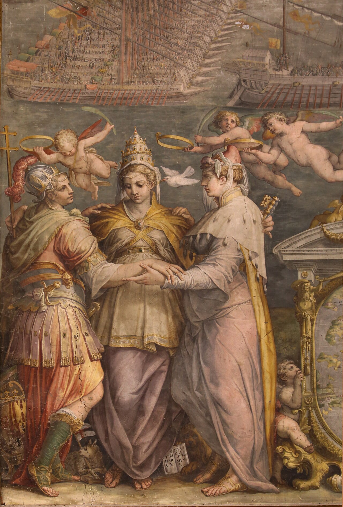

# 리파의 '동맹(Lega)' 도상과 1571년 신성동맹

**Q.** 리파가 '동맹' 도상으로 표현하려 한 동맹의 구체적 역사 사례는?

**A.** 교황 비오 5세가 스페인 왕(가톨릭 왕), 베네치아 공화국과 함께 투르크에 맞서 맺은 **신성동맹(Sacrum Foedus)**이다. 바티칸 살라 레지아에는 이 동맹이 교회·스페인·베네치아를 나타내는 **세 여인이 껴안은 모습**으로 그려져 있다.

---

## 1. 원전(Iconologia, Tomo Quarto)의 'LEGA' 항목

이 카드의 근거는 asset의 `01 Weariness to Pandering.md`에 실린 **LEGA** 항목이다. 체사레 리파(Cesare Ripa)의 원문에 아바테 **체사레 오를란디(Cesare Orlandi)**가 방대한 주석과 사례(Fatti)를 덧붙인 판본으로, 본문에 "TOMO QUARTO"라는 면주가 보인다.

### 도상 처방 (원문 첫 문단)

> DUe Donne abbracciate insieme, armate di elmo e corsaletto, con un'asta per una in mano, sopra una delle quali sia un **Airone**, e sopra l'altra una **Cornacchia**. Sotto i piedi di dette Donne stia una **Volpe** distesa.

즉 — **투구와 흉갑으로 무장하고 서로 껴안은 두 여인**, 각자 창(asta)을 한 자루씩 들었고, 한쪽 창끝에는 **왜가리**, 다른 쪽 창끝에는 **까마귀**가 앉아 있으며, 두 여인의 발밑에는 **여우**가 뻗어 누워 있다.

> 주: OCR에서 `Airone`(왜가리)가 `Arione`/`orione`로, `asta`(창)가 `alla`로 자주 깨져 있다. 리파가 인용한 라틴어 원전 —아리스토텔레스 『동물지』 9권의 *"amici Cornix & Ardeola"*, 플리니우스 10권 72장의 *"Cornix & Ardeola contra Vulpem gerunt communibus inimicitias"*— 를 보면 `Ardeola`(왜가리)임이 확정된다.

판화(asset 원본 `_page_11_Picture_2.jpeg`)에서 실제로 확인되는 요소:

| 화면 요소 | 텍스트의 의미 부여 |
|---|---|
| 투구(elmo)와 흉갑(corsaletto)을 걸친 **두 여인** | "무기를 들고 서로 돕기로 한 결합과 합의(unione, e accordo di ajutarsi coll'armi)" |
| 서로 어깨를 감싼 **포옹 자세** | 동맹 그 자체 — 두 주체의 하나됨 |
| 왼쪽 창끝의 **긴 부리 새(왜가리)**, 오른쪽 창끝의 **까마귀** | 서로는 친구이면서 여우를 **공동의 적**으로 삼아 함께 공격하는 두 새 = "공동의 적에 맞선 동맹"의 상징 |
| 각자 손에 쥔 **창(asta)** | 전쟁의 상형문자(geroglifico) — 동맹이 실행되는 수단 |
| 두 여인 발밑 지면에 길게 뻗은 형체 | **여우(Volpe)** = 동맹국들이 무너뜨리려는 적. 이 판본 판화에서는 지면 음영에 묻혀 흐릿하게만 드러난다 |

판면 하단에 제목 `Lega`, 상단에 `Di Cesare Ripa`, 좌우 하단에 소묘가(*del.*)와 판각가(*inc.*) 서명이 새겨져 있다.

## 2. 리파가 "이 도상은 그런 동맹이 아니다"라고 선을 긋는 대목

주석의 대부분(테세우스가 Lega의 발명자라는 플리니우스 전승, 라틴어 *Foedus* — 엔니우스에 따르면 더 옛날에는 *Fidus* —, 이를 관장한 사제단 **Feciales**, 리비우스가 말한 세 종류의 동맹, 알바인과 로마인의 맹세 의식, 돼지를 부싯돌로 내리치는 서약, 『일리아스』 3권의 그리스식 서약 등)은 **고대의 동맹 일반**을 다룬다.

그런데 리파는 결정적으로 이렇게 끊는다:

> Ma noi nella presente figura non intendiamo rappresentare niuna delle suddette sorti di Lega, perché cadono sotto la figura della **pace, ed amicizia** … Sicché noi esprimeremo un'altra sorte di Lega, ed è quella, **quando due, o più parti fanno Lega, e accordo di unirsi contro un loro comune nemico**.

즉 위에서 열거한 동맹들은 라틴어 *Foedus*가 본래 뜻하는 "평화와 우정"(*AMICITIA ESTO*)에 해당하므로 **평화(Pace)·우정(Amicizia)** 도상이 맡을 몫이고, 이 **Lega** 도상이 표현하는 것은 **공동의 적에 맞서 뭉치는 동맹**이라는 것이다. 그리고 그 실례로 곧바로 이 문장이 이어진다:

> tale fu la **Lega di Pio Quinto col Re Cattolico, e colla Repubblica Veneziana contro il Turco**, la quale fu detta **Sacrum Foedus**, e il Monte, eretto sussidio per tale impresa, chiamasi tuttavia **Mons Sacri Foederis**; e vedesi la detta Lega dipinta nella **Sala Regia** in figura di **tre Donne abbracciate**, una delle quali rappresenta la **Santa Chiesa**, la seconda **Spagna**, la terza **Venezia**, distinte colle loro solite imprese, e armi.

여기서 원문이 직접 짚어 주는 네 가지:

1. **주체** — 비오 5세(Pio Quinto) + 가톨릭 왕(Re Cattolico, 곧 스페인 왕) + 베네치아 공화국
2. **적** — 투르크(il Turco), 곧 오스만 제국
3. **공식 명칭** — *Sacrum Foedus* (신성동맹)
4. **재정** — 이 원정의 보조금으로 세운 교황청 공채(Monte)가 리파/오를란디 당대까지도 *Mons Sacri Foederis*라 불린다. 알레고리가 추상적 관념이 아니라 **당대 로마의 회계장부에까지 이름이 남아 있는 실물 사건**임을 보여주는 대목이다.

## 3. 역사적 사실: 1571년 신성동맹과 레판토

- **1570년** — 오스만이 베네치아령 **키프로스**를 침공(파마구스타 함락은 1571년 8월). 베네치아 단독으로는 감당할 수 없어 교황에게 구원을 요청한다.
- **1571년 5월 25일** — 교황 **비오 5세**의 중재로 로마에서 **신성동맹(Holy League / Sacra Lega)** 조인. 핵심 3주체는 **교황령·스페인(펠리페 2세)·베네치아 공화국**이며, 제노바·사보이아·토스카나·몰타 기사단 등이 부속으로 참여한다. 스페인이 비용의 절반, 베네치아가 3분의 1, 교황령이 6분의 1을 부담하는 구조였다.
- 스페인 왕 펠리페 2세의 칭호가 *Rey Católico* = **Re Cattolico(가톨릭 왕)** 이다. 리파 원문이 "스페인 왕"이 아니라 "가톨릭 왕"이라 적은 이유.
- **1571년 8~9월** — 연합 함대가 **메시나**에 집결. 총사령관은 펠리페 2세의 이복동생 **돈 후안 데 아우스트리아**, 베네치아 측 **세바스티아노 베니에르**, 교황령 측 **마르칸토니오 콜론나**.
- **1571년 10월 7일** — **레판토 해전**. 갤리선 시대 최대 규모의 해전에서 동맹 함대가 오스만 함대를 궤멸시킨다. 비오 5세는 이 승리를 성모의 전구로 돌려 **승리의 성모(뒤의 로사리오 성모) 축일**을 제정했다.
- 동맹 자체는 오래가지 못했다. 1573년 베네치아가 오스만과 단독 강화하며 키프로스를 내주고 이탈하면서 신성동맹은 사실상 해체된다.

## 4. 살라 레지아 프레스코: '세 여인'이라는 원형

비오 5세와 후임 그레고리오 13세는 바티칸 궁 **살라 레지아(Sala Regia)** — 교황이 세속 군주의 사절을 맞던 알현 홀 — 에 **조르조 바사리와 조수들**이 그린 레판토 연작(1572–73년경)을 설치했다. 리파/오를란디가 "살라 레지아에 그려진 것을 볼 수 있다"고 한 것이 바로 이 연작이다.

그중 **《메시나 앞의 동맹 함대》**의 전경 왼쪽에, 원문이 말한 **세 여인**이 있다.

> **이미지 출처 고지**: fig-2는 **asset(원전 판본의 판화)이 아니다.** Wikimedia Commons의 사진 *"Giorgio vasari e aiuti, Flotta della Lega davanti a Messina, 1572-73, 04.jpg"* (촬영: 사용자 Sailko, CC BY 3.0 / 원작 프레스코 자체는 퍼블릭 도메인)에서 가져온 것으로, 리파 원문이 **말로만 지시한** 살라 레지아 벽화를 대조용으로 붙인 것이다. 원전 판화는 fig-1 하나뿐이다.
> URL: https://commons.wikimedia.org/wiki/File:Giorgio_vasari_e_aiuti,_Flotta_della_Lega_davanti_a_Messina,_1572-73,_04.jpg

그림에서 실제로 관찰되는 것 — 원문의 "colle loro solite imprese, e armi"(각자의 통상적인 표장과 문장으로 구별되어)가 그대로 확인된다:

| 위치 | 인물 | 식별 표지 |
|---|---|---|
| **가운데** | **산타 키에사(교회/교황령)** | 머리에 **삼중관(triregno)**, 금빛 코프, 곁을 나는 **성령의 비둘기** |
| **왼쪽** | **스페인** | 투구·흉갑으로 **완전 무장**, 손에 **십자가 지팡이**, 발치에 카스티야-아라곤 계열의 **스페인 문장 방패** |
| **오른쪽** | **베네치아** | 총독풍 두건, 발치에 **성 마르코의 사자**와 *PAX TIBI MARCE EVANGELISTA MEUS*가 적힌 펼친 책 |

세 인물의 **오른손이 화면 한가운데서 하나로 포개져** 있다. 위에서는 푸토들이 종려가지와 금빛 월계관을 내려오고, 오른쪽 카르투슈에는 *GOLFO*·*S. MAURA* 등 지명이 적힌 **레판토 해역 지도**가 붙어 있으며, 화면 오른편에는 큰 낫을 든 해골(죽음)과 사슬에 묶여 절망하는 오스만 포로들이 대비된다.

## 5. 요점: 구체 사건 → 추상 알레고리로의 일반화

이 카드가 노리는 핵심은 **알레고리와 사건의 방향성**이다.

| | 살라 레지아 프레스코 (1572–73) | 리파의 Lega 도상 |
|---|---|---|
| 인물 수 | **세 명** | **두 명** |
| 정체성 | 교회·스페인·베네치아 (고유 문장으로 특정) | **익명의 두 여인** — 어느 나라도 아님 |
| 적 | 화면 밖 실재하는 투르크 (포로·죽음으로 표시) | 발밑의 **여우** — 특정되지 않은 "공동의 적" |
| 무장 | 스페인만 무장, 교회·베네치아는 성직/시민 복장 | **둘 다 균등하게 무장** — 대등한 군사적 결속 |
| 성격 | 1571년의 특정 정치 사건에 대한 **기념화** | 그 사건에서 추출한 **범용 개념 도식** |

리파의 두 여인은 살라 레지아의 세 여인을 **숫자와 국적에서 벗겨낸 것**이다. 셋을 둘로 줄이면 "누구와 누구"라는 특정성이 사라지고 "둘 이상의 당사자"라는 최소 형식만 남는다. 국가 문장 대신 왜가리·까마귀·여우라는 **자연사(플리니우스·아리스토텔레스) 표징**을 얹으면, 동맹의 논리는 정치적 우연이 아니라 자연에 내장된 이치처럼 보이게 된다.

동시에 방향은 반대로도 읽어야 한다. 리파의 추상 도상은 하늘에서 떨어진 것이 아니라, **불과 한 세대 전에 일어나 로마 사람이라면 누구나 기억하던 정치 사건**을 밑그림 삼아 만들어졌다. 리파가 굳이 "tale fu la Lega di Pio Quinto…"라 적고 벽화까지 지목한 것은, 독자가 이 추상 형상을 볼 때 **레판토를 떠올리도록** 의도했다는 뜻이다. `Mons Sacri Foederis`라는 공채 이름까지 덧붙인 것도 같은 맥락이다.

## 6. 원문 항목의 나머지 구성 (Fatti)

LEGA 항목은 도상 해설 뒤에 관례대로 세 가지 사례로 마무리된다:

- **FATTO STORICO SAGRO** — 하솔 왕 야빈이 여호수아에 맞서 가나안 왕들과 맺은 동맹. 압도적 수에도 전멸당한다(여호수아 11장). *공동의 적에 맞선 동맹의 실패 사례.*
- **FATTO STORICO PROFANO** — 알바 왕 무티우스 수페티우스가 로마와 동맹을 맺고도 피데나이 전쟁에서 관망하다, 툴루스 호스틸리우스에게 **동맹 위반자**로 붙잡혀 두 마차에 묶여 찢겨 죽는다. *동맹 배신의 처벌.*
- **FATTO FAVOLOSO** — 아르고스 왕 아드라스토스가 폴리네이케스·티데우스 등과 결성한 **테베 공격 7장군**의 동맹.

---

### 한 줄 정리

리파의 '동맹'은 **1571년 비오 5세–스페인–베네치아의 대(對)투르크 신성동맹(Sacrum Foedus)** 을 실례로 삼는다. 바티칸 살라 레지아의 바사리 프레스코가 이를 교회(삼중관)·스페인(무장·문장)·베네치아(성 마르코 사자)의 **세 여인이 손을 맞잡은 모습**으로 그렸고, 리파는 여기서 국적과 인원수를 지워 **무장한 두 여인 + 왜가리·까마귀 + 발밑의 여우**라는 범용 도식으로 일반화했다.
