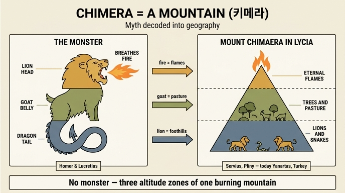

# 키메라(Chimera) — 세 짐승의 몸, 그리고 리키아의 불타는 산

## 카드 정리

| 항목 | 내용 |
|---|---|
| 머리 | 사자(capo di Leone) |
| 배·몸통 | 염소(ventre di capra) |
| 꼬리 | 용/뱀(coda di Drago) |
| 특징 | 입에서 불을 뿜는다(getta fiamme per la bocca) |
| 전거(典據) | 루크레티우스, 호메로스 / 베르길리우스 |
| 역사적 근거 | 리키아(Licia)의 한 산 — 정상에서 늘 불길, 주변에 사자 다수, 중턱에 나무와 목초지 |

## 원문 (Ripa, *Iconologia*, 「MOSTRI」장 중 CHIMERA)

> Lucrezio, ed Omero dicono, che la Chimera ha il capo di Leone, il ventre di capra, e la coda di Drago, e che getta fiamme per la bocca, come racconta ancora Virgilio, che la finge nella prima entrata dell'Inferno, insieme con altri Mostri.
>
> Quello che dissero favoleggiando i Poeti della Chimera si fa fondata nella Storia di un monte della Licia, dalla cima della quale continuamente escono fiamme, ed ha all'intorno gran quantità di Leoni, essendo poi più abbasso, verso il mezzo della sua altezza, molta abbondanza di alberi, e pascoli.

번역: "루크레티우스와 호메로스는 키메라가 사자의 머리, 염소의 배, 용의 꼬리를 가지고 입으로 불길을 내뿜는다고 말한다. 베르길리우스도 그것을 지옥의 첫 입구에 다른 괴물들과 함께 세워 두었다고 이야기한다. // 시인들이 키메라에 대해 우화로 말한 것은 리키아의 어떤 산에 관한 이야기에 근거를 둔다. 그 산 정상에서는 불길이 끊임없이 솟아오르고, 주위에는 사자가 대단히 많으며, 좀 더 아래 산 높이의 중간쯤에는 나무와 목초지가 풍부하다."

## 1. 도상(圖像): 세 짐승이 하나로

키메라는 Ripa가 「MOSTRI(괴물들)」 항목에 스킬라·카리브디스·그리핀·스핑크스·하르피아·히드라·케르베로스와 함께 묶어 놓은 **합성 괴물(hybrid monster)** 중 하나다. Ripa 자신이 서두에서 "육상·수상·공중의 여러 괴물을 그려야 할 일이 자주 생기므로, 그것을 언급한 시인들의 서술을 한데 모아 두었다"고 밝힌다. 즉 이 항목은 알레고리 인물상이 아니라 **화가를 위한 괴물 도해 사전**이다.

기억 포인트는 **위→아래 = 사자 → 염소 → 용**의 수직 순서다.

- **호메로스** 『일리아스』 6.181: "앞은 사자, 뒤는 뱀(δράκων), 가운데는 염소(χίμαιρα)" — 그리고 "무서운 불의 위력을 뿜어냈다".
- **루크레티우스** 『사물의 본성에 관하여』 5권: 자연에 존재할 수 없는 잡종의 예로 "prima leo, postrema draco, media ipsa(앞은 사자, 뒤는 용, 가운데는 그 자신=염소)"를 든다. 루크레티우스에게 키메라는 **불가능한 존재의 표본**, 즉 원자론으로 신화를 부정하는 사례였다.
- **베르길리우스** 『아이네이스』 6.288: 저승 입구(orcus의 문턱)에 켄타우로스·스킬라·브리아레우스·히드라·고르곤·하르피아와 나란히 "불을 무장한 키메라(Chimaera flammis armata)"가 서 있다. Ripa가 "지옥의 첫 입구"라고 한 것이 이 대목이다.

참고로 그리스어 *χίμαιρα(chimaira)* 자체가 "어린 암염소"라는 보통명사다. 이름이 염소인데 머리는 사자라는 이 불균형이 이후 "키메라 = 잡종·환상·허구"라는 비유(영어 *chimerical*, 이탈리아어 *chimera* = 헛된 공상)로 이어졌다. 신화적으로는 티폰과 에키드나의 자식(헤시오도스 『신통기』 319–325)이며, 케르베로스·히드라와 남매다. 리키아 왕 아미소다로스가 길렀고, 페가수스를 탄 **벨레로폰**이 처치했다.

## 2. 역사적 근거: 리키아의 "불타는 산"

카드의 뒷부분은 고대의 **에우헤메리즘(euhemerism, 신화 합리화)**을 그대로 옮긴 것이다. 논리는 단순하고 강력하다.

> 괴물은 없었다. 한 **산의 세 고도대**가 있었을 뿐이고, 그 산의 이름이 "키마이라"였다.

- **정상**: 땅에서 새어 나오는 가스가 끊임없이 타오름 → 입에서 뿜는 **불길**
- **중턱**: 나무와 목초지가 풍부(따라서 **염소**가 방목됨) → **염소의 배**
- **산 주변/아래쪽**: 사자가 많이 서식 → **사자의 머리**
- (세르비우스의 완전한 판본에는 **산기슭에 뱀이 많다**는 항목이 추가되어 **용의 꼬리**까지 맞아떨어진다)

이 설명의 출처는 베르길리우스 주석가 **세르비우스**(4세기)로, 그는 "사자는 산 정상에, 염소가 가득한 목초지는 중간에, 뱀은 산기슭 전체에"라는 배치로 호메로스의 3분할 몸을 그대로 재현했다. Ripa의 문장은 세르비우스 계열 주석을 축약한 것이어서 순서가 조금 흐트러져 있다(정상=불, 사자는 "주위에", 중턱=나무·목초). **암기할 때는 "불–염소–사자"라는 항목 자체를 붙잡고, 층서 배치는 판본마다 조금씩 다르다는 점만 기억하면 된다.** 이 합리화 설명의 최고(最古) 출처로는 **크테시아스**가 거론되며, 대(大)플리니우스 『박물지』도 리키아 파셀리스 근처 "헤파이스투스 산"이 불탄다고 적었다.

이 산은 오늘날 터키 안탈리아주 올림포스/치랄리 근처의 **야나르타시(Yanartaş, "불타는 돌")**로 비정된다. 사문암화(serpentinization) 과정에서 발생한 메탄이 암반 틈으로 새어 나와 수천 년째 자연 발화하고 있으며, 곁에는 헤파이스토스 신전 유적이 있다. 즉 카드의 "정상에서 늘 불길이 나온다"는 진술은 문학적 수사가 아니라 **지금도 관찰 가능한 지질 현상**이다.

## 3. 이 항목이 Iconologia에서 갖는 의미

Ripa의 다른 항목들은 "추상 개념 → 인물상"으로 내려가는 알레고리 제작법이다. 그런데 키메라 항목은 방향이 거꾸로다: **괴물(이미지) → 실제 지형(사실)**로 해체한다. 르네상스·바로크 도상학이 고대 신화를 다룰 때 (1) 시인들의 서술을 그림 지침으로 수집하는 태도와 (2) 그 서술의 자연학적 기원을 캐묻는 태도를 동시에 가지고 있었음을 보여주는 좋은 예다.

※ 이 판본의 「MOSTRI」 장에는 키메라 전용 판화가 실려 있지 않다(개별 괴물은 텍스트 서술만 제공된다). 위 그림은 케르베로스 서술 뒤, 세이렌 항목 앞에 놓인 **장식 컷(tailpiece)**으로, 인체 상반신이 아칸서스 소용돌이로 이어지는 그로테스크 문양이다. 키메라의 초상은 아니지만, "서로 다른 종을 한 몸에 접합하는" 합성 괴물의 조형 원리가 장식 문양 층위에서도 반복되고 있음을 보여준다 — 사자+염소+용의 접합은 이 시대 시각 문화의 일반 문법이었다.

## 한 줄 암기

**"사자 머리·염소 배·용 꼬리에 불을 뿜는다(호메로스·루크레티우스) — 그런데 실은 리키아의 산: 정상은 영원한 불, 중턱은 나무와 목초, 주변은 사자 소굴."**

## 인포그래픽

## 출처

- Cesare Ripa, *Iconologia*, 「MOSTRI — CHIMERA」 (asset: `08 Monsters and Muses.md`)
- [CHIMERA (Khimaira) — Theoi Greek Mythology](https://www.theoi.com/Ther/Khimaira.html)
- [Mount Chimaera — Wikipedia](https://en.wikipedia.org/wiki/Mount_Chimaera)
- [Yanartaş — Wikipedia](https://en.wikipedia.org/wiki/Yanarta%C5%9F)
- [Servius, Commentary on the Aeneid, Book 6 — Perseus](https://www.perseus.tufts.edu/hopper/text?doc=Perseus:text:1999.02.0053:book%3D6:commline%3D395)
- [Vergil, Aeneid VI 282–294 — Dickinson College Commentaries](https://dcc.dickinson.edu/vergil-aeneid/vergil-aeneid-vi-282-294)
- [High pH microbial ecosystems at Yanartaş (Chimera), Turkey — PMC](https://www.ncbi.nlm.nih.gov/pmc/articles/PMC4298219/)
