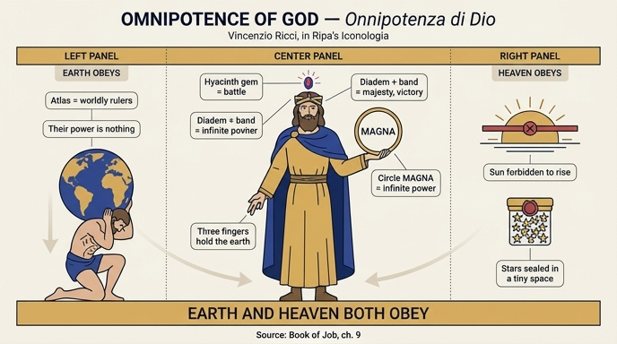

# 하나님의 전능 (Onnipotenza di Dio)

> **Q.** 리치가 그린 '하나님의 전능(Onnipotenza di Dio)'의 도상은?
>
> **A.** 왕의 복장을 한 위엄 있는 남자가 띠를 두른 왕관(디아뎀) 꼭대기에 히아신스 보석을 달고, 한 손에 'MAGNA'라 쓰인 원을, 다른 손은 세 손가락을 땅으로 펴고 있다. 왼쪽에는 세계를 지고 땅에 구부린 아틀라스가, 오른쪽에는 떠오르려다 저지당한 태양과 좁은 곳에 갇힌 수많은 별들이 있다.

원문: `.fm/assets/11 Oblivion to Omnipotence of God.md` 439~467행 (체사레 리파 『Iconologia』 증보판 4권, 이탈리아어 OCR).

---

## 0. 먼저 확인할 것 — 이건 리파의 항목이 아니다

원문 441행의 저자 표시는 OCR 상태가 나빠 이렇게 찍혀 있다.

```
Dd T. Fra Vincenzio I{icci M. 0.
```

같은 asset 폴더의 `01 Weariness to Pandering.md` 353·404·431행에 동일한 서명이 깨끗하게 남아 있어 복원이 확정된다.

```
Del P. Fra Vincenzio Ricci M. O.
```

즉 **P(adre) Fra Vincenzio Ricci, M(inore) O(sservante)** — "프란치스코회 소형제 관찰파 수사 빈첸초 리치 신부". (참고로 같은 파일 457행에는 `Del T. Fra Vincenzio l\lcci M. 0.`처럼 또 다른 형태로 깨져 있어, `P.`→`T.`/`Dd`, `Ricci`→`I{icci`/`l\lcci`가 이 OCR의 반복 오류 패턴임을 알 수 있다.)

### 빈첸초 리치는 누구인가

- 산세베로 출신(**da San Severo**, 풀리아)의 프란치스코회 **소형제회 관찰파(Minori Osservanti)** 수사, 신학자이자 설교가. 직함은 "풀리아 산탄젤로 관구의 신학자·설교자".
- 저서 **『Geroglifici morali』**(나폴리, Gio. Domenico Roncagliolo, 1626). 부제가 성격을 그대로 말해 준다 — "따라야 할 여러 덕과 피해야 할 악덕에 관하여, **설교가·연설가 및 학인들에게 유용한** 새 저작".
- 리파의 『이코놀로지아』가 판을 거듭하며 증보될 때(특히 체사레 오를란디가 편집한 18세기 페루자 5권본 계열), 리치의 신학적 의인상들이 다수 편입되었다. 항목마다 "Del P. Fra Vincenzio Ricci M. O."라는 저자 서명이 붙는 것은 **편집자가 리파 본인의 글과 구별하기 위해 명시한 것**이다.

### 왜 이 구분이 중요한가

| | 리파 본인의 방식 | 리치의 방식 (이 항목) |
|---|---|---|
| 1차 전거 | 그리스·로마 고전, 신화, 고대 화폐·부조 | **불가타 성경** |
| 2차 전거 | 피에리오 발레리아노, 알치아티 등 상형문자·엠블럼 문헌 | 교부·스콜라 신학(아우구스티누스) + 피에리오 |
| 서술 구조 | 도상 기술 → 요소별 고전적 유래 설명 | 도상 기술 → **신학 논증** → 요소별 설명 → **`Alla Scrittura Sacra`(성경으로)** 별도 섹션 |
| 목적 | 화가·시인을 위한 도상 사전 | **설교단에서 쓸 수 있는** 시각적 논증 |

이 항목이 465행부터 `Alla Scrittura Sacra.`라는 별도 표제 아래 **모든 속성을 성경 구절로 다시 한 번 정당화**한다는 점이 결정적이다. 리파의 순수 항목에는 이런 구조가 없다. 반종교개혁기 트리엔트 공의회 이후, 종교 이미지는 "성경적 근거가 있는가"를 요구받았고, 리치는 그 요구에 정면으로 응답하는 형식을 쓴 것이다.

---

## 1. 도상 원문 (443행)

> UOmo di venerando aspetto, vestito alla real maniera. In capo avrà un diadema, con un giacinto nella sommità, circondato da una fascia. Terrà un circolo in una mano, dentro il quale sarà scritto **MAGNA**; e nell'altra terrà tre dita distese verso la terra. Di lato alla parte sinistra vi sarà Atlante curvato, ed abbassato in terra, con un M[o]ndo sopra; ed alla parte destra un Sole, che vuole spuntare, ed è impedito; e di sotto vi sono molte stelle rinchiuse in luogo angusto, e piccolo.

(OCR 복원: `uk diadema`→`un diadema`, `M.ndo`→`Mondo`, `finirtra_j`→`sinistra`, `delira`→`destra`, `Ipuntare`→`spuntare`, `angullo`→`angusto`. 이 OCR은 장음 s(ſ)를 f로 읽는 오류가 전면적이다 — `fecondo`=secondo, `farà`=sarà, `folamente`=solamente 등.)

**번역.** 위엄 있는 용모의 남자, 왕의 방식으로 옷을 입었다. 머리에는 디아뎀을 쓰는데, 꼭대기에 히아신스 보석이 있고 띠(fascia)가 둘러져 있다. 한 손에는 원을 드는데 그 안에 **MAGNA**라 쓰여 있고, 다른 손은 세 손가락을 땅을 향해 펴고 있다. 왼쪽 곁에는 아틀라스가 위에 세계를 인 채 땅으로 구부러져 낮추어져 있고, 오른쪽에는 떠오르려 하나 저지당한 태양이 있으며, 그 아래에는 수많은 별들이 비좁고 작은 곳에 갇혀 있다.

---

## 2. 속성별 논거 표

| 속성 | 리치의 논거 | 원문 근거 |
|---|---|---|
| **위엄 있는 남자 · 왕의 복장** | 하나님은 만유의 **보편적 왕(Re universale del tutto)**이므로. 전능을 *통치권(dominium)*으로 번역함 | 447행 / 에스델 15:9 |
| **디아뎀 + 두른 띠(fascia)** | 피에리오 『상형문자』 41권 "디아뎀에 관하여" — 디아뎀은 **왕의 위엄(maestà regia)**의 상형문자. 띠는 여기에 더해 **승리** | 449행 / 지혜서 18:24 |
| **꼭대기의 히아신스** | 피에리오 41권 — 히아신스는 붉고 푸른 색으로 **전투(pugna)**의 상형문자. 하나님이 원수와 싸우심 | 451·455행 / 집회서 40:4 |
| **'MAGNA'라 쓰인 원** | 원 = 무한·비교 불가능한 전능. 시작과 끝을 함께 품음. `MAGNA` = "큰 일들을 행하심" | 457·467행 / 요한계시록 1:8 · **욥기 9:10** |
| **땅을 향해 편 세 손가락** | ① 단 세 손가락(=권능의 원자 하나)으로 땅을 떠받치심 ② 또는 **삼위**를 뜻함 | 459행 / 이사야 40:12 · 욥기 9:6 |
| **왼쪽: 세계를 진 채 구부린 아틀라스** | 세상 권력자들(Grandi del Mondo)의 권세. 그러나 전능 앞에서는 **무(niente)**이므로 구부러짐 | 461행 / **욥기 9:13** |
| **오른쪽: 저지당한 태양 + 갇힌 별들** | 하나님이 만물을 지배하시어 태양이 뜨지도 빛을 보내지도 못하게 하심. 천문학자들 말로 땅보다도 큰 별들을 지극히 작은 곳에 가두심 | 463행 / **욥기 9:7** |

---

## 3. 요소별 상세

### 3-1. 신학적 전제 (445행) — "전능"의 스콜라적 정의

리치는 도상 설명에 앞서 전능의 **한계 조항**부터 못박는다.

> L'Onnipotenza solamente appartiene a Dio, il quale può tutte le cose, che però non importino **incompossibilità**, e che non dicano **ripugnanza** dalla parte loro...

전능은 오직 하나님께 속하며, 하나님은 **비공존성(incompossibilità)** 과 **자기모순(ripugnanza)** 을 함축하지 않는 모든 것을 하실 수 있다. 예시도 교과서적이다.

- 하나님은 **무한한 피조물**을 창조하실 수 없다 — 그것은 곧 하나님일 텐데, 무한한 것은 하나님뿐이므로.
- 하나님은 **또 다른 하나님**을 창조하실 수 없다 — 피조된 것은 하나님이 아니라 피조물이므로.
- 두 개의 무한은 함께 성립할 수 없다. "무한 바깥에는 더 이상 아무것도 없기(fuori dell'infinito non vi è più niente)" 때문.

이것은 토마스 아퀴나스 『신학대전』 I q.25 a.3의 정식("하나님은 절대적으로 가능한 모든 것을 하실 수 있다 — 모순을 함축하는 것은 가능한 것의 이름에 값하지 않는다")을 이탈리아어로 풀어 쓴 것이다. 리치는 "**전능의 대상은 존재 가능한 것(l'essere possibile)**"이라고 요약한다.

이어서 **전유(appropriatio) 교리**가 나온다.

- **전능 → 성부**, **지혜 → 성자**, **선함 → 성령**
- 근거는 아우구스티누스: *Principium totius divinitatis* — "온 신성의 원리". 성부는 산출되지 않은 원리이며, 그에게서 성자가, 그리고 성자와 함께 성령이 나오므로.
- 단 리치는 즉시 단서를 단다: **전능은 다른 두 위격에도 성부에게와 똑같이(egualmente) 있으며**, 위의 이유로 성부에게 "전유"될 뿐이다.

> 이 단서가 아래 "세 손가락"의 두 번째 해석과 직결된다.

### 3-2. 디아뎀과 띠 (449행)

피에리오 발레리아노 『Hieroglyphica』 **41권 "de diademate"** 를 명시적으로 인용한다. 두 가지 일화가 붙는다.

1. **알렉산드로스와 리시마코스.** 고대 왕들은 디아뎀 위에 띠(fascia)를 감는 관습이 있었고, 대(大)알렉산드로스도 그것을 착용했다. 그런데 한번은 그 띠를 풀어 **리시마코스의 이마 상처를 싸매 주었고**, 현자들은 그 상처 입은 자에게 **왕권(regia podestà)이 올 것**이라고 점쳤다. (리시마코스는 실제로 디아도코이 중 하나로 트라키아·소아시아의 왕이 된다.) 따라서 디아뎀+띠 = **왕의 위엄과 권세**.
2. **코린나와 핀다로스.** 원문 OCR은 `Lorinna`지만 **Corinna**(코린나)의 오독이다. 시학에 매우 박식한 소녀 코린나가 **테베에서 핀다로스를 상대로 음악 경연에서 거둘 승리**의 표징으로 띠를 받았다. 따라서 띠는 **승리(vittoria)** 도 함의한다.

즉 이 왕관 하나가 *위엄 + 권세 + 승리* 세 겹을 진다.

### 3-3. 히아신스 — 통념과 다른 해석에 주의

여기서 흔한 짐작(히아신스=하늘색=천상성, 출애굽기의 청색 실, 요한계시록 21:20의 기초석)은 **리치의 논거가 아니다.** 451~455행을 그대로 읽으면 이렇다.

> Vi è nella sommità del Diadema un giacinto, ch'è **di color rosso, e ceruleo**, che a quello tira alquanto, il quale secondo Pierio lib. 41. è **geroglifico della pugna**, che così era appresso i Romani, come dice Plutarco di Pompeo, di Marcello, e di M. Bruto, significando la pugna, e la battaglia... **che fa Iddio contro i nemici suoi**, e contro quelli che non fanno conto delle sue grandezze.

- 히아신스는 **붉은색과 하늘색(ceruleo)** 을 겸하되 **붉은 쪽으로 다소 기우는** 돌이다. (르네상스 보석지에서 *hyacinthus*는 오늘날의 사파이어·지르콘·헤소나이트 등을 뭉뚱그린 명칭이었고, 등급에 따라 색이 청색에서 적갈색까지 걸쳤다.)
- 피에리오 41권에 따라 그 붉음은 **전투(pugna)의 상형문자**다. 근거는 로마 관습 — 플루타르코스가 **폼페이우스·마르켈루스·마르쿠스 브루투스**에 대해 전하는 대로다. (로마 장군은 사령부 천막 위에 **붉은 튜닉/군기**를 내걸어 교전 개시를 알렸다. 플루타르코스의 여러 『영웅전』에 이 신호가 등장한다.)
- 따라서 왕관 꼭대기의 붉은 히아신스 = **하나님이 당신의 원수들과, 그리고 당신의 위대하심을 대수롭지 않게 여기는 자들과 벌이시는 전쟁.**

즉 이 보석은 "천상적 푸름"이 아니라 **호전적 붉음**이다. 위엄 있는 왕관의 정점에 전쟁의 표징을 얹음으로써, 전능이 추상적 속성이 아니라 **행사되는 힘**임을 못박는다.

> **성경 섹션에서의 흔들림.** 465행 `Alla Scrittura Sacra`에서 리치는 같은 요소를 이렇게 부른다 — "il diadema **infasciato col rubino sopra**"(**루비**를 얹고 띠를 두른 디아뎀). 그러고 나서 덧붙인다: "E se vogliamo il giacinto ancora sopra il diadema, o corona"(그리고 디아뎀 혹은 왕관 위에 히아신스를 원한다면) → 집회서 40:4. 붉은 돌이라는 공통 성질 때문에 루비/히아신스를 사실상 호환적으로 다루는 것으로, **붉음이 논증의 핵심**임을 역으로 확인해 준다. (`rubino` 판독은 OCR `col rubino fopra`에서 나오며 문맥상 확실하다.)

### 3-4. 'MAGNA'라 쓰인 원 (457행) — 인용 구절 확정

> Il circolo che tiene in mano, dinota la sua infinita, ed incomparabile Onnipotenza, spiegato col detto **MAGNA**, facendo cose grandi, e maravigliose.

원 자체는 무한·비교 불가능성의 표지다. 467행이 두 갈래로 근거를 댄다.

1. **원 = 시작이자 끝** — 요한계시록 1:8
   > *Ego sum Alpha, et Omega, principium, et finis, dicit Dominus Deus, qui est, et qui erat, et qui venturus est, **Omnipotens**.*
   원이 "시작과 끝을 함께 품듯(siccome quello racchiude il principio, e fine)", 하나님은 만물의 창시자(Autore)시다. 구절 자체가 *Omnipotens*로 끝난다는 점에서 이 도상의 표제 구절 격이다.
2. **하나님의 위대하심** — 집회서(Ecclesiastico) 43:31
   > *Terribilis Dominus, et magnus vehementer, et mirabilis potentia ipsius.*
   (원문 OCR은 `Eccl. 45. v. 31.`이나 불가타 대조상 **43:31**이 맞다. 숫자 3→5 오독.)

그리고 **`MAGNA`라는 글자 자체의 출처**는 원문이 직접 밝힌다 — **욥기 9:10**.

> Dentro il circolo vi è il detto **MA-GNA**, perchè fa gran cose con quella sua Onnipotenza, e fa quanto vuole. **Job. 9. v. 10**: *Qui facit **magna**, et incomprehensibilia, et mirabilia, quorum non est numerus.*

> "헤아릴 수 없이 크고 측량할 수 없는 기이한 일을 행하시느니라."

따라서 원 안의 `MAGNA`는 **욥기 9:10의 발췌 인용**이다. (누가복음 1:49 *fecit mihi magna qui potens est*나 욥기 5:9가 아니다 — 리치가 장절을 명시했다.) 원의 둘레는 "수효가 없음(quorum non est numerus)"을, 그 안의 글자는 "큰 일들"을 담당하는 셈이다.

### 3-5. 땅을 향해 편 세 손가락 (459행)

> *(다음 카드의 주제이므로 여기서는 요지만 적는다.)*

두 해석이 병기된다.

1. 하나님은 땅을 **오직 세 손가락으로**, 즉 "당신 권능의 원자 하나(un atomo della sua potenza)"만으로 유지·지탱하신다. → **이사야 40:12** *Quis appendit **tribus digitis** molem terrae, et libravit in pondere montes, et colles in statera?*
2. 또는 세 손가락은 **삼위(tre Persone Divine)** 로, 세 위격이 모든 대외적(ad extra) 산출에 똑같이 협력한다. → 아우구스티누스: ***Opera Trinitatis ad extra sunt indivisa*** ("삼위일체의 대외적 활동은 나뉘지 않는다"). 3-1의 전유 교리 단서와 정확히 짝을 이룬다.

추가로 **욥기 9:6** — *Qui commovet terram de loco suo, et columnae eius concutiuntur* (땅을 그 자리에서 옮기시니 그 기둥들이 흔들리느니라). 지탱할 뿐 아니라 **움직이신다**.

### 3-6. 왼쪽 — 세계를 지고 구부린 아틀라스 (461행)

> *(다음 카드의 주제이므로 여기서는 요지만.)*

> Atlante incurvato in terra, col Mondo sopra, ombreggia con chiari lumi la potenza de' **Grandi del Mondo**, che reggono i loro imperi, ma sta curvato, perchè quella al pari di questa onnipotenza, **è un niente**, ed a lei s'inchinano, e bassano tutte le Nazioni.

아틀라스는 여기서 **세상의 대권자들**(제국을 다스리는 자들)이다. 그가 구부러진 이유는 전능에 견주면 그 권세가 **무(niente)** 이기 때문이며, 모든 민족이 전능 앞에 절하고 낮아진다.

### 3-7. 오른쪽 — 저지당한 태양과 갇힌 별들 (463행)

> *(다음 카드의 주제이므로 여기서는 요지만.)*

- 떠오르려 하나 **저지당한 태양**: 하나님이 만물을 지배하시어 태양이 나타나지도 그 빛을 보내지도 못하게 하신다.
- **좁은 곳에 갇힌 별들**: "천문학자들에 따르면(conforme gli Astrologi) 별들은 땅보다도 훨씬 클 만큼 거대한데", 하나님은 그것들을 **지극히 작은 곳(piccolissimo luogo)** 에 가두신다. — 즉 규모의 대비가 논증의 핵심이다.

---

## 4. 결정적 발견 — 이 도상은 **욥기 9장의 삽화**다

467행의 성경 대조 섹션을 장절만 뽑아 배열하면 구조가 드러난다.

| 도상 요소 | 인용 구절 |
|---|---|
| 왕의 복장 | 에스델 15:9 |
| 띠 두른 디아뎀 | 지혜서 18:24 |
| 히아신스 | 집회서 40:4 |
| 원 (시작과 끝) | 요한계시록 1:8 / 집회서 43:31 |
| **MAGNA** | **욥기 9:10** |
| **아틀라스** | **욥기 9:13** |
| 세 손가락 (지탱) | 이사야 40:12 |
| **세 손가락 (움직임)** | **욥기 9:6** |
| **저지당한 태양 + 갇힌 별들** | **욥기 9:7** |

즉 **중앙의 원, 좌측 아틀라스, 우측 태양·별, 그리고 손가락의 능동적 측면이 모두 욥기 9장 한 장에서 나온다.** 왕의 복장·왕관·보석은 인물을 왕으로 세우기 위한 '무대 의상'이고, 도상의 **논증 부분은 통째로 욥기 9장의 시각화**인 셈이다.

특히 **아틀라스**가 그렇다. 순수한 이교 신화 차용처럼 보이지만, 리치가 대는 근거는 **욥기 9:13**이다.

> *Deus, cuius irae nemo resistere potest, et **sub quo curvantur qui portant Orbem**.*
> "하나님이 진노를 돌이키지 아니하시나니 **세계를 떠받치는 자들**이 그 밑에 **굴복하느니라**."

불가타 본문에 **"세계를 떠받치는 자들(qui portant Orbem)"이 "그 아래 구부러진다(curvantur)"** 는 표현이 문자 그대로 들어 있다. 리치의 아틀라스는 **성경 구절이 이미 그려 놓은 자세**를 그리스 신화의 이름으로 부른 것이다. 이것이 반종교개혁기 이미지 정치의 표준 수법이다 — 이교 형상을 쓰되, 그 사용을 성경 문자가 승인하게 만든다.

태양과 별도 마찬가지로 **욥기 9:7 한 절**이 통째로 담당한다.

> *Qui praecipit soli, et non oritur, et **stellas claudit quasi sub signaculo**.*
> "그가 해에게 명령하여 뜨지 못하게 하시며 **별들을 봉하시며**."

원문 467행이 "e appunto sotto un piccolo suggello"(그리고 바로 작은 봉인 아래)라고 덧붙이는 것은 *quasi sub signaculo*("봉인 아래인 듯")를 시각화하기 위해서다. 즉 **별들이 갇힌 "좁고 작은 곳"의 정체는 봉인된 그릇/인장**이다.

---

## 5. 구도 읽기 — 좌우 대칭이 곧 논증이다

```
        ┌───────────────── 중앙: 전능하신 왕 ─────────────────┐
        │      디아뎀 + 띠 + 히아신스  (위엄·승리·전쟁)        │
        │   ○ MAGNA (욥 9:10)          ✋ 세 손가락 ↓ (사 40:12) │
        └────────────────────────────────────────────────────┘
   왼쪽 ◀───────────────────────────────────────────────▶ 오른쪽
   아틀라스, 세계를 지고 구부림              태양은 뜨지 못하고
   = 지상 권력(Grandi del Mondo)             별들은 봉인 아래 갇힘
   = 욥기 9:13                                = 욥기 9:7
   → 인간의 권세는 "niente"                  → 천체 질서도 복종
        └──────────── 땅과 하늘이 모두 복종한다 ────────────┘
```

- **좌(지상) / 우(천상)** 로 나뉜 배치는 장식이 아니라 **논증의 두 전제**다. 가장 강한 지상 권력(제국을 짊어진 자)과 가장 확고한 천상 질서(해의 운행, 별들의 크기) — 인간이 상상할 수 있는 두 극단의 '큰 힘'을 각각 한쪽에 세우고, 둘 다 무력화함으로써 **"그 무엇도 예외가 아니다"** 를 시각적으로 증명한다. 중앙 인물은 아무것도 하지 않고 서 있을 뿐이며, 손가락 셋만 아래로 뻗어 있다 — 힘의 **경제성**이 곧 힘의 크기다("권능의 원자 하나로").
- **아래로 향하는 수직축**도 일관된다. 세 손가락은 아래로, 아틀라스는 땅으로 구부러지고, 별들은 아래쪽(`di sotto`) 좁은 곳에 갇힌다. 오직 태양만 **위로 올라가려다 저지된다** — 유일한 상승 벡터가 차단되면서 "모든 것이 낮아진다"는 도식이 완성된다.
- 리파 계열 의인상 대다수는 **인물 하나 + 지물 두셋**으로 끝난다. 여기처럼 **서사적 배경 인물(아틀라스)과 천체 사건(일출 저지, 별의 봉인)까지 배치한 복합 구성은 드물다.** 이는 리치의 항목이 도상 사전 표제어라기보다 **설교용 도해(scheda predicabile)** 로 설계되었기 때문이다 — 설교가가 이 한 장면을 말로 풀면 그대로 욥기 9장 강해가 된다.

### 아틀라스의 전용이 갖는 함의

- 그리스 신화의 티탄 아틀라스는 본래 **제우스에게 벌 받아 하늘을 떠받치는 자**다. 리치는 이 형벌의 자세를 그대로 가져오되, 벌 주는 자를 하나님으로 바꾼다.
- 그러나 리치의 해석에서 아틀라스는 **신화적 인물이 아니라 알레고리의 알레고리**다 — 그는 "세상의 대권자들"을 뜻하고, 그 대권자들이 다시 "무"임을 뜻한다. 이교 신은 신으로 등장할 자격조차 얻지 못하고, **정치권력의 비유물**로 격하된 뒤 무릎 꿇는다.
- 반종교개혁기 이미지 정치에서 이 구도는 두 방향으로 작동한다. 대외적으로는 **고전 고대의 시각 어휘를 포기하지 않으면서도**(인문주의자·후원자에게 통하는 언어) 그것을 기독교 진리에 종속시켜 보여주고, 대내적으로는 **세속 군주권에 대한 교회의 우위**를 말없이 주장한다. "제국을 짊어진 자들이 그 아래 구부러진다"는 욥기 9:13은 17세기 나폴리(스페인 부왕령)에서 읽힐 때 결코 중립적인 문장이 아니다.

---

## 6. OCR 훼손과 복원 정리

| 행 | OCR 원문 | 복원 | 근거 |
|---|---|---|---|
| 441 | `Dd T. Fra Vincenzio I{icci M. 0.` | `Del P. Fra Vincenzio Ricci M. O.` | `01 Weariness…md` 353·431행의 동일 서명 |
| 443 | `uk diadema` / `M.ndo` / `angullo` | `un diadema` / `Mondo` / `angusto` | 문맥 |
| 445 | `Vrincipìum totìns divinitatis` | *Principium totius divinitatis* | 아우구스티누스 관용구 |
| 449 | `Lorinna` | **Corinna**(코린나) | 핀다로스와 테베에서 경연한 여류 시인 |
| 449 | `lib. 41. </e diademate` | `lib. 41. de diademate` | 피에리오 『Hieroglyphica』 편명 |
| 451 | `di color rodo, e ceruleo` | `di color rosso, e ceruleo` | ſ/f/d 오독 |
| 459 | `Operai Trinitatis ad extra funt indhifa` | *Opera Trinitatis ad extra sunt indivisa* | 아우구스티누스 정식 |
| 465 | `Eller 15. v. 9.` | `Esther 15. v. 9.` | 불가타 대조 |
| 465 | `fadpta erat` | *sculpta erat* | 지혜서 18:24 불가타 |
| 465 | `^b eo, qui utitnr hyacinto` | *Ab eo qui utitur hyacintho* | 집회서 40:4 불가타 |
| 467 | `Eccl. 45. v. 31.` | **집회서 43:31** | 불가타 장절 대조 (3→5 오독) |
| 467 | `Job. 9. V. IO` / `^ii fccit Piagna` | 욥기 9:10 / *Qui facit magna* | 불가타 |
| 467 | `Deus, ams irs, nemo rejìfiere potefl` | *Deus cuius irae nemo resistere potest* | 욥기 9:13 |
| 467 | `!^.is appendìt tribns digitis tiiolem teme` | *Quis appendit tribus digitis molem terrae* | 이사야 40:12 |
| 467 | `^i tommon>et terram de loco fuo` | *Qui commovet terram de loco suo* | 욥기 9:6 |
| 467 | `^'/ prcecipit Soli, & non oritar` | *Qui praecipit soli, et non oritur* | 욥기 9:7 |
| 467 | `Et fldlas dattdit, quafi jub fignacido` | *Et stellas claudit quasi sub signaculo* | 욥기 9:7 |
| 469 | `27i FCONOLOCrA` | `271 ICONOLOGIA` | 면수 |

**추정에 그치는 부분(확정 아님)**
- 465행 `rubino`(루비)는 판독상 명확하지만, 443행 도상 기술의 `giacinto`와 어긋난다. 리치 자신이 붉은 보석 계열을 호환적으로 쓴 것인지, 인쇄 단계의 불일치인지는 이 텍스트만으로 단정할 수 없다.
- 451행 피에리오 인용에서 플루타르코스의 어느 『영웅전』 대목인지는 원문이 밝히지 않는다. 폼페이우스·마르켈루스·브루투스에게 공통되는 것은 **교전 신호로 내걸던 붉은 튜닉/군기**이며, 이것이 논거일 가능성이 가장 높으나 원문에 명시되어 있지는 않다.
- 이 항목에 대응하는 **판화는 이 asset에서 확인되지 않았다.** `11 Oblivion to Omnipotence of God.md`에 포함된 도판 3점(347·357·399행)은 각각 인쇄 장식·Offesa(모욕)·Omicidio(살인)의 것으로, 본 항목과 무관하다.

---

## 7. 한 줄 요약

리파가 아니라 **프란치스코회 수사 빈첸초 리치**가 쓴 이 항목은, 왕관 쓴 인물을 중심에 두고 **왼쪽에 굴복한 지상 권력(아틀라스)·오른쪽에 정지당한 천상 질서(태양과 별)** 를 대칭 배치하여 "땅과 하늘이 모두 복종한다"를 시각적으로 증명하며, 그 논증의 뼈대(MAGNA·아틀라스·태양·별)는 사실상 **욥기 9장 한 장의 삽화**다.

---

## 인포그래픽


