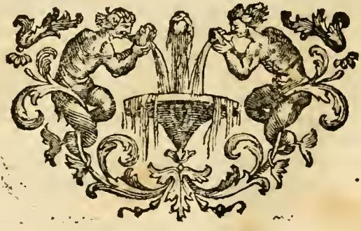

# 리치의 「Ordine(성품성사)」 도상 — 상세 해설

> **Q.** 리치가 그린 '성품성사(Ordine, 신품성사)'의 도상은?
>
> **A.** 길고 흰 옷에 왕관을 쓴 아름다운 남자가 어깨에 날개를 달고 날려는 자세이며, 위에서 값진 보석이 내려와 그쪽으로 얼굴을 향한다. 발밑에 별들을 밟고, 한 손에 석류나무 가지를, 다른 손에 다이아몬드를 들었으며 곁에 노루(또는 사슴)가 있다. 성품은 서품자에게 영적 권능을 주는 표징으로 정의된다.

---

## 0. 원문 위치와 원문 그대로의 도상 규정

출전: `assets/12 Honor to Origin of Love.md` 288~290행.

```
### ORDINE UNO DE' SETTE SACRAMENTI .
#### Del [P.] Fr. Vincenzio [Ri]cci M. O.

UOmo di bell' aspetto, con abito lungo di bianco colore, con la corona
in testa, colle ali dietro gli omeri in atto di volare, a cui di sopra
discenda preziosa gemma, ove rivolge la faccia. Tiene sotto i piedi
alcune stelle. Ha in una mano un ramo di melo granato, e nell' altra un
adamante, ed appresso un Caprio, o Cervo.
```

카드의 답은 이 한 문장을 그대로 옮긴 것이다. 즉 `Uomo di bell'aspetto`(아름다운 남자) → `abito lungo di bianco colore`(길고 흰 옷) → `corona in testa`(왕관) → `ali dietro gli omeri in atto di volare`(어깨 뒤 날개, 날려는 자세) → `preziosa gemma`가 `di sopra discenda`(위에서 내려오는 값진 보석) + `ove rivolge la faccia`(그쪽으로 얼굴을 돌림) → `sotto i piedi alcune stelle`(발밑의 별들) → `ramo di melo granato`(석류나무 가지) → `adamante`(다이아몬드) → `Caprio, o Cervo`(노루 또는 사슴)의 9개 항목이다. 리파류 도상 항목은 언제나 **① 이런 지시문(도상 처방) → ② 요소별 의미 해설**의 2단 구조를 가지며, 이 항목도 예외가 아니다.

---

## 1. 이 'Ordine'는 '질서'가 아니다 — 같은 표제어의 두 항목

이 카드에서 가장 흔한 함정. 이탈리아어 `ordine`는 보통 '질서·순서·차례'이고, 실제로 리파의 알파벳 사전에는 **`ORDINE`가 두 번 연달아** 나온다. 같은 md 파일 285~288행을 보면 순서가 이렇다.

| 표제어 | 저자 | 도상 | 뜻 |
|---|---|---|---|
| `ORDINE DIRITTO, E GIUSTO` (285행) | **Di Cesare Ripa** (리파 본인) | 오른손에 **수평추(archipendolo)**, 왼손에 **직각자(squadra)** 를 든 남자 | 기하학적·도덕적 '올바른 질서', 즉 반듯함·정당함 |
| `ORDINE UNO DE' SETTE SACRAMENTI` (288행) | **Del P. Fr. Vincenzio Ricci M. O.** (리치) | 흰 옷·왕관·날개의 아름다운 남자 (= 이 카드) | **성사(sacramentum ordinis)**, 곧 성품/신품성사 |

즉 표제어 자체가 `ORDINE **UNO DE' SETTE SACRAMENTI**`("일곱 성사 중 하나인 오르디네")로 못박아 두었다. 앞 항목이 이집트인의 수평추·직각자 상징(피에리오 발레리아노 인용)으로 '질서'를 다루기 때문에, 뒤 항목이 굳이 부제를 달아 **성사** 쪽으로 한정한 것이다. 한국어로는 **성품성사**(현재 가톨릭 공식 용어) 또는 구용어 **신품성사**, 라틴어로 *sacramentum ordinis*, 그 수여 행위가 *ordinatio*(서품)다. 라틴어 *ordo*의 원뜻이 '(성직자) 등급·품(品)'이라는 데서 '品'이 들어간 역어가 나왔다.

---

## 2. 정의문 — 페트루스 롬바르두스의 "표징"

```
L' Ordine è uno de' sette Sagramenti di Santa Chiesa, che altro non è, che un
[s]egno, nel quale all' Ordinato si dà una spirituale potestà, conforme il
Maestro delle sentenze 4. sentent. 24.
```

- 카드 답의 "**서품자에게 영적 권능을 주는 표징**"이 바로 이 문장이다: *un segno nel quale all'Ordinato si dà una spirituale potestà* = "서품된 자에게 영적 권능(potestas spiritualis)이 주어지는 표징(segno)".
- **OCR 함정**: md 원문에는 `un legno`(=나무/장작)로 잘못 읽혀 있다. 실제 단어는 `un **segno**`(표징)다. 문맥(`nel quale ... si dà una spirituale potestà`)과 아래 인용 출처가 이를 확정한다. 카드 답이 '표징'인 이유.
- **`il Maestro delle sentenze`** = *Magister Sententiarum*, 곧 **페트루스 롬바르두스(Petrus Lombardus, 1096?~1160)**. `4. sentent. 24` = 『명제집(Sententiae)』 **제4권 제24구분**, 교회 성품(*De ordinibus ecclesiasticis*)을 다루는 대목. 롬바르두스의 고전적 정의가 "Ordo est signaculum quoddam Ecclesiae, quo spiritualis potestas traditur ordinato"(성품은 서품자에게 영적 권능이 전달되는 교회의 어떤 표징이다)이고, 리치는 이것을 이탈리아어로 직역해 앞세운 것이다.
- 『명제집』은 중세~근세 신학 교육의 표준 교과서였으므로, 성사 항목을 롬바르두스 정의로 시작하는 것은 당시 설교자 대상 도상집에서 가장 안전한 '표준 인용'이었다.

---

## 3. 요소별 의미 — 리치 자신의 해설 (원문 순서대로)

| 도상 요소 | 리치의 해설 | 핵심어 |
|---|---|---|
| **아름다운 용모**(uomo di bell'aspetto) | "이 성사는 다른 모든 성사들 사이에서 사랑스럽고 아름답기(*vago*) 때문" | 성사의 탁월성 |
| **길고 흰 옷** | 받는 이에게 부여되는 "많은 권위와 탁월함(*autorità, ed eccellenza*)"의 표시. 흰색은 색들 중 고귀하고 완전하며 **기쁨(letizia)** 을 가리킴 → 서품자의 마음에 기쁨을 낳는 이 성사의 고귀함 | 권위 + 순결 + 희락 |
| **머리의 왕관** | 서품자가 지니는 **지배권(dominio)**. 특히 사제는 그 큰 권능으로 "하늘과 땅에서 지배한다". 또는 **사제 품위가 왕적 품위와 결합·일치**하기 때문 | 왕적 사제직 |
| **어깨의 날개, 날려는 자세** | "이 성품을 받은 자는 **하늘로 날아올라야** 하며, 땅의 일보다 하늘의 일(*azioni più celesti che terrene*)을 해야 하기 때문" | 천상 지향 |
| **위에서 내려오는 값진 보석(gemma)** | ★ "이 성사에서 새겨지는 **인호(carattere)** 이며, 하느님으로부터 영적으로 오고 영혼 안에 **지워지지 않게(indelebilmente)** 자리잡는다" | **character indelebilis** |
| **위로 향한 얼굴** | 서품자는 땅이 아니라 하늘을 보아야 함. 자기가 불린 복된 **몫**을 생각하며 — "**Cleros**(κλῆρος)라는 이름은 **Sors**(제비·몫) 말고는 다른 뜻이 아니다". 또는 사제는 땅의 것을 짓밟고 멸시해야 하므로 | 성직자(clerus) 어원 |
| **발밑의 별들** | "땅에 살면서도 **천사의 직무를 수행**하고 하늘의 교제(*conversazione del Cielo*)에 속하므로" 별을 발밑에 둔다 | 지상의 천사 |
| **석류나무 가지** | "타인의 구원을 위해 지녀야 할 **큰 사랑(carità)** 의 상징" — 석류 한 알에 수많은 씨가 들어 있는 데서 온 다수(多)·풍요·일치의 상징 | 카리타스 |
| **다이아몬드(adamante)** | "부서지지 않고 망치질에도 견디는" 것 → 세상의 유혹에 **똑같이 버티는 항구함**, 그리고 **교회 관할권(giurisdizione Ecclesiastica)** 을 지켜내는 강함 | 불굴·항구함 |
| **노루 또는 사슴(Caprio, o Cervo)** | "도망하는 동물, 사람들의 교제에서 떨어져 있는 동물" → 품위에 세워진 자도 이처럼 세상과 그 허영·속임수·거래·처세로부터 **물러나야** 한다. "**Religioso**(수도자)란 *a mundo relegatus*(세상에서 격리된 자) 말고는 다른 뜻이 아니다" | 세속 이탈 |

두 개의 어원 유희(**Cleros = Sors**, **Religioso = a mundo relegatus**)가 이 항목의 수사적 축이다. 리치는 신학 개념을 늘 이런 라틴어 말놀이 + 자연물 속성으로 이중 고정한다.

### 3-1. 왜 하필 '보석'이 인호인가 — 트리엔트 공의회 성품 교리

리치의 `gemma = carattere ... indelebilmente` 한 줄은 **트리엔트 공의회 제23차 회기(1563년 7월 15일)** 의 성품성사 교리·법조문을 그대로 도상화한 것이다.

- 트리엔트는 성품이 **그리스도가 제정한 참되고 고유한 성사**임을 확정했다(제3조: 부정하면 파문).
- 그리고 **제4조**: 거룩한 서품으로 성령이 주어지지 않는다거나, **인호(character)가 새겨지지 않는다**거나, 한번 사제가 된 자가 다시 평신도가 될 수 있다고 말하는 자는 파문. 세례·견진과 마찬가지로 성품에도 **"지워지지도 제거되지도 않는 인호"**(*character ... qui nec deleri nec auferri potest*)가 새겨진다는 것이 요지다.
- 이는 종교개혁 측의 '만인사제직 → 서품은 단순 직무 위임, 환속 가능' 주장에 대한 직접 반박이었다.

그래서 도상 언어가 이렇게 짜인다. **① 위에서(*di sopra*) 내려온다** = 인호는 인간이 만드는 것이 아니라 하느님에게서 옴(*viene spiritualmente da Dio*). **② 보석이다** = 깎이거나 썩지 않는 물질, 즉 지워지지 않음(*indelebilis*). **③ 그 보석 쪽으로 얼굴을 돌린다** = 인호가 영혼 안에 주체적으로 자리잡음(*è soggetta nell'anima*)과 서품자의 응답. 곁의 **다이아몬드**(망치질에도 안 깨짐)가 같은 '불멸/불변' 관념을 손에 들린 형태로 한 번 더 반복하므로, 이 도상에는 **경성(硬性) 광물 상징이 위·아래로 두 번** 배치되어 있다는 점이 시험 포인트다. 하나(하늘의 gemma)는 **받는 은총**, 다른 하나(손의 adamante)는 **행사할 덕**이라는 역할 분담.

---

## 4. '리치'는 누구인가 — 카스텔리니와 혼동하지 말 것

원문 서명은 md 290행 `Del [P.] Fr. Vincenzio [Ri]cci M. O.`이며, 같은 자산 묶음의 다른 30여 곳에는 온전하게 **`Del P. Fra Vincenzio Ricci M. O.`** 로 나온다(예: `01 Weariness to Pandering.md` 353·404·431행, `03 Machine of the World to Marriage.md` 486행, `17 Practice to Providence.md` 77·269행). 12번 파일의 `V. Fr.`는 `P. Fra`의 OCR 오독.

- **P. Fra** = *Padre Fra*(신부·수사), **M. O.** = *Minore Osservante*, 곧 **프란치스코회 준수파(작은 형제회 옵세르반티)** 소속.
- 본명 **빈첸초 리치 다 산 세베로(Vincenzo Ricci da S. Severo)**, 신학자. 저서 **『Geroglifici morali』(도덕적 상형문자, 나폴리 1626)** — "설교자·연설가와 그 밖의 학인들에게 유용한", 따라야 할 덕과 피해야 할 악덕을 다룬 알레고리 지침서.
- 리치는 **화가·도안자가 아니라 글로 도상을 처방한 저자**다. 즉 "리치가 그린"은 붓으로 그린 것이 아니라 **문장으로 그린(도상을 규정한)** 것이다.
- 이 리치 텍스트들이 리파 본문에 들어온 경로는 18세기 페루자 판본, 곧 **체사레 오를란디(Cesare Orlandi) 편 『Iconologia del cavaliere Cesare Ripa, perugino』(Perugia, 1764~1767, 전 5권)** 이다. 이 판은 리파 원본에 오를란디의 주석과 **리치 『Geroglifici morali』에서 가져온 도상 처방**, 부다르(Boudard)의 파르마 판 이미지 소개 등을 대량 증보했다. 실제로 같은 md 파일 안에 `(a) Il Sig. Boudard nella sua Edizione di Parma...`(206행) 같은 편자 각주가 섞여 있는 것이 이 판본의 특징이다. 우리 자산에 실린 이탈리아어 본문·판화는 모두 이 페루자 판 계열이다.
- 리치의 기고는 대개 **각주 (a)(b)... 안의 요약 인용** 형태(`Il P. Ricci figura la ...`)로 들어가지만, **성사 항목처럼 리파 원본에 대응 항목이 없을 때는 독립 표제어로 승격**된다. 이 `ORDINE UNO DE' SETTE SACRAMENTI`가 그런 경우다.

### 카스텔리니와의 구별 (중요)

| | **Vincenzio Ricci** | **Giovanni Zaratino Castellini** |
|---|---|---|
| 신분 | 프란치스코회 준수파 수사·신학자 (산 세베로) | 로마의 문인·고전학자 |
| 리파와의 관계 | 별개 저작 『Geroglifici morali』(1626)의 저자. **18세기 오를란디 페루자 판**이 이를 인용·증보 | **17세기 확장판**(1618 파도바, 1625 베네치아 등)에 **새 항목을 직접 집필해 추가**한 협력자 |
| 도안자인가 | 아니오 (텍스트만) | 아니오 (텍스트만) |

`assets/12 Honor to Origin of Love.md`는 이 둘을 **바로 붙여** 보여주는 좋은 사례다: 288행 `ORDINE ... / Del P. Fr. Vincenzio Ricci M. O.` 다음에 곧바로 320~322행 `ORIGINE DI AMORE / Di Giovanni Zaratino Castellini`(투명한 볼록 거울로 태양광을 모아 횃불에 불을 붙이는 여인, 명구 `SIC IN CORDE FACIT AMOR INCENDIUM`)가 온다. 즉 **두 서명은 이 파일 안에서 몇 줄 차이로 인접해 있을 뿐, 서로 다른 세기의 서로 다른 기고자**다. "리치 = 카스텔리니 계열 확장판의 도안자"는 성립하지 않는다.

한편 **판화의 실제 도안·판각자**는 판 하단 서명으로 확인된다. 아래 fig-2의 좌하단 `Carlo Mariotti del.`(도안), 우하단 `Carlo Grandi inc.`(판각) — 페루자 판 도판을 만든 현지 화가·판각공이다. 즉 이 책에서 **처방(리치·카스텔리니·리파) / 도안(Mariotti) / 판각(Grandi)** 은 완전히 다른 사람들이다.

---

## 5. 리파의 '일곱 성사' 연작 안에서의 위치

『Iconologia』는 알파벳순 표제어 사전이므로 '일곱 성사'가 한자리에 묶인 별도 장(章)이 아니라 **알파벳 순서대로 흩어져** 실린다. 그래서 연작이면서도 연달아 보이지 않는다.

| 성사 | 이탈리아어 표제어 | 알파벳 위치 |
|---|---|---|
| 세례 | Battesimo | B |
| 견진 | Cresima / Confermazione | C |
| 성체 | Eucaristia | E |
| 고해 | **Penitenza** | P |
| 병자성사 | Estrema Unzione | E |
| **성품** | **Ordine** | **O** ← 이 카드 |
| 혼인 | **Matrimonio** | M |

우리 자산(『Onore』~『Quiete』 구간, 파일 01~18)에서 실제로 확인되는 것은 세 개다.

- `03 Machine of the World to Marriage.md` 484행 — **`MATRIMONIO, UNO DE' SAGRAMENTI, / Del P. Fra Vincenzio Ricci M. O.`** : 서로 신의(fede)를 주고받는 남녀, 각자 어깨에 **돌** 하나(혼인은 무거운 짐이고 서로의 짐을 진다), 한쪽 손에 **해골**(죽음으로만 풀리는 결합)과 늘어진 **반지 두 개**, 다른 쪽에 **삼겹줄**(끊기 어려움)과 **리라**(화합), 발 하나는 쇠에.
- `12 Honor to Origin of Love.md` 288행 — **`ORDINE UNO DE' SETTE SACRAMENTI`** (이 카드).
- `15 Madness to Stubbornness.md` 255행 — **`Penitenza`**(각주 형태): 무릎 꿇고 굽은 여인, 손에 묵주, 앞에 빵·물·채찍이 놓인 작은 상, 수척한 얼굴, 고행복(cilicio), **어깨의 날개**, 위에 왕관을 곁들인 **splendore**.

여기서 알 수 있는 **연작의 조형 문법**: `ORDINE`와 `Penitenza`가 공유하는 **어깨의 날개 + 위에서 내려오는 하늘의 빛/보석(splendore·gemma) + 위로 향한 얼굴**이 리치가 성사류·초자연 은총류 항목에 반복 사용하는 세트다. 곧 성품성사 도상의 개별 요소를 외울 때는 "**날개+하늘의 은총 = 성사 공통 문법**, **왕관+별+석류+다이아몬드+노루 = 성품 고유 표지**"로 갈라 두면 혼동하지 않는다.

또한 표제어 `ORDINE UNO DE' SETTE SACRAMENTI` 자체가 "**일곱** 성사 중 하나"를 명시하므로, 이 표제 문구는 트리엔트가 확정한 **성사 칠성사 체계**를 항목 제목 수준에서 선언하는 기능도 한다.

---

## 6. 성경 논증부 — `Alla Scrittura Sagra`

리치는 요소별 해설 뒤에 `Alla Scrittura Sagra`(성경으로) 절을 붙여 각 요소에 성경 구절을 하나씩 대응시킨다. 설교자용 도상집의 전형적 마감이다.

| 요소 | 원문이 든 구절 | 라틴어 |
|---|---|---|
| 아름다운 용모 / 흰 옷 | 원문 표기 `43.` (집회서 43장) | *Pulchritudinem candoris eius admirabitur oculus* — "눈이 그 흰빛의 아름다움에 감탄하리라" |
| 왕관 | (원문은 `Prov. 4 v. 2`로 오기, 실제는 **1베드 2,9**) | *Vos autem genus electum, regale sacerdotium, gens sancta, populus acquisitionis* — "너희는 선택된 겨레, **왕적 사제단**" |
| 하늘의 보석(은총의 선물) | (원문은 `2 Pet. 2 v. 9`로 오기, 실제는 **잠언 4,2**) | *Donum bonum tribuam vobis, legem meam ne derelinquatis* |
| 위로 향한 얼굴 | 에제키엘 (원문 절 표기 결락, **에제 21,2** 계열) | *Fili hominis, pone faciem tuam ad Ierusalem, et [stilla] ad sanctuaria* |
| 발밑의 별 | `Philip. 3. v. 20` (**필리 3,20**) | *Nostra autem conversatio in caelis est* — "우리의 시민권은 하늘에 있다" |
| (세속 이탈 보강) | `1 Joann. 2. v. 15` / `Coloss. 3 v. 2` | *Nolite diligere mundum* / *Quae sursum sunt sapite, non quae super terram* |
| 석류나무 가지 | `Cant. 2. v. 4` (**아가 2,4**) | *Introduxit me in cellam vinariam, ordinavit in me charitatem* |
| 다이아몬드 | `Osea 11. v. 8` (**호세 11,8**) | *Quomodo dabo te sicut Adam[a], ponam te ut Seboim* |
| 노루/사슴 | `Cant. 8. v. 14` (**아가 8,14**) | *Fuge dilecte mi, et assimilare **capreae** hinnuloque **cervorum** super montes aromatum* |

- 마지막 아가 8,14의 *caprea*(노루)와 *hinnulus cervorum*(사슴의 새끼)이 곧 도상의 **`Caprio, o Cervo`** 의 직접 출처다. 즉 이 동물은 리치가 임의로 고른 것이 아니라 **아가서 마지막 절의 어휘를 그대로 옮긴** 것이며, 아가 해석 전통에서 사제 영혼의 신비적 도피(*fuge*)를 뜻한다. → 카드 답의 "노루(또는 사슴)"가 왜 **둘 중 하나로 흔들리는 표기**인지가 이 지점에서 설명된다. 원문 자체가 `Caprio, **o** Cervo`(노루 **또는** 사슴)로 양자택일을 허용한다.
- 석류나무 가지 ↔ 아가 2,4의 *ordinavit in me charitatem*("내 안에 사랑을 **질서 있게** 놓으셨다")도 절묘하다. 동사 *ordinare*가 표제어 `Ordine`와 어근이 같아, '성품(ordo)'과 '질서 잡힌 사랑(caritas ordinata)'을 말놀이로 연결한다. 1절에서 본 '질서 vs 성사'의 두 뜻이 사실 여기서 의도적으로 겹쳐 쓰인다.
- 왕관 구절과 보석 구절의 출처 표기가 **서로 뒤바뀐 채 인쇄**된 점(1베드 2,9 ↔ 잠언 4,2)은 페루자 판/OCR 단계의 오류다. 원문을 인용할 때 주의.

---

## 7. 이 항목의 도판 — 자산 실사 결과

`12 Honor to Origin of Love.md`에 걸린 판화 참조는 **딱 3개**(`_page_286`, `_page_291`, `_page_292`)이고, 세 장을 모두 직접 열어 확인한 결과 **`ORDINE` 항목의 인물 판화는 자산에 존재하지 않는다.** 판별 근거:

- `_page_292_Picture_3.jpeg` — 하단 캡션 `Origine d'Amore`, 좌하단 `C. M. del.` 서명. 여인이 **손잡이 달린 볼록 거울**로 우상단 **태양** 광선을 모아 왼손의 **횃불**에 불을 붙이고, 거울 손잡이에서 늘어진 **띠(cartella)** 에 `SIC IN CORDE / AMOR / INCENDIVM`이 새겨져 있다. → 카스텔리니의 다음 항목 **「사랑의 기원」** 도판이며 성품성사와 무관.
- `_page_286_Picture_2.jpeg` — 하단 캡션 `Orazione`, 상단 표제 `Di Cesare Ripa`. → 바로 앞 항목 **「기도」** 도판(fig-2).
- `_page_291_Picture_3.jpeg` — 인물 도상이 아니라 **장식 소품(테일피스)**. md에서 이 참조는 `Ordine` 본문 마지막 문장(`Cant. 8. v. 14 ... montes aromatum`) 직후, 다음 표제 `ORIGINE DI AMORE / TOMO QUARTO 285` 바로 앞에 놓여 있다. 즉 **`Ordine` 기사를 닫는 꼬리 장식**이다(fig-1).
- 추가 확인: 미러링된 149장의 페이지 번호를 전수 조사했을 때 **287~290, 293~321번 페이지 이미지가 아예 없다.** `Ordine` 본문이 놓인 인쇄면(TOMO QUARTO 283~284)에 해당하는 추출물이 없으므로, 이 판본에서 리치 계열 증보 항목에는 전용 판화가 붙지 않았거나 추출 단계에서 빠진 것이다.

### fig-1 — `Ordine` 기사를 닫는 테일피스 (`_page_291_Picture_3`)



좌우 대칭의 아칸서스 당초 사이에서 **두 마리 반인반수(사티로스형 인물)** 가 손에 든 그릇으로 가운데 **원뿔형 분수 대야**에 물을 쏟아붓는 목판 소품이다. 인물 도상이 아니므로 카드의 상징(날개·왕관·보석·별·석류·다이아몬드·노루)과 직접 대응하지 않는다. 다만 **본문 지면상 이 카드 항목에 물리적으로 속한 유일한 이미지**이므로, 이 장식이 나오는 지점이 곧 `Ordine` 기사의 끝이라는 위치 표지로 쓸 수 있다(그 직후 표제어가 `ORIGINE DI AMORE`).

### fig-2 — 같은 판본·직전 항목 「Orazione(기도)」 (`_page_286_Picture_2`)


성품성사 도판이 없으므로, **같은 판본에서 같은 조형 문법을 쓰는 바로 앞 항목**으로 대체 관찰한다. 이 판에서 실제로 확인되는 것들:

- **위로 치켜든 얼굴 + 좌상단에서 구름을 뚫고 내려오는 광선(splendore)**: 무릎 꿇은 여인이 얼굴을 들어 하늘의 빛을 응시한다. → `Ordine` 도상의 **`a cui di sopra discenda preziosa gemma, ove rivolge la faccia`**(위에서 내려오는 보석 쪽으로 얼굴을 돌림)와 **완전히 같은 배치**다. 성품성사 판화라면 이 광선 자리에 **광채 나는 보석 한 알**이 놓이고, 인물은 무릎 꿇은 대신 **어깨 날개를 펴고 날아오르려는 자세**가 된다.
- **길고 흰 옷**: 이 여인의 흰 장의는 `Ordine`의 `abito lungo di bianco colore`가 실제 판화에서 어떻게 표현되는지를 보여준다(리치의 해설대로 흰색 = 고귀·완전·기쁨).
- **오른손의 향로(incensiere), 왼손을 펼친 자세, 발밑의 구름·언덕**: `Ordine`에서는 이 손 자리에 각각 **석류나무 가지**와 **다이아몬드**가, 발밑에는 구름 대신 **별들**이 들어가고, 곁에 **노루/사슴**이 추가된다. 즉 리치·리파 도상은 "① 옷·자세 ② 얼굴 방향 ③ 양손 지물 ④ 발밑 ⑤ 곁의 동물"의 다섯 슬롯을 채우는 조립식 구조이며, `Ordine`은 그 다섯 슬롯이 모두 채워진 완전형(⑤ 노루/사슴까지)이다.
- **하단 서명 `Carlo Mariotti del.` / `Carlo Grandi inc.`**: 4절에서 말한 대로, 도안자·판각자가 텍스트 저자(리치·카스텔리니)와 별개임을 눈으로 확인할 수 있는 지점.

---

## 8. 암기용 정리

**한 문장 요약** — 리치의 「Ordine」는 *흰 장의·왕관·날개* 를 갖춘 미남자가 *하늘에서 내려오는 보석*(= 지워지지 않는 인호)을 우러르며 *별을 밟고* 한 손에 *석류*(카리타스), 다른 손에 *다이아몬드*(불굴·관할권 수호)를 들고 *노루/사슴*(세속 이탈)을 곁에 둔 상으로, 롬바르두스의 정의 "서품자에게 영적 권능을 주는 **표징**"을 시각화한 것이다.

**슬롯 5개 + 정의 1개로 회상**

1. 옷·자세 → 흰 장의, **날개**, 날려는 몸짓 (천상 지향 / 권위·기쁨)
2. 머리 → **왕관** (왕적 사제직, 하늘과 땅의 지배)
3. 얼굴 → 위에서 내려오는 **보석** 을 향함 (**character indelebilis**, 트리엔트 23차)
4. 발밑 → **별** (땅에 살며 천사의 직무)
5. 두 손 → **석류 가지**(사랑) + **다이아몬드**(항구함)
6. 곁 → **노루/사슴** (아가 8,14, *a mundo relegatus*)
7. 정의 → 롬바르두스 『명제집』 IV, 24: **영적 권능을 주는 표징**

**혼동 주의 3종**
- `ORDINE 디리토 에 주스토`(수평추+직각자, 리파) ≠ `ORDINE 성사`(이 카드, 리치)
- `리치`(프란치스코회 준수파, 『Geroglifici morali』 1626, 오를란디 페루자 판이 증보 인용) ≠ `카스텔리니`(17세기 확장판 기고자, 바로 뒤 「사랑의 기원」)
- 광물 상징 두 개: 하늘의 **gemma** = 받은 은총(인호) / 손의 **adamante** = 행사할 덕(불굴)

---

## 참고

- 원본 자산: `/Users/swcho/projects/swcho/default/books/260801 Iconologia/.fm/assets/12 Honor to Origin of Love.md` (285~330행)
- 판본: Cesare Ripa, *Iconologia del cavaliere Cesare Ripa, perugino*, ed. Cesare Orlandi, Perugia 1764–1767 (Tomo Quarto) — [Internet Archive](https://archive.org/details/iconologiadelcav04ripa)
- Vincenzo Ricci, *Geroglifici morali* (Napoli, 1626) — [Internet Archive](https://archive.org/details/geroglificimoral01ricc)
- 트리엔트 공의회 제23차 회기(1563.7.15) 성품성사 교리와 법조문 — [Wikisource](https://en.wikisource.org/wiki/Canons_and_Decrees_of_the_Council_of_Trent/Session_XXIII/Sacrament_of_Orders), [Hanover Historical Texts](https://history.hanover.edu/texts/trent/ct23.html)
