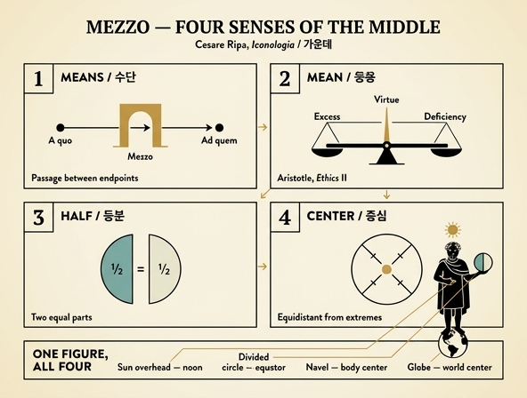

# 가운데(MEZZO)의 네 가지 의미

> **Q.** '가운데(Mezzo)'의 여러 의미는 어떻게 정리되는가?
>
> **A.** 첫째, 무언가를 이루는 수단(운동에서 출발점과 도착점 사이의 매개). 둘째, 과잉과 결핍 사이의 중용(아리스토텔레스 '중용은 중간과 완전함을 찾는 덕'). 셋째, 어떤 것을 둘로 똑같이 나눈 등분. 넷째, 극단들에서 같은 거리에 있는 부분(원의 중심)이다.

---

## 1. 이 항목이 놓인 자리

체사레 리파(Cesare Ripa)의 『이코놀로지아』 제4권, 「형이상학(Metafisica)」 바로 뒤에 「**MEZZO**」 항목이 온다. 이탈리아어 *mezzo*는 한 단어로 우리말의 '수단·중간·절반·중심'을 모두 뒤덮는다. 리파는 그림을 설명하기 전에 먼저 이 낱말의 **의미를 넷으로 갈라놓고**, 그다음에 각 의미를 하나씩 형상에 박아 넣는다. 그래서 이 카드는 '도상 해설'이 아니라 **개념 분류(divisio)** 를 묻는 카드다.

원문은 이렇게 시작한다.

> *"Per il Mezzo, possiamo significare diverse cose."*
> ("Mezzo로 우리는 여러 가지를 뜻할 수 있다.")

## 2. 네 가지 의미 — 원문에 따른 정리

| # | 의미 | 원문 표현 | 대표 예 | 오늘날 낱말 |
|---|---|---|---|---|
| 1 | **수단 · 매개** | *un istrumento, per mezzo del quale si fa qualche cosa* | 국소운동의 세 요소 중 '통과하는 중간' | medium / means |
| 2 | **중용 (덕)** | *la mediocrità delle cose tra l'eccesso e il difetto* | 아리스토텔레스의 중용 | the mean |
| 3 | **등분 (절반)** | *una parte uguale di una cosa, quale spartita in due parti* | 반으로 자른 두 조각 | half |
| 4 | **등거리 지점 (중심)** | *quella parte, che egualmente dista dagli estremi* | 원의 중심(centro) | center |

### (1) 수단으로서의 가운데 — *per mezzo del quale*

첫째 의미는 **"그것을 통해 무언가가 이루어지는 도구"** 다. 리파는 스콜라 자연학의 국소운동(*moto locale*) 분석을 그대로 끌어온다. 운동에는 세 가지가 고려된다.

- **terminus a quo** — 출발하는 지점
- **terminus ad quem** — 도착하는 지점
- **il mezzo per il quale** — 움직이는 것이 **통과해 지나가는 중간**

즉 '가운데'는 두 끝점 사이에 있으면서 이동을 **가능하게 하는 통로**다. 여기서 위치상의 '중간'이 곧 기능상의 '수단'으로 미끄러진다. 한국어 '수단(手段)'과 이탈리아어 *mezzo*, 영어 *means*, 라틴어 *medium*이 같은 은유를 공유한다는 점을 기억하면 외우기 쉽다. ("~을 통해서"의 *per mezzo di*가 곧 "~라는 매개로".)

### (2) 중용으로서의 가운데 — 과잉과 결핍 사이

둘째 의미는 윤리학의 중용이다. 리파의 표현은 **"과잉(eccesso)과 결핍(difetto) 사이의 적정함(mediocrità)이며, 두 극단 모두에 참여하는 것"** 이다. '두 극단에 모두 참여한다(*partecipi di tutte due gli estremi*)'는 대목이 핵심이다. 중용은 양극단을 **배제한 제3의 것이 아니라**, 둘 사이에서 둘을 견주어 잡아낸 지점이다.

근거로 두 인용이 붙는다.

- **아리스토텔레스, 『니코마코스 윤리학』 제2권** (리파가 라틴역으로 인용)
  > *Mediocritas est quaedam virtus medii, et perfecti indagatrix.*
  > "중용은 중간과 완전한 것을 **찾아내는(indagatrix)** 일종의 덕이다."

  여기서 *indagatrix*(여성형 '탐색자·추적자')라는 낱말이 중요하다. 중용은 미리 주어진 눈금이 아니라 상황마다 **사냥해 찾아내야 하는** 것이다. 아리스토텔레스가 말한 '우리에게 상대적인 중간(*pros hēmas*)'의 취지와 통한다.

- **마르티알리스, 『에피그람』 제1권**
  > *Illud quod medium est, inter utrumque probatur.*
  > "양쪽 사이에 있는 그 중간이 인정받는다."

리파는 뒤에서 이 의미를 다시 강조한다. 황금 망토와 월계관이 뜻하는 **덕의 값어치는 '가운데'에 있다**는 것이다.

> *la virtù, la quale consiste nel Mezzo* — "덕은 가운데에 있다"

그리고 헤시오도스를 끌어 **"Dimidium plus toto"(절반이 전체보다 많다)** 라고 하고, 플라톤 『국가』를 덧붙인다. 이유는 명료하다. **완전함은 '전체'에 있지 않다. 전체는 극단까지 포함하고, 극단은 때때로 악덕이며 해롭기 때문이다.** ('전체=양극단 포함' → '절반=중간만' → 그래서 절반이 전체보다 낫다.)

### (3) 등분으로서의 가운데 — 반으로 나눈 두 몫

셋째는 순수하게 **양적·분할적** 의미다. 어떤 것을 두 부분으로 나누었을 때 그 두 부분이 서로 같으면, 각각이 그것의 *mezzo*(절반)다. 우리말 '가운데'보다는 '반(半)'에 해당하는 용법이다. 도상에서는 **똑같이 둘로 나뉜 원**이 이 의미를 담당한다.

### (4) 중심으로서의 가운데 — 극단에서 등거리

넷째는 **기하학적 중심**이다. "극단들로부터 똑같이 떨어져 있는 부분", 곧 **원의 중심점(Centro)** 이다. 두 권위가 나란히 인용된다.

- **에우클레이데스**: 중심에서 원주로 그은 모든 선(반지름)은 서로 같다.
- **아리스토텔레스, 『니코마코스 윤리학』 II. 6**
  > *Rei medium appello id quod aeque abest ab utraque extremitate.*
  > "나는 사물의 중간을 '양쪽 극단에서 같은 거리에 있는 것'이라 부른다."

여기서 (2)와 (4)가 **같은 문장으로 묶인다**는 점을 놓치지 말아야 한다. 아리스토텔레스가 윤리적 중용을 정의할 때 쓴 표현이 바로 기하학적 등거리다. 리파의 네 의미는 흩어진 동음이의어 목록이 아니라, **기하학적 중심을 원형으로 삼아 윤리·운동론·산술로 퍼져 나간 하나의 은유 가족**이다.

### 외우기 위한 축약

**수단 → 중용 → 절반 → 중심** = **medium → mean → half → center**
(통로로서의 가운데 / 덕으로서의 가운데 / 양으로서의 가운데 / 위치로서의 가운데)

## 3. 리파가 이 넷을 하나의 인물상에 담는 방법

리파의 도상 지시문은 이렇다.

> **장년의 남자**가 **지구의(地球儀) 위에** 아름다운 자세로 서 있다. **황금 망토**를 두르고 머리에 **월계관**을 썼다. **오른손**으로는 **똑같이 두 부분으로 나뉜 원**을 우아하게 들고, **왼손 집게손가락**으로는 **배꼽**을 가리킨다. 그리고 **머리 위 수직으로 태양**이 있다.

각 요소가 위 네 의미(특히 3·4번)를 나누어 맡는다.

| 도상 요소 | 뜻 | 대응 의미 |
|---|---|---|
| 장년(età virile) | 인생 연수의 중간이며 심신의 덕이 절정인 나이 | 중용 |
| 지구의 위에 서기 | 땅은 가장 무거워 세계의 중심에 있다 | 중심 |
| 황금 망토·월계관 | 완전함과 덕의 값 — "덕은 가운데에 있다" | 중용 |
| 둘로 나뉜 원 | 천구를 균등히 가르는 춘추분 대원(적도) | 등분 |
| 배꼽을 가리킴 | 배꼽은 인체 전체의 중앙 | 중심 |
| 머리 위 태양 | 자오선상의 정오, 그리고 일곱 행성의 가운데 | 중심 |

세부 근거도 촘촘하다.

- **장년**: 이 나이에 체액의 조화(*temperamento*)가 가장 왕성하고, 이성이 이끄는 사추덕(**용기·현명·절제·정의**)을 온전히 인식하고 쓸 수 있다.
- **지구의**: 무게 때문에 땅은 하늘에서 가장 먼 가장 낮은 자리, 곧 세계의 중심을 차지한다. 마닐리우스의 시행과 **요한네스 사크로보스코 『천구론』** 1장이 근거로 인용된다 — *"terra ... ad punctum illum naturaliter tenditur"*(무거운 것은 본성상 중심점으로 향한다).
- **황금**: 파라켈수스주의자들이 대우주와 소우주를 대응시키며 **은=뇌, 금=심장**이라 한 데 따른다. 해부학자들에 따르면 심장은 인간의 가운데에 있고, 거기서 모든 완전함과 신체의 균형이 나온다. 아리스토텔레스 인용 — ***primum vivens, ultimum moriens***(가장 먼저 살고 가장 늦게 죽는 것).
- **둘로 나뉜 원**: 파라보스코가 '춘추분 콜루르'라 부른 원. 세계의 양극을 지나 천구를 두 등분하고, 지점(至點)의 콜루르에서 등거리에 있다. 태양이 게자리 초입에 오면 하지, 염소자리에 닿으면 동지, 양자리 초입에서 춘분, 천칭자리에서 추분이 된다. 이 원을 지날 때 낮과 밤이 각 12시간이므로 **적도(Equatore)** 라고도 하고, 띠처럼 천구를 반으로 감으므로 **제1동자의 띠(cingolo del primo mobile)** 라고도 한다.
  > *Hic duo Solstitia faciunt Cancer, Capricornus, / Sed noctes aequat Aries, et Libra diebus.*
- **배꼽**: 피에리오 발레리아노 『상형문자』 34권, 그리고 갈레노스 『인체 부분의 활용』 15권 4장. 갈레노스는 몸의 중앙이 심장인지 배꼽인지 따지고서, **심장은 가슴의 중앙, 배꼽은 몸 전체의 중앙**이라고 정리한다. 팔다리를 벌려 사각형에 넣어 보아도 배꼽이 중심이다(비트루비우스적 인체 비례 전통).
- **머리 위 태양**: 자오선을 지나는 순간이 곧 **정오(mezzogiorno)** 이며, 그 선은 하늘을 두 부분으로 나눈다. 더 나아가 태양은 **일곱 행성의 가운데**다. 프톨레마이오스와 알바타니에 따르면 태양은 달·수성·금성보다 위, 토성·목성·화성보다 아래에 있어 **다른 행성들의 규범이자 척도**가 된다. 알부마사르의 논변도 붙는다 — 신이 태양을 토성 위에 두었다면 너무 멀어 아래 세계에 작용하지 못하고 땅은 차갑게 남았을 것이고, 달 아래에 두었다면 너무 느리고 너무 가까워 아래 것들을 다 태워버렸을 것이다. **가운데 있기에 그 작용이 알맞게 조절된다.**

여기서 오비디우스 『변신』 1권, 태양 수레에 오르려는 파에톤에게 포이보스가 준 경고가 인용된다. 이 항목 전체의 표어라 할 만하다.

> *Altius egressus caelestia signa cremabis: / Inferius terras; **medio tutissimus ibis**.*
> "너무 높이 가면 천상의 별자리를 태울 것이고, 너무 낮으면 땅을 태울 것이다. **가운데로 가면 가장 안전하리라.**"

마지막으로 리파는 태양을 **왕이자 행성들의 심장**으로 부르며, 왕이 왕국의 가운데에 있고 심장이 동물의 가운데에 있는 것과 같다고 한다. 모든 지체를 **똑같이** 도울 수 있기 위해서다. 그리고 '일곱 행성의 공화국'이라는 재치 있는 알레고리를 덧붙인다.

| 행성 | 직책 | 이유 |
|---|---|---|
| 태양 | 왕 | 가운데에서 모두에게 빛을 나눔 |
| 토성 | 고문관 | 노령 |
| 목성 | 만인의 재판관 | 관대함(magnanimità) |
| 화성 | 군사령관 | 무력 |
| 금성 | 가산을 분배하는 주모(主母) | 모성 |
| 수성 | 비서·서기관 | 말과 문서 |
| 달 | 대사(大使) | 운행이 빨라 매달 전역을 순회 |

## 4. 시험 포인트

- 네 의미의 **순서와 짝**: ① 수단(운동의 매개) ② 중용(과잉/결핍) ③ 등분(절반) ④ 중심(등거리).
- ②의 인용 출처는 **아리스토텔레스 『니코마코스 윤리학』 제2권**, "중용은 중간과 완전함을 찾아내는 덕". 보조 인용은 **마르티알리스**.
- ④의 인용 출처는 **에우클레이데스(반지름의 동일성)** 와 **아리스토텔레스 『니코마코스 윤리학』 II.6(양극단 등거리)**.
- ②와 ④가 같은 정의를 공유한다는 점 — **윤리적 중용의 정의가 기하학적 중심의 정의와 동일**하다.
- "**절반이 전체보다 많다(Dimidium plus toto)**"의 논리: 전체는 악덕일 수 있는 극단까지 포함하므로.
- 도상 요소와 의미의 대응, 특히 **둘로 나뉜 원 = 등분(적도/춘추분 원)**, **배꼽·지구의·정오의 태양 = 중심**.

## 인포그래픽

