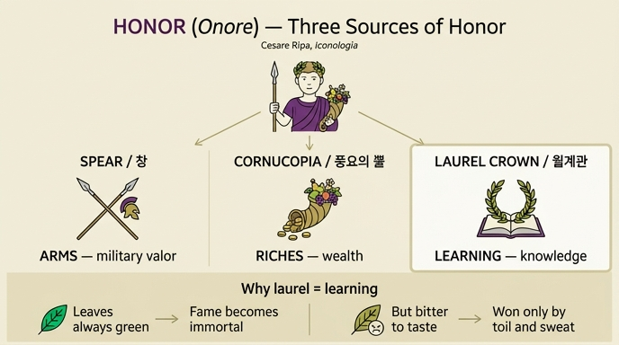

# 명예(Onore)의 세 지물: 창 · 풍요의 뿔 · 월계관

> **Q.** 명예 도상에서 창·풍요의 뿔·월계관은 무엇을 뜻하는가?
>
> **A.** 사람이 명예를 얻는 세 가지 주된 원천인 **무예(창)**, **부(풍요의 뿔)**, **학문(월계관)** 을 뜻한다. 월계수 잎이 늘 푸르되 맛이 쓰듯, 학문은 명성을 불멸케 하지만 많은 수고와 땀 없이는 얻지 못한다.

---

## 1. 출처 도상 전체 (Cesare Ripa, *Iconologia*, 「ONORE」 첫 번째 항목)

리파가 직접 규정한 명예의 인물상은 다음과 같다.

> "아름다운 젊은이. 자색(porpora) 옷을 입고 월계관을 썼으며, **오른손에는 창(asta)**, **왼손에는 열매·꽃·잎이 가득 담긴 풍요의 뿔(cornucopia)** 을 들었다."

리파는 명예를 "덕 있는 영혼들이 자유롭고 자발적으로 내어주는 것에 붙은 이름이며, 그 덕의 보상으로 사람에게 돌려지고, 정직함(l'onesto)을 목적으로 추구되는 것"으로 정의하고, 토마스 아퀴나스(*Summa* II-II, q.29)의 문구를 인용한다 — **"honor est cuiuslibet virtutis praemium"**(명예는 모든 덕의 보상이다).

부수 지물의 뜻:

| 요소 | 의미 |
|---|---|
| 젊고 아름다움 | 이유나 삼단논법 없이도 그 자체로 누구나 끌리고 원하게 만드는 것이기 때문 |
| 자색(purple) 의복 | 왕의 장식이자 **최고의 명예**를 나타내는 표지 |

## 2. 핵심 대응 — 세 지물 = 명예의 세 원천

원문: *"L'asta, e il cornucopia, e la corona di alloro significano le tre cagioni principali, onde gli Uomini sogliono essere onorati, cioè la scienza, la ricchezza, e le armi."*
("창과 풍요의 뿔과 월계관은 사람들이 명예를 받게 되는 세 가지 주된 원인, 곧 학문·부·무예를 뜻한다.")

| 지물 | 원어 | 원천 | 원어 |
|---|---|---|---|
| 창 | asta | **무예 / 군사적 공훈** | armi |
| 풍요의 뿔 | cornucopia | **부 / 재산** | ricchezza |
| 월계관 | corona di alloro | **학문 / 지식** | scienza |

⚠️ **암기 함정**: 리파는 지물을 "창 → 뿔 → 월계관" 순으로 열거하고, 그 의미는 "학문 → 부 → 무예" 순으로 **역순(교차 대응, chiasmus)** 으로 적었다. 순서대로 1:1 매칭하면 창=학문으로 틀린다. 뒤이어 리파가 직접 "*e l'alloro significa la scienza*"(그리고 월계수는 학문을 뜻한다)라고 못 박아 주므로, **월계관=학문**을 고정점으로 잡고 나머지를 배치하면 안전하다.

## 3. 월계수 비유의 두 겹 — 왜 하필 학문인가

리파가 월계수를 학문에 배당한 근거는 잎의 **두 가지 성질을 동시에** 읽어내는 데 있다.

| 월계수의 성질 | 학문의 성질 |
|---|---|
| 잎이 **늘 푸르다**(foglie perpetuamente verdi) | 학문은 그것을 지닌 사람의 **명성을 불멸케 한다**(fa immortale la fama) |
| 그런데 **맛이 쓰다**(amare al gusto) | 그러나 **많은 수고와 땀 없이는 얻지 못한다**(non si acquista senza molta fatica, e sudore) |

즉 상록(常綠) = 불멸의 영예라는 **보상**, 쓴맛 = 그 보상에 이르는 **대가**. 한 그루 나무 안에 결과와 조건이 함께 들어 있다는 점이 이 알레고리의 묘미다.

**헤시오도스 전거**: 리파는 곧이어 헤시오도스를 인용한다. 무사이(Muse)들이 그에게 **월계수 홀(scettro di lauro)** 을 주었는데, 그는 가난한 처지(*in bassa fortuna*)에서 **많은 노고를 거쳐** 사물에 대한 학문과 자기 이름의 불멸에 도달했다는 것이다. 『신들의 계보』 도입부(30행 전후)에서 무사이가 헤시오도스에게 무성한 월계수 가지를 홀로 건네고 신적인 목소리를 불어넣는 장면이 그 출처이며, 여기서 월계수는 곧 "수고로 획득한 학문 → 불멸의 명성"이라는 회로 자체를 상징한다.

## 4. 같은 「ONORE」 항목의 다른 변형들과 비교하면 더 선명하다

리파는 명예를 네 가지 판본으로 제시한다. 지물이 조금씩 갈리므로 대조해 두면 혼동을 막을 수 있다.

1. **제1 도상(위 문항 대상)** — 자색 옷 + **월계관 + 창 + 풍요의 뿔** → 학문·무예·부.
2. **제2 도상** — 위엄 있는 남자, **야자(palma)관**, 금 목걸이와 금 팔찌, 오른손에 창, 왼손에 두 신전이 그려진 방패와 명구 *Hic terminus haeret*.
   - 야자: 아울루스 겔리우스 『아티카 야화』 3권 — 무거운 것을 얹어도 굽지 않고 오히려 솟구치므로 **승리**의 표지. 보카치오에 따르면 명예는 **승리(Vittoria)의 아들**이므로 어머니의 표장을 달아야 한다.
   - 창과 방패: 피에리오 발레리아노(42권) — 고대 왕들이 왕관 **대신** 지녔던 표장. 베르길리우스 『아이네이스』 6권의 "창에 몸을 기댄 저 젊은이"(아이네아스 실비우스).
   - 두 신전: **덕의 신전(Templum Virtutis)을 통과하지 않으면 명예의 신전(Templum Honoris)에 들어갈 수 없다** → 참된 명예는 오직 덕에서 난다.
   - 금 팔찌·금 목걸이: 플리니우스 『박물지』 35권 — 로마인이 전장에서 용맹히 싸운 자에게 준 **고대의 명예 표지**(포상).
3. **안토니누스 피우스 메달** — 길고 가벼운 옷의 젊은이, 한 손에 **월계 화환**, 다른 손에 잎·꽃·열매가 가득한 **풍요의 뿔**.
4. **비텔리우스 메달** — 오른손에 **창**, 가슴을 반쯤 드러냄, 왼손에 **풍요의 뿔**, 왼발 옆에 **투구(elmo)**.
   - 창과 드러난 가슴: 명예는 **힘으로 지키고 결백함으로 보존**해야 한다.
   - 풍요의 뿔과 투구: 명예를 쉽게 얻게 해 주는 두 가지 — 하나는 **재산(roba)**, 하나는 **군사적 활동(esercizio militare)**. 전자는 호의로, 후자는 위세로 명예를 낳는다. 전자는 기대를 품게 하고 후자는 두려움을 일으킨다. **하나는 명예를 손잡고 부드럽게 이끌어 오고, 다른 하나는 힘으로 끌고 온다.**

→ 4번 항목은 문항의 세 원천 중 **부와 무예**만 남긴 축약판이고, 3번은 **부와 학문**만 남긴 축약판이다. 세 지물이 한 몸에 다 모인 것은 제1 도상뿐이다.

## 5. 암기 팁

- **"창-칼, 뿔-돈, 잎-책"**: 창=무예, 뿔=부, 월계=학문.
- 월계관 하나만 확실히 잡아라. 리파가 유일하게 별도 문장으로 근거까지 붙여 설명한 지물이 월계수(=학문)다.
- 월계수는 **"늘 푸르지만 쓰다"** = **"불멸의 명성이지만 수고와 땀이 든다"**. 두 성질 ↔ 두 함의의 짝을 세트로 기억.

## 6. 이미지 참고

이 카드가 다루는 「ONORE」 항목의 삽화 판화는 자산 폴더의 미러 이미지 세트에서 누락되어 있다(원서 273~282쪽 구간의 도판이 추출되지 않아 `_page_275_*` 다음이 `_page_286_*`로 건너뛴다). 대신 아래 인포그래픽으로 지물–원천 대응 구조를 시각화했다.

출처: Cesare Ripa, *Iconologia*, Tomo Quarto, 「ONORE」 항목 — `.fm/assets/12 Honor to Origin of Love.md`

참고 링크: [Hesiod, *Theogony*(무사이의 월계수 홀)](https://www.theoi.com/Text/HesiodTheogony.html) · [Cesare Ripa (Wikipedia)](https://en.wikipedia.org/wiki/Cesare_Ripa) · [Laurel wreath (Wikipedia)](https://en.wikipedia.org/wiki/Laurel_wreath)

## 인포그래픽

