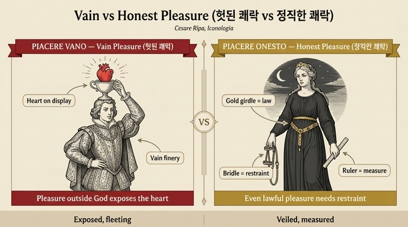

# '헛된 쾌락'(Piacere Vano)과 '정직한 쾌락'(Piacere Onesto)의 도상

체사레 리파(Cesare Ripa)의 『이코놀로지아(Iconologia)』는 추상 개념을 의인상(擬人像)으로 그리는 법을 정리한 알레고리 사전이다. '쾌락(Piacere)' 항목 아래에는 여러 변형이 실려 있는데, 이 카드는 그중 서로 짝을 이루는 대비 항목인 **헛된 쾌락(Piacere Vano)**과 **정직한 쾌락(Piacere Onesto)**을 다룬다.

## 1. 헛된 쾌락 — Piacere Vano

> "화려하게 차려입은 젊은이가 머리 위에 심장이 담긴 잔(tazza)을 이고 있다."

- **화려한 옷차림의 젊은이**: 허영에 빠진 인간의 전형. 젊음은 세속의 즐거움이 가장 투명하게 비치는 시기라서 쾌락 도상은 대개 젊은이로 그려진다.
- **머리 위 잔 속의 심장**: 핵심 상징. 허영한 인간의 속성은 "자기 심장과 자기가 한 모든 일을 모든 사람에게 내보이는 것"이다. **하나님 밖에서 쾌락을 찾는 자는 필연적으로 제 심장을 만인에게 드러낼 수밖에 없다** — 그래서 심장을 감추기는커녕 잔에 담아 머리 위에 이고 다닌다.
- 리파는 속담을 덧붙인다: "불도 사랑도 숨길 수 없다(né il fuoco, né l'amore si può tener segreto)." 심장은 모든 덧없는(caduchi) 쾌락이 솟아나고 빚어지는 샘이기 때문이다.

## 2. 정직한 쾌락 — Piacere Onesto

> "검은 옷을 입은 베누스(Venere)가 보석으로 장식된 금 허리띠를 단정하게 두르고, 오른손에는 재갈(freno), 왼손에는 재는 자(braccio da misurare)를 들고 있다."

- **검은 옷의 베누스('검은 베누스', Venere Nera)**: 파우사니아스가 『아르카디아』에서 전하는 별칭. 어떤 쾌락은 **가려서, 단정하게, 밤에** 취해야 하기 때문이다 — 때와 장소를 가리지 않는 짐승과 달리, 인간의 쾌락에는 은밀함과 절도가 있어야 한다.
- **금 허리띠(cingolo)**: 호메로스가 『일리아스』에서 베누스에게 부여한 띠. 고대인들에게 이 띠는 **법(leggi)의 질서**를 상징했다 — 베누스(쾌락)는 법의 테두리 안에 묶여 있을 때에만 정직하고 칭찬받을 만하다.
- **오른손의 재갈 + 왼손의 자**: 법의 테두리 **안에서조차** 쾌락은 절제되고(moderati) 억제되어야(ritenuti) 한다는 이중의 가르침. 재갈은 억제, 자는 척도(節度)를 뜻한다.

## 3. 대비 구조 한눈에

| | 헛된 쾌락 (Piacere Vano) | 정직한 쾌락 (Piacere Onesto) |
|---|---|---|
| 인물 | 화려한 젊은이 | 검은 옷의 베누스 |
| 핵심 지물 | 머리 위 잔 속의 심장 | 금 허리띠, 재갈, 자 |
| 노출/은폐 | 심장을 만인에게 전시 | 밤에 가려서, 단정하게 |
| 교훈 | 하나님 밖의 쾌락 = 자기 과시, 덧없음 | 법 안에서도 절제·억제 필요 |

## 4. 참고: '쾌락(Piacere)' 본항의 판화

이 판본에서 Piacere Vano / Piacere Onesto 두 항목에는 전용 판화가 없고, 상위 항목인 '쾌락(Piacere)' 본항에만 판화가 실려 있다.

판화에서 관찰되는 요소: **날개**(쾌락은 금방 날아가 버림 — 라틴어 Voluptas), **하프**(베누스와 미의 여신들에 어울리는 감미로운 소리), 그리고 오른쪽 아래의 **세이렌**(노래로 뱃사람을 홀리듯, 쾌락은 겉보기 달콤함으로 추종자를 파멸시킴 — 뒤편의 배가 이를 암시). 이 본항의 '덧없고 기만적인 달콤함'이라는 주제가 '헛된 쾌락'으로, '절제'라는 처방이 '정직한 쾌락'으로 각각 분화된 셈이다.

## 인포그래픽

