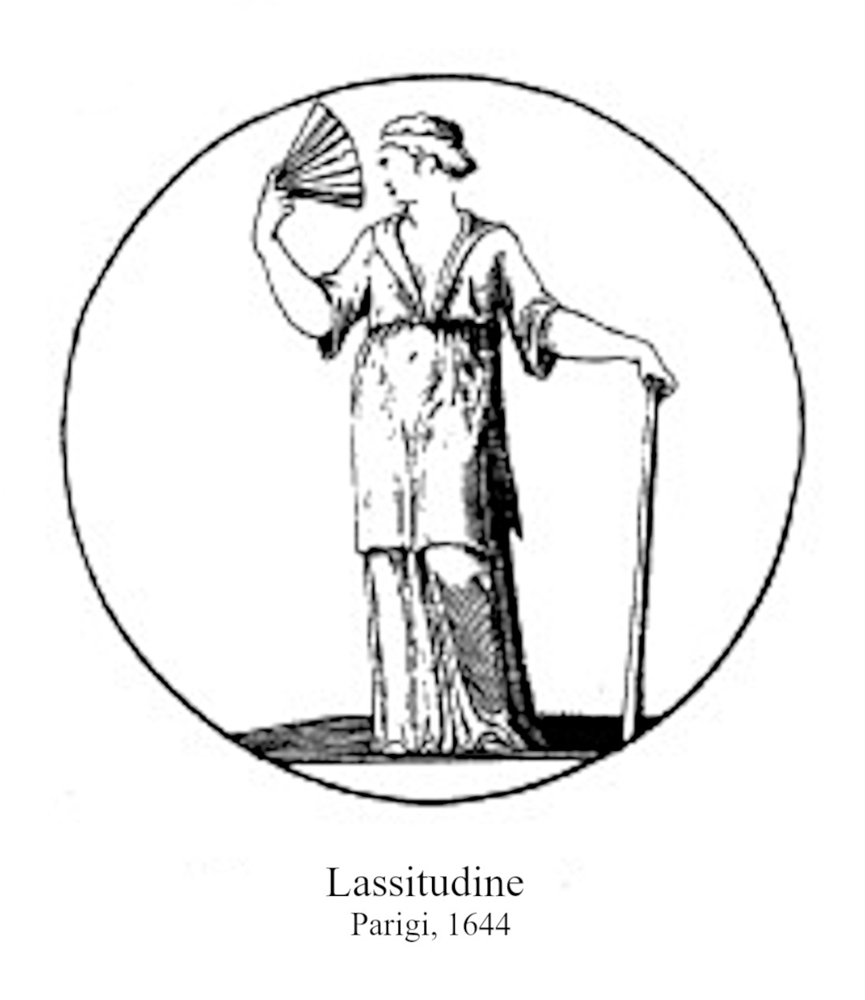
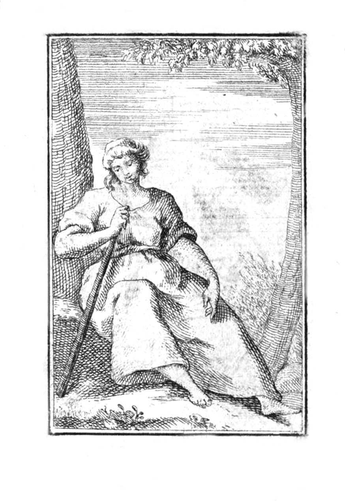

# 여름의 나른함 (LASSITUDINE, O LANGUIDEZZA ESTIVA)

> **Q.** 리파는 '여름의 나른함(Lassitudine, o Languidezza Estiva)'을 어떤 모습으로 의인화했는가?
>
> **A.** 마른 여인이 얇고 가벼운 옷을 입고 가슴을 드러낸 채, 왼손으로 지팡이에 몸을 기대고 오른손으로 부채질하는 모습이다. 더위로 인한 신체의 무력감을 표현한다.

---

## 1. 원문 (Orlandi 판 『Iconologia』 Tomo IV, p.2)

출전: `01 Weariness to Pandering.md` 93~109행 — `LASCIVIA`(음탕) 항목과 `LEALTÀ`(충직) 항목 사이에 놓인, **Ripa 본인의 텍스트(Di Cesare Ripa)** 항목이다.

> **Donna magra.** Sarà di **abito sottile**, assai leggermente vestita, mostrando il **petto discoperto**. Colla **sinistra mano** si appoggerà ad un **bastone**, e colla **destra** terrà un **ventaglio**, mostrando di farsi vento.

즉 카드의 답은 이 한 문장을 그대로 옮긴 것이다. 다섯 가지 요소 — ① 마른 몸(magra), ② 얇은 옷(abito sottile), ③ 드러난 가슴(petto discoperto), ④ 왼손의 지팡이(bastone), ⑤ 오른손의 부채(ventaglio) — 가 전부이며, 리파는 이어서 다섯 요소를 **하나씩** 해설한다. 이 항목은 리파의 도상 서술 방식(먼저 그림을 말로 그리고, 그다음 각 속성의 의미를 논증)을 아주 짧고 깔끔하게 보여주는 표본이다.

---

## 2. 판화로 확인하기

**주의:** 우리가 쓰는 Orlandi(페루자, 1766) 판본 Tomo IV에서 이 항목은 **삽화 없이 본문만** 실려 있다. 같은 페이지의 앞뒤 항목인 `Lascivia`와 `Lega`에는 전면 판화가 붙어 있지만, `Lassitudine`과 `Lealtà`는 Orlandi가 판화를 새로 넣지 않은 항목이다. 따라서 아래 도판은 **같은 텍스트를 삽화로 옮긴 다른 판본**에서 가져온 것이다.

### fig-1 — Paris 1644 (Baudoin 프랑스어판, imm. LXXXV)

리파의 문장과 **속성 대 속성으로 정확히 일치**하는 도판이다. 그림에서 실제로 관찰되는 것:

| 그림에서 보이는 것 | 리파 원문 |
|---|---|
| 팔·어깨·목이 앙상하고 몸통에 살이 없는 여윈 체형 | `Donna magra` |
| 몸에 달라붙지 않고 흘러내리는 홑겹의 얇은 헐렁한 옷, 맨발 | `abito sottile, assai leggermente vestita` |
| 앞섶이 V자로 크게 벌어져 목·가슴이 드러남 | `petto discoperto` (1644년 프랑스어판: *la gorge descouverte*) |
| 화면 오른쪽 — 그녀의 **왼팔**이 지팡이 손잡이 위에 얹혀 있고, 상체 무게가 그쪽으로 실려 기울어 있다 | `colla sinistra mano si appoggerà ad un bastone` |
| 화면 왼쪽 — 그녀의 **오른손**이 얼굴 높이로 들려 펼친 부채를 얼굴 쪽으로 향하고 있다 | `colla destra terrà un ventaglio, mostrando di farsi vento` |

몸 전체가 지팡이 쪽으로 무너지듯 기울고, 얼굴은 부채 쪽으로 돌려 바람을 받으려 하는 **두 방향의 대각선**이 곧 '무력함 + 더위로부터의 도피'라는 관념을 시각화한다.

### fig-2 — Wien 1766 (빈 판본, vol.2 p.152)

같은 항목의 18세기 회화적 변주. 부채는 생략되고 **지팡이 하나로 축약**되었다. 여인은 아예 나무 그늘 아래 땅바닥에 주저앉아 지팡이를 가슴에 안고 고개를 떨구고 있으며, 맨발이 힘없이 뻗어 있다. 배경의 나무 그늘과 가벼운 옷차림이 '여름'을 지시한다. fig-1과 비교하면 **지팡이 = 스스로를 지탱하지 못함**이라는 핵심 의미가 어떤 변주에서도 끝까지 살아남는 필수 속성임을 알 수 있다.

(참고로 Augsburg 1704년판에서는 부채가 손부채가 아니라 장대 끝에 깃털을 단 *flabellum* 형태로 그려진다.)

---

## 3. 왜 그런 모습인가 — 리파의 논증 하나씩

### (0) 정의: "밖으로 몸에 닥치는 괴로운 약함"

> Per la Languidezza, o Lassitudine intendiamo, quella debolezza, che **esteriormente** accade al corpo, e che **l'annoja**.

핵심어는 `esteriormente`(외적으로, 신체적으로)와 `annoja`(괴롭힌다)다. 이것은 **도덕적 나태가 아니라 생리적 탈진**이다. 그래서 리파의 체계에서 `Accidia`(나태)·`Ozio`(게으름) 같은 악덕 항목과는 범주가 다르다 — 나른함은 죄가 아니라 **당하는 상태**이며, 그래서 벌 받는 자세가 아니라 '기대고, 부채질하는' 자세로 그려진다.

### (1) 왜 굳이 "estiva(여름의)"라고 한정했는가

> Si dice **estiva**, per dimostrare non già la Languidezza cagionata **da malattia, o da altra cosa**; ma quella causata da **Stagione naturalmente calda**, che è l'Estate.

나른함·무력감은 병(malattia)·과로·노령 등 여러 원인에서 온다. 리파는 그 가운데 **원인을 계절 하나로 못 박기 위해** 'estiva'를 붙였다. 도상학적으로 중요한 이유가 있다 — 원인이 병이면 도상은 침상·요강·의사의 소변 플라스크 같은 병자 기물을 써야 하고, 원인이 노령이면 백발·주름을 써야 한다. 원인을 '자연히 뜨거운 계절'로 고정해야 비로소 **얇은 옷·드러난 가슴·부채**가 정당한 속성이 된다. 즉 'estiva'는 나머지 네 속성을 성립시키는 전제 조건이다.

### (2) 마른 몸 — 갈레노스 체액론의 직접 적용

> Si dipinge **magra**, perché **esalando la sostanza del corpo**, per mezzo del **calore, che la dissolve**, viene necessariamente a dimagrarsi.

리파는 은유가 아니라 **당대의 의학 이론을 문자 그대로** 근거로 든다.

- 갈레노스 체액론에서 계절은 4성질(뜨거움·차가움·건조함·습함)과 짝지어진다. **여름 = 뜨겁고 건조함(calidum et siccum)**, 지배 체액은 **황담즙(collera / bile gialla)**.
- 열은 물체를 **녹이고(dissolve) 증발시킨다(esalare)**. 인체 안의 습기, 특히 생명의 밑천으로 여겨진 **근원적 습기(humidum radicale)**와 정기(spiriti)가 열에 의해 발산되어 몸 밖으로 빠져나간다.
- 실체(sostanza)가 빠져나갔으니 몸은 **필연적으로(necessariamente)** 야윈다. 리파가 "필연적으로"라는 말을 쓴 것은, 이 야윔이 화가의 취향이 아니라 물리적 귀결임을 주장하기 위해서다.
- 그리고 이 야윔은 단순한 외형이 아니라 **기력 자체의 소실**을 뜻한다. 체액론에서 힘은 정기에서 나오므로, 정기가 증발했다는 것과 힘이 없다는 것은 같은 사태의 두 얼굴이다. → 그래서 다음 속성인 지팡이가 필요해진다.

### (3) 얇은 옷과 드러난 가슴 — 이중의 기호

> L'abito, ed il petto nudo sono **segni così della stagione** ... **come ancora sono segni del calore**, che attualmente si trova in Languidezza.

리파는 이 하나의 속성이 **두 가지를 동시에 지시**한다고 명시한다.

1. **계절의 기호**: 사람들은 여름에 되도록 덜 덥게 지내려고 아주 가벼운 옷을 입으므로, 옷차림 자체가 "지금은 여름이다"를 말한다.
2. **현재 작용 중인 열의 기호**: `attualmente`(지금 실제로)라는 부사가 중요하다. 나른함은 지나간 더위의 기억이 아니라 **바로 이 순간 몸에 가해지고 있는 열**의 결과라는 것. 옷을 벗다시피 한 상태는 그 열이 지금도 진행 중임을 증언한다.

한 속성으로 '원인(계절)'과 '작용(열)'을 겹쳐 표시하는 것이 리파식 경제성이다. 또한 이 노출은 `Lascivia`(음탕) 같은 항목의 노출과 의미가 전혀 다르다는 점도 주의 — 여기서 드러난 가슴은 관능이 아니라 **더위에 대한 생리적 대응**이다.

### (4) 왼손의 지팡이 — 자기 지탱 능력의 상실

> **Coll'appoggiarsi**, mostriamo aver bisogno di **sostentamento**, e chi ha bisogno di sostentamento, **non ha forze sufficienti per sé stesso**, il che è propriissimo della nostra figura, che si è detto esser **debolezza di forze del corpo umano**.

삼단논법으로 되어 있다.

1. 기댄다 = 지탱(sostentamento)이 필요하다.
2. 지탱이 필요하다 = **스스로에게 충분한 힘이 없다**.
3. 그런데 나른함의 정의가 바로 '인체의 기력의 약함(debolezza di forze del corpo umano)'이다.
4. ∴ 기대는 자세는 나른함의 정의에 "가장 고유한(propriissimo)" 표현이다.

즉 지팡이는 '늙음'이나 '순례'의 지팡이가 아니라 **정의를 그대로 번역한 기호**다. 서 있으되 스스로 서 있지 못하는 상태 — 완전히 쓰러진 것도, 멀쩡히 선 것도 아닌 중간 상태 — 를 시각화한 것이 이 자세다. 지팡이를 **왼손**에 준 이유는, 더 능동적인 오른손을 부채에 배정하기 위해서다. 즉 **수동적 속성(버티기)은 왼쪽, 능동적 속성(더위를 밀어내기)은 오른쪽**이라는 리파의 관습적 좌우 배분이다.

### (5) 오른손의 부채 — 데워진 공기를 밀어내기

> Il **ventaglio** mostra, che **movendo l'aria prossima già riscaldata, fa luogo all'altra più fresca**, il che è di molto **refrigerio** al corpo; dimanieracché l'uso del ventaglio, essendo per la **noja, ed affanno del caldo**, dimostra sufficientemente quello, che propriamente si trova nella languidezza, che è la detta **molestia del calore**.

부채의 논리도 물리적이다.

- 몸에 밀착한 공기층(`aria prossima`)은 이미 체열로 데워져 있다. 부채질은 이 데워진 공기를 **움직여 치워서**, 그 자리에 더 시원한 공기가 들어올 **자리를 내준다(fa luogo)**. 그 결과가 `refrigerio`(냉각·시원함)다.
  - 이는 갈레노스 위생학의 '비자연적인 것들(res non naturales)' 여섯 항목 중 첫째인 **공기(aer)**를 조절하는 정당한 처방이다. 부채는 장식품이 아니라 **의학적 도구**로 등장한다.
- 더 중요한 것은 논증의 방향이다. 부채는 시원함을 그리는 것이 아니라, **부채를 쓸 수밖에 없다는 사실**을 통해 그 원인인 `noja`(성가심)와 `affanno del caldo`(더위의 헐떡임)를 **역으로 증언**한다. 리파가 말하는 나른함의 본질이 바로 이 `molestia del calore`(열의 괴롭힘)이기 때문이다.
- 그래서 리파는 "부채질하는" 것이 아니라 `mostrando di farsi vento` — **부채질하는 시늉/모습을 보이며**라고 썼다. 도상에서 중요한 것은 실제 냉각 효과가 아니라 **부채질을 하고 있다는 가시적 사실**이다.

---

## 4. 정리 — 다섯 속성의 역할 분담

| 속성 | 손/위치 | 지시하는 것 | 근거 |
|---|---|---|---|
| 마른 몸 | 전신 | 열에 의한 실체·정기의 증발 → 기력 소실 | 갈레노스 체액론 (여름=열+건) |
| 얇은 옷 | 착의 | ① 계절(여름) ② 현재 작용 중인 열 | 여름철 관습 + 열의 지표 |
| 드러난 가슴 | 상반신 | 위와 동일 (관능 아님) | 위와 동일 |
| 지팡이 | 왼손 | 스스로 지탱 못 함 = 나른함의 정의 자체 | 삼단논법 |
| 부채 | 오른손 | 열의 괴롭힘(molestia del calore)을 역증 | 공기 조절 = 갈레노스 위생학 |

**암기 요령:** 원인(여름의 열) → 결과 두 갈래 → **몸 안쪽 결과 = 야윔 + 지팡이**(힘이 빠졌다), **몸 바깥 대응 = 얇은 옷 + 드러난 가슴 + 부채**(열을 물리려 한다). 다섯 속성이 이 두 축에 깔끔히 나뉜다.

---

## 5. 함께 보면 좋은 항목

- **Estate / Mesi(여름·달들)** — 같은 계절을 '나른함'이 아니라 '수확·풍요'로 그리는 반대 관점.
- **Accidia · Ozio(나태·게으름)** — 겉모습은 비슷하나 **도덕적 악덕**으로 다뤄지는 대조군. 나른함은 죄가 아니다.
- **Lascivia** — 바로 앞 항목이며 역시 노출이 등장하지만 의미는 정반대.
- **Debolezza / Infermità** — 병이 원인인 약함. 리파가 'estiva'로 잘라낸 바로 그 이웃 개념.

---

### 출처

- 본문: `.fm/assets/01 Weariness to Pandering.md` 93–109행 (Orlandi 판 『Iconologia del Cavaliere Cesare Ripa Perugino』 Tomo IV, Perugia, 1766, p.2) — 이 판본에는 해당 항목의 판화가 없음.
- fig-1: Ripa, *Iconologie* (Jean Baudoin 역), Paris 1644, imm. LXXXV, vol.1 p.99.
- fig-2: Ripa, Wien 1766, vol.2 p.152.
- 도판 및 판본별 대조: [Iconologia di Cesare Ripa — Lassitudine 1644 (LIMES, Univ. di Pisa)](https://limes.cfs.unipi.it/allegorieripa/lassitudine-1644/)
- 원본 스캔: [Internet Archive — iconologiadelcav04ripa](https://archive.org/details/iconologiadelcav04ripa)
