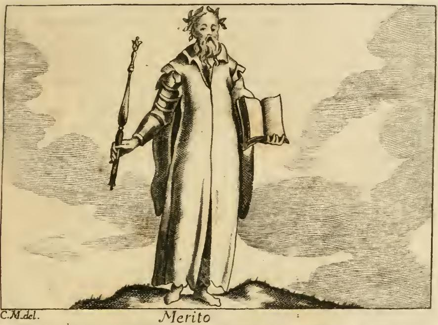

# 그리스도의 공로 (MERITO DI CRISTO)

> **Q.** 리치가 그린 '그리스도의 공로(Merito di Cristo)'의 도상은?
>
> **A.** 날개 달린 용맹한 장수가 승리한 지휘관의 투구를 쓰고, 오른손의 맨 칼을 땅으로 향하며 열쇠 하나를 들고, 왼손은 다른 열쇠와 홀을 들고 하늘로 쳐들었다. 오른발 밑에는 죽은 사탄이, 왼발 밑에는 죽은 죽음이 깔려 있고, 한쪽에 금·은·보석의 보물이 놓인 둥근 금 탁자가, 다른 쪽에 무서운 얼굴의 사자와 온몸에서 피 흘리는 어린 양이 있다.

---

## 0. 한눈에 보기 — 4개 묶음으로 외우기

요소가 12개나 되는 **복합 도상**이다. 낱개로 외우면 반드시 빠뜨린다. 아래 네 묶음으로 쪼개서 외우는 것이 유일한 방법이다.

| 묶음 | 요소 | 한 줄 의미 |
|---|---|---|
| **① 승리의 표지** (몸에 붙은 것) | 날개 · 투구 · 맨 칼 · 열쇠 둘 · 홀 | 그는 **이긴 장수**다 |
| **② 정복된 것** (발밑) | 오른발 = 죽은 사탄 / 왼발 = 죽은 죽음 | 두 원수는 **이미 죽었다** |
| **③ 공로의 값** (한쪽 옆) | 둥근 금 탁자 + 금·은·보석 보물 | 그 공로는 **무한하다** |
| **④ 두 본성** (다른 쪽 옆) | 사자(무서운 얼굴) / 피 흘리는 어린 양 | **신성과 인성**, 한 분 안에 |

### 좌우 규칙 — 이것만 잡으면 손발이 안 헷갈린다

> **오른쪽은 아래를(지옥을 잠그고), 왼쪽은 위를(하늘을 연다).**

- **오른손**: 맨 칼 + 열쇠 하나 → **땅(아래)** 을 향함. 칼끝은 죽은 사탄에 닿아 있음.
- **왼손**: 다른 열쇠 + 홀 → **하늘(위)** 로 쳐듦.
- **발**: 오른발 = 사탄, 왼발 = 죽음. (칼끝이 닿는 오른쪽이 사탄 쪽 — 손과 발이 같은 편)

---

## 1. 원문 (오를란디판 『Iconologia』 제4권, 109–111쪽)

이 항목은 체사레 리파 본인의 글이 아니다. 체사레 오를란디(Cesare Orlandi)가 증보한 페루자판 『Iconologia』(1764–67) 제4권에, 앞선 `MERITO` 항목의 대괄호 주 `[ j ]`에 이어 **별도 항목으로 옮겨 실은 리치의 도상**이다.

원문 표제부:

```
MERITO DI CRISTO.
Del P. Fra Vincenzio [Ricci] dei M. O.
```

`M. O.` = **Minori Osservanti**(프란치스코회 준수파). 즉 저자는 화가가 아니라 **빈첸초 리치 다 산 세베로(Vincenzo Ricci da San Severo)**, 풀리아 산탄젤로 관구의 신학자·설교가이며 『**Geroglifici morali**』(나폴리, Gio. Domenico Roncagliolo, 1626)의 저자다. 이 책은 리파의 『Iconologia』를 모델로 삼되 **오직 종교적 알레고리만**으로 채운 도상 사전이어서, 17~19세기 화가·조각가들에게 리파의 대안 레퍼토리로 쓰였다.

### 1-1. 도상 서술부 (원문 그대로)

> UOmo valoroso, alato, coll'elmo in testa da vittorioso Capitano; Terrà la spada nuda nella destra mano in verso terra, ed una chiave, e la sinistra alzata verso il Cielo, con un'altra chiave, e collo scettro. Sotto il piede destro vi stia Satanasso ucciso, e che gli tocchi la punta della spada. Sotto il pie' sinistro vi sia la morte, altresì uccisa. Da un lato vi è una tavola di oro rotonda, sulla quale vi è un tesoro grande di argento, oro, e preziose gemme, e dall'altro lato un Leone con volto terribile, ed un Agnello ferito, a cui esce sangue per tutto.

**직역**: 용맹한 남자, 날개가 달렸고, 머리에는 승리한 지휘관의 투구를 썼다. 오른손에는 맨 칼을 땅을 향해 들고 또 열쇠 하나를 들며, 왼손은 다른 열쇠 하나와 홀을 들고 하늘을 향해 쳐들었다. 오른발 밑에는 죽임당한 사탄이 있어 **칼끝이 그에게 닿아 있고**, 왼발 밑에는 역시 죽임당한 죽음이 있다. 한쪽에는 둥근 금 탁자가 있어 그 위에 은·금·값진 보석의 큰 보물이 있고, 다른 쪽에는 무서운 얼굴의 사자와, 온몸에서 피가 흘러나오는 상한 어린 양이 있다.

### 1-2. 리치 본인의 해설 (요소별, 원문 요지)

원문 해설부(`Quindi questo santissimo merito si dipinge...` 이하)를 요소별로 정리하면:

| 요소 | 리치의 설명 |
|---|---|
| 용맹한 장수 · 무장 · 칼 | 십자가에서 **죽음과 마귀를 상대로 치른 전투에서 용맹하게 이겼기** 때문 |
| 발밑의 죽은 마귀 | 그때 세상에서 누리던 힘과 지배권이 **완전히 무력화(debilitato affatto)** 되었음 |
| 발밑의 죽은 죽음 | 전에는 두려움의 대상이었으나 그에게 패한 뒤 **생명으로 바뀌었다(convertita in vita)** |
| 두 열쇠 | 땅을 향한 열쇠로 **탐욕스러운 지옥을 잠가 그 입을 막고**, 다른 열쇠로 **아무에게도 열리지 않던 하늘을 열었다** |
| 홀 | **하늘과 땅에서 그가 가진 통치권**(impero) |
| 투구 | 그리스도의 머리를 지키는 것 = **두 본성 중 하나(신성)는 결코 상하지 않았다**. 고난과 모욕 속에서도 신적 존재로 남아 아무 손상도 입지 않았음 |
| 칼 | **그의 권능**, 그것으로 원수들을 꺾었다(sbassò i nemici) |
| 둥근/구형 탁자 | **원(구)형 자체가 무한(infinito)의 상징**. 그 위의 은·금·보석은 **무한한 공로**와 십자가에서 흘린 **피의 값** |
| 사자 (담대하고 큰 먹이를 취한 듯한) | **하느님의 아들의 신성**. 언제나 온전히 남아 **수난할 수 없는(impassibile)** 존재이며, 그의 승리는 모두 이 가장 용맹한 사자가 이룬 것 |
| 피 흘리는 죽임당한 어린 양 | **인성과 육신**. **수난할 수 있는(patibile)** 본성으로서 피를 흘리고 채찍을 받고 마침내 치욕스러운 죽음에 이르며, 온순한 어린 양처럼 손에 넘겨졌다 |

> **주의할 빈칸**: 원문 해설부는 **날개(alato)를 설명하지 않는다.** 도상 서술부에만 나온다. 날개는 고대 승리의 여신(Victoria/Nike) 도상에서 그대로 가져온 관습적 표지로, "이긴 자"임을 즉각 읽히게 하는 장치로 보면 된다.

---

## 2. 요소별 성경 근거 표

원문 마지막 절(`Alla Scrittura Sacra.`)에서 리치는 요소마다 성구를 짝지어 놓았다. **원문 표기에 오식이 많아** 실제 위치를 함께 적는다.

| 요소 | 원문이 든 전거 (표기 그대로) | 실제 위치 | 본문 |
|---|---|---|---|
| 용맹한 장수 | `Geremia 21. v. 11` | **예레미야 20:11** ⚠️ | *Dominus mecum est tamquam bellator fortis* — "여호와는 두려운 용사같이 나와 함께 계시니" |
| 손에 든 칼 | (출처 표기 없음) | **스가랴 11:17** | *Gladius super brachium ejus* — "칼이 그의 팔에" |
| 머리의 투구 (신성) | `Zacch. 11. v. 17` | **고린도전서 11:3** ⚠️ | *Caput Christi Deus* — "그리스도의 머리는 하나님이시라" |
| 칼로 마귀를 죽임 | `Hierem. 51. v. 30` | 예레미야 51:30 ✔ | *Devoratum est robur eorum* — "그들의 용력이 쇠하여" |
| 죽음을 발로 밟음 | `Psal. 69. v. 5` | **시편 68:4** (불가타 67:5) ⚠️ | *Qui ascendit super occasum, Dominus nomen illi* — "광야에 행하시던 그를 위하여 … 그 이름은 여호와시니" |
| 〃 | `Isaia 25. v. 8` | 이사야 25:8 ✔ | *Praecipitabit mortem in sempiternum* — "사망을 영원히 멸하실 것이라" |
| 〃 | `Osea 13. v. 14` | 호세아 13:14 ✔ | *Ero mors tua, o mors; morsus tuus ero, inferne* — "사망아 네 재앙이 어디 있느냐 음부야 네 멸망이 어디 있느냐" |
| **땅을 향한 열쇠** (지옥을 잠금) | `Apoc. 1. v. 18` | 요한계시록 1:18 ✔ | *Habeo claves mortis et inferni* — "사망과 음부의 열쇠를 가졌노니" |
| **하늘을 여는 열쇠** | `Esaia 45. v. 2` | 이사야 45:1하–2 ✔ | *Aperiam ante eum januas, et portae non claudentur* — "그 앞에 문들을 열어서 닫지 못하게 하리라" |
| 홀 + 열쇠 | `Santa Teresa` | **대(大)안티폰 「O Clavis David」** ⚠️ | *O clavis David, et sceptrum domus Israel, qui aperis et nemo claudit, qui claudis et nemo aperit* |
| 금 탁자의 보물 | `Sap. 7. v. 14` | 지혜서 7:14 ✔ | *Infinitus est thesaurus illius* — "지혜는 사람에게 **무한한 보고**라" |
| 사자 | `Apoc. 5. v. 5` | 요한계시록 5:5 ✔ | *Vicit Leo de tribu Juda, radix David* — "유대 지파의 사자 다윗의 뿌리가 이기었으니" |
| 피 흘리는 어린 양 | `Haj. 85. v. 7` | **이사야 53:7** ⚠️ | *Sicut ovis ad occisionem ducetur, et quasi agnus coram tondente se obmutescet* — "도수장으로 끌려가는 어린 양과 같이 … 잠잠하였도다" |
| 〃 | `Apoc. 13. v. 8` | 요한계시록 13:8 ✔ | *Agni qui occisus est ab origine mundi* — "창세 이후로 죽임당한 어린 양" |
| 〃 (피의 값) | `Pet. I. v. 18` | 베드로전서 1:18–19 ✔ | *non corruptibilibus auro vel argento redempti estis … sed pretioso sanguine quasi Agni immaculati Christi* — "금이나 은 같이 없어질 것으로 된 것이 아니요 … 흠 없고 점 없는 어린 양의 보배로운 피로" |

### 2-1. 원문 출처 표기 오식 교정 (⚠️ 표시분)

1. **`Geremia 21. v. 11` → 예레미야 20:11.** 21장 11절에는 해당 구절이 없다. *bellator fortis* 구절은 20:11이다.
2. **`Zacch. 11. v. 17. Caput Christi Deus` → 표기가 한 칸 밀린 오식.** 스가랴 11:17은 바로 앞의 *Gladius super brachium ejus*(칼) 전거이고, *Caput autem Christi Deus*(투구)는 **고린도전서 11:3**이다. 원판에서 `Zacch. 11. v. 17`(칼)과 `1. Cor. 11. v. 3`(투구) 두 표기가 붙어 있다가 하나가 탈락한 것으로 보인다.
3. **`Psal. 69. v. 5` → 불가타 시편 67:5 = 개역 시편 68:4.** 인용문 자체가 *Legge il Greco: Dominus nomen illi*(그리스어 본은 "그 이름은 주"로 읽는다)라고 70인역을 언급하는 대목이라 시편 68편이 맞다.
4. **`Santa Teresa` → 성 테레사의 말이 아니다.** *O clavis David…* 는 대림절 12월 20일에 부르는 **네 번째 대안티폰**이며, 그 자체가 **이사야 22:22**("다윗의 집의 열쇠를 그의 어깨에 두리니 그가 열면 닫을 자가 없고 닫으면 열 자가 없으리라")와 **요한계시록 3:7**에 기초한다. 원문 앞부분에 나오는 `il gran Principe di Santa Chiesa`(= 베드로) 같은 표현과 뒤섞이며 `Santa Chiesa`가 `Santa Teresa`로 잘못 새겨진 것으로 보인다. **카드에서 홀+열쇠의 전거를 물으면 "이사야 22:22 / 계 3:7 기반 O 안티폰"이 정답.**
5. **`Haj. 85. v. 7` → 이사야 53:7.** 성경에 `Haj.` 85장이라는 것은 없다. `Isai. 53. v. 7`의 오독(`I`→`H`, `53`→`85`)이다. 리치가 "예레미야가 미리 보았다"고 쓴 부분도 실은 **이사야**의 종의 노래다(원문 자체의 저자 오기).

---

## 3. 원문에는 없지만 이 도상을 지탱하는 전통적 전거

리치가 인용하지 않았어도, 이 도상의 각 요소는 다음 계보 위에 서 있다. 원문 전거와 **구별해서** 알아두면 좋다.

| 요소 | 추가 전거 | 설명 |
|---|---|---|
| 날개 달린 승리의 장수 | **골로새서 2:15** | "통치자들과 권세들을 무력화하여 드러내어 구경거리로 삼으시고 십자가로 그들을 이기셨느니라" — *Christus Victor*(정복자 그리스도) 전통의 근본 구절. 리치의 해설("십자가에서 치른 전투에서 이겼다")과 정확히 겹친다 |
| 발밑의 사탄 | **창세기 3:15** | "여자의 후손은 네 머리를 상하게 할 것이요" — 원복음(*protoevangelium*). 뱀의 **머리를 발로 밟는** 도상의 원천 |
| 발밑의 죽음 | **고린도전서 15:26, 54–55** | "맨 나중에 멸망 받을 원수는 사망이니라" / "사망아 너의 승리가 어디 있느냐" |
| 왼손을 하늘로 쳐든 자세 | **히브리서 7:25** | "그가 항상 살아 계셔서 그들을 위하여 간구하심이라" — 승천과 **중보**의 방향성. 위로 든 손은 단순한 승리 포즈가 아니라 하늘에서 계속 변호하는 대제사장의 자세 |
| 사자 = 어린 양 | **요한계시록 5:5–6** | 5절의 "유다 지파의 사자"와 6절의 "죽임을 당한 어린 양"이 **같은 한 존재**로 이어진다. 이 도상이 사자와 어린 양을 나란히 놓은 결정적 대구가 여기다 |
| 금 탁자의 보물 | 교회 전통 | *thesaurus meritorum Christi* — **그리스도의 공로의 보고**. 가톨릭 대사(indulgentia) 교리의 기초 개념 |

### 3-1. 땅을 향한 맨 칼 — 흔한 오해 교정

계시록 1:16("그 입에서 좌우에 날선 검이 나오고")이나 히브리서 4:12("하나님의 말씀은 살아 있고 활력이 있어 좌우에 날선 어떤 검보다도 예리하여")의 검은 **말씀·심판의 검**이고, 도상에서 보통 **입에서 나오거나 위로 세워진다.**

이 도상의 칼은 그것이 아니다. 원문은 두 가지를 못박아 둔다.

1. **`gli tocchi la punta della spada`** — 칼끝이 죽은 사탄에게 **닿아 있다**.
2. **`la spada che tiene è la sua potenza, con che sbassò i nemici`** — 그 칼은 **권능**이고, 그것으로 원수를 **꺾어 내렸다**.

즉 아래를 향한 칼은 "심판의 유보"가 아니라 **집행이 이미 끝나 칼끝이 시체에 놓여 있는 상태**다. 승리의 사후 장면이다. 시험에서 "칼이 아래를 향하는 이유"를 물으면 → **적을 찌른 그 자리에 그대로 두어 승리를 증명**하는 것.

### 3-2. *calcatio* — 적을 발로 밟는 승리 도상

발밑에 원수를 두는 구성은 성경 이전에 **고대 로마의 *calcatio colli*(목을 밟음)** 에서 온다. 개선식에서 승자가 포로의 목에 발을 얹는 의식이며, 황제 도상(적을 밟고 선 황제상)으로 정착했다. 기독교 미술은 이 형식을 그대로 물려받아 **아나스타시스(부활·저승 정복)** 도상에서 그리스도가 부서진 지옥문과 하데스를 밟고 서게 만들었다. 이 카드의 "오른발 사탄, 왼발 죽음"은 그 로마식 승리 어휘의 직계다. 성경 쪽 짝은 시편 110:1("네 원수들로 네 발등상이 되게 하기까지")이다.

---

## 4. 세 Merito 비교 — 이 항목 전체의 구조

같은 `MERITO` 항목 구간에 도상이 셋 연달아 나온다. 셋을 나란히 놓으면 **오를란디/리치가 무엇을 하려 했는지** 드러난다.

| | ① 리파의 Merito | ② 리치의 Merito | ③ 리치의 **Merito di Cristo** |
|---|---|---|---|
| **주체** | 인간의 공로 (세속적·철학적) | 인간의 공로 (신학적) | **그리스도의 공로** |
| **모습** | 험하고 가파른 곳 위에 선 사람. 호화로운 옷, 월계관. 무장한 오른손에 홀, 맨 왼손에 책 | 붉은 옷(위는 녹색으로 장식)의 튼튼한 젊은이. 옷 전체에 **손 문양**. 한 손에 `NESCIO`(나는 모른다) 두루마리 | 날개 달린 승리의 장수. 투구·칼·두 열쇠·홀 |
| **위/아래 방향** | **아래 → 위** (스스로 험한 산을 올라간다) | **위 → 아래** (위쪽 광채에서 두 손이 내려와 보석 왕관과 구를 건넨다) | **위와 아래를 동시에 장악** (왼손·열쇠·홀은 하늘로, 칼·열쇠·발밑은 땅으로) |
| **핵심 문구** | 험한 길을 택한 **헤라클레스** — "합법적으로 싸운 자가 아니면 관을 받지 못한다"(디모데후 2:5) | **`NESCIO`** — 하느님 앞에서 내 공로의 **불확실성**. 우리의 선은 하느님에게서 나며 우리 운명은 그의 손에 있다 | **무한(infinito)** — 구형 탁자와 보물 |
| **확실성** | 노력으로 얻는다 | 알 수 없다 | **확실하고 무한하다** |
| **두 자연/본성** | (해당 없음) | (해당 없음) | 사자(신성, 수난 불가) / 어린 양(인성, 수난 가능) |

**요지**: ①은 고전적 덕(virtù) 개념, ②는 그 위에 은총론을 얹어 인간 공로를 상대화하고, ③에서 **유일하게 무한하고 확실한 공로**로 착지한다. 카드 세 장이 이 순서를 그대로 따라간다.

---

## 5. 왜 "무한한" 공로인가 — 다음 카드로 넘어가는 다리

원문 신학 설명부의 논리 사슬을 압축하면:

1. 공로(merito)는 그 값에 상응하는 보수를 정당하게 받게 하는 행위다(토마스 아퀴나스 『신학대전』 III, q. 45, a. 6 인용 — 원문 표기 `Div. Thom. 3. p. q. 45. art. 6`).
2. 우리에게는 공로가 지복(Beatitudine)보다 **앞서지만**, 그리스도에게는 그렇지 않다.
3. 그리스도 안에는 **인성과 신성 두 본성**이 있고, **속성 교류(comunicazione degl'idiomi, *communicatio idiomatum*)** 에 의해 한쪽에 속한 것이 다른 쪽에도 속한다.
4. 그러므로 그의 행위는 **하느님으로서, 동시에 사람으로서** 이루어졌다 → 그 공로는 **무한(merito infinito)** 하다.
5. 무한이어야 하는 이유: 무한한 정의의 엄격함에서 나오는 하느님의 진노를 달래려면 무한한 값이 필요하고, 인간이 범한 모욕도 (객체 면에서, *objective*) 무한하다.
6. 결론: 하느님이면서 사람인 그분 외에 **어떤 피조물도 인간의 구속을 이룰 수 없다.**

> 원문은 여기서 스코투스학파(`Scoto 3. sent. 7. q. 5`)의 반대 견해도 소개한다 — 순수한 피조물도 구속을 이룰 수 있었을 것이고 그 일도 하느님께 무한히 받아들여졌을 것이라는 입장. 이어서 **"아담이 죄를 짓지 않았어도 성자는 육신을 취하러 오셨을 것"** 이라는 스코투스적 예정론(무죄수육설)을 길게 논한다. 즉 이 항목은 도상 해설이자 **프란치스코회(스코투스) 신학의 요약**이다. 리치가 준수파 수사임을 기억하면 이 편향이 자연스럽다.

**금 탁자의 보물**이 곧 이 무한성의 시각화이고, 원형/구형이 **시작도 끝도 없음** = 무한을 뜻한다. 지혜서 7:14의 *infinitus est thesaurus*가 이 요소의 전거인 이유다. 그리고 이 "그리스도의 공로의 보고(*thesaurus meritorum Christi*)" 개념이 **대사(면벌) 교리**의 기초가 된다 — 무한한 보고이므로 교회가 거기서 나누어 적용할 수 있다는 논리.

---

## 6. 자료집 이미지 현황 (확인 결과)

**이 카드의 도상, 즉 '그리스도의 공로'의 판화는 자료집에 없다.** 해당 챕터 `04 Mechanics to the Month in General.md`의 `MERITO` 구간에 삽입된 이미지를 전부 확인한 결과:

| 파일 | 정체 |
|---|---|
| `_page_114_Picture_3.jpeg` | ✔ **리파의 `Merito` 의인상** (진짜 인물 판화, 판면 하단에 `Merito`, 좌하단에 `C.M.del.` 서명) |
| `_page_115_Picture_6.jpeg` | ✗ 잎·열매 문양 **장식 컷** |
| `_page_118_Picture_3.jpeg` | ✗ 잎·꽃 문양 **장식 컷**(가로 띠 장식) |
| `_page_119_Picture_10.jpeg` | ✗ 두 인어와 리라를 배치한 **장식 카르투슈(비네트)** |

리치의 두 도상(인간의 `Merito`와 `Merito di Cristo`)은 오를란디판에 **글로만 실렸다.** 실제 목판화를 보려면 리치의 원저 『Geroglifici morali』(1626) 쪽을 봐야 한다(Internet Archive에 스캔 공개: `archive.org/details/geroglificimoral01ricc`).

### 대조용 이미지 — 이 카드의 도상이 **아님**



*위: 리파의 `Merito`. 험한 땅 위에 맨발로 서서 월계관을 쓰고, 무장한 오른팔로 홀을, 맨 왼손으로 펼친 책을 든 노인. 스스로 험한 곳을 올라 얻은 **인간의 공로**다.* **카드의 답이 되는 '그리스도의 공로'는 이 그림이 아니다** — 날개도, 투구도, 칼도, 열쇠도, 발밑의 사탄과 죽음도 없다. 두 도상의 차이를 눈으로 대조하는 용도로만 참고할 것.

---

## 7. 암기 체크리스트

답을 말할 때 아래 12칸을 순서대로 채우면 빠지는 것이 없다.

1. **날개 달린** 용맹한 장수
2. 승리한 지휘관의 **투구**
3. 오른손 — **맨 칼**, 땅을 향해 (칼끝이 사탄에 닿음)
4. 오른손 — **열쇠 하나** (지옥을 잠금)
5. 왼손 — 하늘로 **쳐듦**
6. 왼손 — **다른 열쇠** (하늘을 엶)
7. 왼손 — **홀** (하늘과 땅의 통치권)
8. 오른발 밑 — **죽은 사탄**
9. 왼발 밑 — **죽은 죽음**
10. 한쪽 — **둥근 금 탁자**
11. 그 위 — **금·은·보석의 보물** (무한한 공로)
12. 다른 쪽 — **무서운 얼굴의 사자**(신성) + **온몸에서 피 흘리는 어린 양**(인성)

**축약 주문**: 「**날개·투구** / **오른쪽은 칼과 열쇠로 아래를, 왼쪽은 열쇠와 홀로 위를** / **발밑엔 사탄과 죽음** / **한쪽엔 둥근 금탁자의 보물, 다른 쪽엔 사자와 피 흘리는 어린 양**」

---

## 참고

- Cesare Ripa, *Iconologia*, 체사레 오를란디 증보판 (페루자, 1764–67), 제4권, `MERITO` · `MERITO DI CRISTO` 항목 (자료집 `04 Mechanics to the Month in General.md` 395–493행)
- [Vincenzo Ricci, *Geroglifici morali* (Napoli: Gio. Domenico Roncagliolo, 1626) — e-rara 서지](https://www.e-rara.ch/lg1/content/titleinfo/17087532)
- [*Geroglifici morali* 전문 스캔 (Internet Archive)](https://archive.org/details/geroglificimoral01ricc)
- [「I Geroglifici morali: l'immagine simbolica tra predicazione e arte nel XVII secolo」 — 리치 연구 (Univ. Firenze)](https://flore.unifi.it/handle/2158/1365532)
- [대안티폰 「O Clavis David」 해설 (Salt + Light Media)](https://slmedia.org/blog/the-o-antiphons-o-key-of-david)
- [Antiphona *O clavis David et sceptrum* — 그레고리오 성가 자료](https://gregorien.info/chant/id/5713/9/en)
