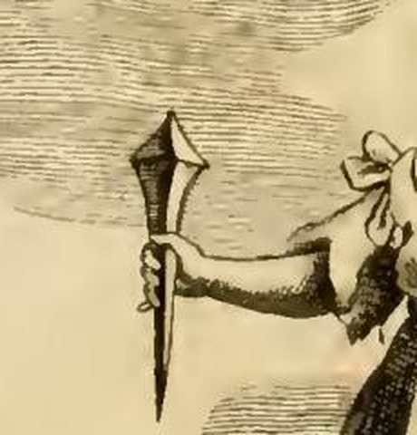

# 감사의 기억(Memoria Grata) — 손에 쥔 '큰 못'은 무엇인가

**질문** 감사의 기억 도상에서 큰 못은 무엇을 뜻하는가?

**답** '대들보 못으로 은혜를 박아두라(Clavo trabali figere beneficium)'는 격언에서 온 것으로, 받은 은혜를 단단히 기억해야 함을 상징한다.

---

## 1. 원문(조반니 차라티노 카스텔리니) 먼저 정확히

이 항목은 리파 본인이 아니라 **조반니 차라티노 카스텔리니(Gio. Zaratino Castellini)**가 써 붙인 항목이다. 표제는 `MEMORIA GRATA / De' benefici ricevuti`(받은 은혜에 대한 감사의 기억).

도상 처방(원문):

> UNa graziosa Giovane incoronata, con ramo di ginepro folto di granella. **Tenga in mano un gran chiodo.** Stia in mezzo di un Leone, ed un' Aquila.

> 열매가 촘촘히 달린 노간주 가지로 관을 쓴 우아한 젊은 여인. **손에는 큰 못 하나를 들게 한다.** 사자와 독수리 사이에 서 있게 한다.

못에 대한 해설 단락(원문 그대로):

> Il chiodo, che tiene in mano, è tolto dagli Adagi in quel Proverbio: **Clavo trabali figere beneficium**, conficcare il beneficio con un chiodo da trave, per denotare la tenace memoria del benefizio ricevuto, che aver si deve.

> 손에 들고 있는 못은 『격언집(Adagia)』의 그 속담에서 가져온 것이다. **Clavo trabali figere beneficium**, 즉 '**대들보 못으로 은혜를 박아 넣다**'라는 말로, 받은 은혜에 대해 마땅히 지녀야 할 **끈질긴 기억(tenace memoria)**을 나타내기 위한 것이다.

즉 카드의 정답 그대로다. 못은 (1) 라틴 격언의 도상적 번역이고, (2) 그 격언이 말하는 것은 '뽑히지 않는 고정 = 지워지지 않는 기억'이다. `tolto dagli Adagi`는 **에라스뮈스의 『격언집(Adagia)』**을 가리킨다 — 카스텔리니는 격언집을 경유해 이 문구를 얻었고, 고전 전거는 밝히지 않았다(§4 참조).

## 2. 판화에서 실제로 보이는 것

`C.M. del. — Memoria grata de' Benefici ricevuti` 서명이 달린 판화다. 처방과 하나하나 대응한다.

- **머리**: 뾰족한 잎이 방사상으로 뻗은 관 — 노간주(ginepro) 가지.
- **오른손**: 어깨보다 높이 치켜든 손에 **큰 못**. 왼발 쪽 아래로 사자, 오른쪽에 독수리.
- **양옆**: 갈기 있는 사자(육상 동물의 왕)와 날개를 반쯤 펼친 독수리(공중의 여왕).

못 부분을 확대하면 왜 이것이 '대들보 못'인지 분명해진다.

- **대가리가 크고 각지게 넓다** — 자잘한 핀이 아니라 하중을 받는 구조재용 대못이다.
- **자루가 굵게 시작해 길게 좁아지며 끝이 아래를 향한다** — 지금 막 박아 넣을 자세다.
- **손을 머리 위로 들어 못끝을 아래로 겨눈다** — 못이 장식품이 아니라 **박는 도구**로 제시된다. 은혜를 기억하는 것은 가만히 남아 있는 상태가 아니라, 내가 내 손으로 박아 넣는 **행위**라는 뜻이다.

## 3. clavus trabalis의 정확한 뜻

- **trabs** = 대들보, 서까래 등 건물의 하중을 받는 큰 목재.
- **clavus trabalis** = 그 대들보를 고정하는 **큰 쇠못/스파이크**. 카스텔리니 자신이 `chiodo da trave`(대들보 못)로 옮겨 놓았다.
- 따라서 관용적 의미는 단순히 '못으로 붙이다'가 아니라 **'다시 뽑을 수 없게, 최대 강도로 못 박아 확정하다'**이다. 영어의 *to clinch*, 우리말의 '못 박아 두다'와 정확히 겹친다.
- 처방의 형용사 `gran`(큰)이 장식이 아니라 **번역어**라는 점이 중요하다. *trabalis*를 그림으로 옮길 방법이 '못을 크게 그리는 것'이었다.
- 어형 주의: 형용사는 *trabālis*, 탈격 단수는 *trabali*. 문헌에서 `trabali clavo`(키케로)와 `clavo trabali`(격언집·카스텔리니) 두 어순이 다 나온다.

## 4. 격언의 고전 전거 — 키케로 『베레스 반박』 2.5.53

에라스뮈스 격언집을 거슬러 올라가면 이 표현의 통용 전거는 키케로다.

> Et ut hoc beneficium, **quem ad modum dicitur, trabali clavo figeret**, cum consilio causam Mamertinorum cognoscit et de consili sententia Mamertinis se frumentum non imperare pronuntiat.
> — Cicero, *In Verrem* II.5.53

> 그리고 **이 은혜(beneficium)를, 사람들 말마따나 대들보 못으로 박아 두기 위해**, 그는 자문단을 두고 마메르티니인들의 사안을 심리한 뒤, 자문단의 의결에 따라 마메르티니인들에게 곡물을 징발하지 않겠다고 공표한다.

문맥에서 확인해야 할 세 가지가 있다.

1. **어휘가 그대로 일치한다.** 카스텔리니 격언의 두 핵심어 *beneficium*과 *trabali clavo*가 한 문장에 함께 있다. 이 대목이 격언의 출처로 통하는 이유다.
2. **키케로 자신이 이미 속담으로 인용하고 있다.** `quem ad modum dicitur`(사람들이 말하듯이)라는 삽입구가 그 증거다. 즉 키케로가 만든 말이 아니라, 기원전 1세기에 이미 굳어 있던 속담을 키케로가 인용해 준 덕에 문헌에 남은 것이다.
3. **원래 문맥은 감사가 아니라 부패다.** 여기서 은혜를 못 박는 쪽은 **베레스**다. 시칠리아 총독 베레스가 자기 편인 메사나(마메르티니) 사람들에게 곡물 징발 면제라는 특혜를 주면서, 그것이 뒤집히지 않도록 자문단 의결이라는 공식 절차까지 밟아 '대들보 못으로 박아' 확정한다는 냉소적 서술이다. 즉 **은혜를 준 쪽이 자기 시혜를 못 박는** 장면이다.

→ 카스텔리니는 이 격언의 **방향을 뒤집어** 썼다. 원문에서는 시혜자가 자기 은혜를 확정하려고 못을 박지만, 『이코놀로지아』에서는 **은혜를 받은 사람이 그 기억을 자기 안에 못 박는다**. 못이 '문서·법적 확정'에서 '기억의 확정'으로 옮겨 온 것이 이 도상의 핵심 전용(轉用)이다.

## 5. 못의 두 번째 층 — 시간에 못 박기(clavus annalis)

로마인에게 못은 **연수를 세는 장치**이기도 했다.

- **의례**: 매년 9월 이데스(13일)에 최고 정무관(`praetor maximus`)이 카피톨리누스의 유피테르 옵티무스 막시무스 신전 켈라 옆벽에 **못 하나**를 박았다. 이 못을 **clavus annalis**(연年의 못)라 한다.
- **전거**: 리비우스 7.3. 리비우스는 이 관행을 규정한 고대 법문(`lex vetusta`, 고체 문자로 쓰인)을 인용하고, 킨키우스를 근거로 **에트루리아 볼시니의 노르티아(Nortia) 신전**에서도 해마다 못을 박아 연수를 기록했다고 전한다. 기원전 363년에는 역병 중에 이 잊힌 의례를 되살리려고 **못 박기만을 위한 임시 독재관(`dictator clavi figendi causa`)**을 임명하기까지 했다.
- **의미**: 문자가 드물던 시절 못은 '지나간 한 해를 되돌릴 수 없게 벽에 고정하는' 기록 장치였다. 즉 **못 = 시간 속에 사건을 붙박아 놓는 것 = 기억의 물리적 매체**다.

이 층을 알면 '왜 기억의 인물이 못을 드는가'가 우연이 아님이 보인다. 라틴 문화에서 못은 이미 **연대기의 도구**였다.

## 6. 못의 세 번째 층 — 불변의 필연(Necessitas)

호라티우스 『송가』 1.35(포르투나 찬가)에서 운명의 여신 앞을 걷는 것은 **못을 든 필연**이다.

> te semper anteit saeva Necessitas, / **clavos trabalis et cuneos** manu / gestans aena, nec severus / uncus abest liquidumque plumbum.
> — Horatius, *Carmina* 1.35.17–20

> 당신(포르투나) 앞에는 늘 사나운 **필연(Necessitas)**이 걸어가며, / 청동 손에 **대들보 못과 쐐기(clavi trabales et cunei)**를 / 쥐고 있다. 무서운 갈고리도, 녹인 납도 / 빠지지 않는다.

- **여기 쓰인 단어가 바로 `clavi trabales`다.** 카스텔리니 격언의 못과 같은 물건이다. (일부 번역에 '나무 못'으로 나오는데 오역이다. *trabalis*는 '대들보용'이라는 뜻이고 재질은 쇠다. '나무'는 못이 아니라 못이 박히는 대상이다.)
- 못·쐐기·갈고리·녹인 납은 모두 **석재·목재를 영구히 접합하는 건축 자재**다. 필연이란 '다시 분리할 수 없게 접합된 것'이라는 이미지다.

### 같은 코퍼스 안에서의 교차 확인

『이코놀로지아』의 **NECESSITÀ(필연)** 항목(`09 Music to Nymphs.md`)이 실제로 못을 쓴다.

> Donna, che nella mano destra tiene un martello, e nella sinistra un mazzo di chiodi.
> (오른손에 **망치**, 왼손에 **못 한 다발**을 든 여인.)

해설도 명시적이다.

> …perciò si rassomiglia ad uno, che porta il martello da una mano, e dall' altra i chiodi; dicendosi volgarmente, quando non è più tempo da terminare una cosa con consiglio, **esser fitto il chiodo**.
> (…그래서 한 손에 망치, 다른 손에 못을 든 사람에 비유된다. 어떤 일을 숙고로 결정할 시간이 지났을 때 흔히 '**못이 박혔다**'고 말하기 때문이다.)

덧붙여 같은 항목의 두 번째 형상은 플라톤(『국가』 10권)의 **금강석 방추(fuso di Diamante)**를 든 필연이고, 각주는 고대의 필연 여신이 "**청동으로 된 손에 긴 못(cavicchi)을 들고 있었다**"고 적는다 — 호라티우스 1.35의 청동 손과 못을 그대로 옮긴 것이다.

→ 정리하면 리파 코퍼스 안에서 못은 **두 항목에 걸쳐** 쓰이며 뜻이 일관된다.

| 항목 | 지물 | 못이 고정하는 것 |
|---|---|---|
| Necessità(필연) | 망치 + **못 다발** | 되돌릴 수 없는 사태 — '못이 박혔다' |
| Memoria Grata(감사의 기억) | **큰 못 하나** | 되돌릴(잊을) 수 없는 은혜 |

차이도 의미가 있다. 필연은 **망치와 못 다발**(남에게, 여러 번, 강제로 박는다)을 들고, 감사의 기억은 **못 하나**만 든다(자기 안에, 이 은혜 하나를, 스스로 박는다).

## 7. 왜 하필 '기억'에 못인가 — 노간주 관과 못은 같은 논리의 두 판본

이 항목은 지물 두 개로 같은 명제를 두 번 말한다. **"이것은 부패하지도, 빠지지도 않는다."**

| | 노간주 관 (앞 카드) | 큰 못 (이 카드) |
|---|---|---|
| 위치 | **머리에** 쓴다 | **손에** 쥔다 |
| 논리 | **재료의 불후성** — 썩지 않고, 잎이 지지 않는다 | **결합의 불가역성** — 한번 박히면 뽑히지 않는다 |
| 태 | **수동적 지속**: 저절로 그러하다 | **능동적 고정**: 내가 박는다 |
| 원문 근거 | `non si tarla e non s'invecchia mai`(벌레 먹지도 늙지도 않는다), `al ginepro non cadono mai le foglie`(잎이 지지 않는다) | `tenace memoria`(끈질긴 기억), `conficcare`(박아 넣다) |

- 카스텔리니가 노간주를 고른 세 이유 중 둘은 **불후성**(플리니우스: `Cariem et vetustatem non sentit iuniperus` — 노간주는 부패도 노쇠도 겪지 않는다 / 잎이 지지 않는다)이고, 하나는 **실용적 약효**(노간주 열매가 기억력에 좋다; 카스토레 두란테와 '괄테로'의 기억술 논고 인용)다. 그리고 은혜의 기억은 `sempiterna`(영원)해야 한다며 키케로의 `Cui sum obstrictus memoria beneficii sempiterna`를 끌어온다.
- **배치의 의미**: 관은 **머리(기억의 자리)**에 얹혀 '저절로 시들지 않는 상태'를, 못은 **손**에 들려 '내가 수행하는 고정 행위'를 나타낸다. 감사는 잘 잊지 않는 체질(관)만으로 되지 않고, 박아 넣는 의지(못)가 필요하다는 이중 처방이다.
- **사자와 독수리**는 세 번째 판본, 즉 **실례(實例)**다. 이성이 없는 짐승조차 은혜를 기억한다는 증거로 안드로클루스의 사자(가시를 빼 준 노예를 원형경기장에서 알아보고 해치지 않음), 뱀에서 구해 준 사람에게 독물 마시는 것을 막아 준 독수리, 세스토스에서 자기를 기른 처녀의 화장 장작더미에 스스로 날아든 독수리가 열거된다. 결론은 계급적이다 — 사자는 육상의 왕, 독수리는 공중의 여왕이므로, **고귀하고 관대한 자일수록 받은 은혜를 더 잘 기억한다**.

## 8. 성경의 '못' 표현 — 참고는 되지만 계통이 다르다

혼동하기 쉬우므로 구분해 둔다. 카스텔리니는 성경을 **인용하지 않았다**. 아래는 유사 이미지의 별개 계통이다.

- **전도서 12:11** "지혜자의 말씀은 찌르는 채찍 같고 회중의 스승의 말씀은 **잘 박힌 못** 같으니"(불가타 `quasi clavi in altum defixi`) — '못 = 깊이 박혀 잊히지 않는 가르침'. **의미상 가장 가깝다.** 다만 대상이 *은혜*가 아니라 *말씀·가르침*이다.
- **이사야 22:23** "그를 단단한 곳에 **못 같이 박으리니**, 그가 그의 아버지 집에 영광의 보좌가 될 것이요" — 여기 못은 **직위의 확고함**(엘리아김의 임명)이다. 은혜의 기억과는 무관하다. 이어지는 22:25는 그 못이 결국 **뽑힌다**고 하여, '뽑히지 않음'이라는 우리 격언의 요지와 오히려 반대로 간다.
- **에스라 9:8** "거룩한 곳에서 우리에게 **박힐 곳(못)**을 주셨나이다" — 남은 자에게 주어진 발판.
- **계통 차이**: 히브리 성경의 못은 대개 *yathed*, 즉 **천막 말뚝**이나 벽에 박는 걸이못이며 유목 천막·성전 건축의 이미지에서 온다. 라틴 *clavus trabalis*는 **로마 석재·목조 건축의 구조용 대못**이고, 여기에 §5의 *clavus annalis*(연수 기록)와 §6의 *Necessitas*(불변) 층이 얹힌다. 리파/카스텔리니의 못은 명백히 후자 계통이다.

## 9. 원문 출처 표기 교정

원전(오를란디 판) 텍스트에는 인용 오식이 몇 군데 있다. 이 항목에서 확인되는 것들:

| 원문 표기 | 교정 | 비고 |
|---|---|---|
| `dagli Adagi`(격언집)만 명시 | 고전 전거는 **키케로 『베레스 반박』 II.5.53** | 격언집은 중간 경로일 뿐, 못 격언의 실제 문헌 출처를 밝히지 않았다 |
| `Plinio lib. 6. cap. 40`(노간주가 부패·노쇠를 겪지 않음) | **제16권** 계열 | 플리니우스에서 삼림수·목재는 제16권 소관이다. 같은 단락이 곧 `Plinio lib. 16. cap. 21`로 제16권을 인용하는 것과 비교하면 `6`은 `16`의 탈자로 보인다(제6권은 지리지) |
| `Anlo Gellio nel 3. lib. cap. 24`(안드로클루스와 사자) | **아울루스 겔리우스 『아티카 야화』 5.14** | 아피온을 인용한 안드로클루스 일화는 5권 14장이다 |
| `Eliano libro 8. cap. 48`(같은 일화) | 아일리아노스 『동물의 본성』 **7.48**로 지시되는 것이 일반적 | 판본별 장절 차이 가능성이 있어 단정은 보류 |
| 이름 `Androdo` / `Androche` | **Androclus**(안드로클루스) | 이탈리아어화·OCR 변형 |
| `Grate Pergameno`(독수리 일화 전거) | **크라테스 페르가메누스**(Crates of Pergamon) | |

(원문은 18세기 인쇄본을 OCR한 텍스트여서 `chiodo`→`chiodo`, `gfaziofa`→`graziosa` 등 장음 s(ſ) 계열 판독 오류가 다수 섞여 있다. 위 표는 인쇄본 자체의 인용 오식과 OCR 잡음을 함께 정리한 것이다.)

## 10. 한 줄 정리

> 큰 못은 `Clavo trabali figere beneficium`(대들보 못으로 은혜를 박아 두라)의 그림 번역이다. *clavus trabalis*는 대들보를 잡는 대못, 즉 **다시 뽑을 수 없는 최대 강도의 고정**을 뜻하며(키케로 *In Verrem* 2.5.53에서 이미 속담으로 인용됨), 로마 문화에서 못은 해를 벽에 박아 세던 *clavus annalis*(리비우스 7.3)와 필연이 쥔 *clavi trabales*(호라티우스 *Carm.* 1.35)를 통해 **'시간에 붙박아 되돌릴 수 없게 만드는 것'**을 뜻해 왔다. 그래서 감사의 기억은 머리에 **썩지 않는 노간주**(수동적 지속)를, 손에 **뽑히지 않는 못**(능동적 고정)을 든다.

## 참고

- [Cicero, *In Verrem* II.5 (Latin Library)](https://www.thelatinlibrary.com/cicero/verres.2.5.shtml) — `trabali clavo figeret` 원문 확인
- [Cicero, *Against Verres* actio 2 book 5 (Perseus)](https://www.perseus.tufts.edu/hopper/text?doc=Perseus:text:1999.02.0012:text%3DVer.:actio%3D2:book%3D5)
- [Horace, *Odes* 1.35 (Perseus)](https://www.perseus.tufts.edu/hopper/text?doc=Perseus%3Atext%3A1999.02.0025%3Abook%3D1%3Apoem%3D35) — `clavos trabalis et cuneos`
- [Clavus Annalis (Key to Umbria)](https://www.keytoumbria.com/ROMAN_REPUBLIC/Clavus_Annalis.html), [Dictatorship *clavi figendi causa*](https://www.keytoumbria.com/ROMAN_REPUBLIC/Dictatorship_Clavi_Figendi_Causa.html) — 리비우스 7.3 및 볼시니 노르티아 신전
- [*Clavus Annalis* (Harper's Dictionary of Classical Antiquities, Perseus)](https://www.perseus.tufts.edu/hopper/text?doc=Perseus:text:1999.04.0062:entry%3Dclavus-annalis-harpers)
- [CLAVUS (Smith, *Dictionary of Greek and Roman Antiquities*, Perseus)](http://www.perseus.tufts.edu/hopper/text?doc=Perseus:text:1999.04.0063:entry%3Dclavus-cn)
- [Erasmus, *Adagia* (Wikipedia)](https://en.wikipedia.org/wiki/Adagia) — 카스텔리니가 말한 `gli Adagi`
- 같은 코퍼스: `09 Music to Nymphs.md`의 `NECESSITÀ` 항목(망치 + 못 다발), `04 Mechanics to the Month in General.md`의 `MEMORIA GRATA` 항목
