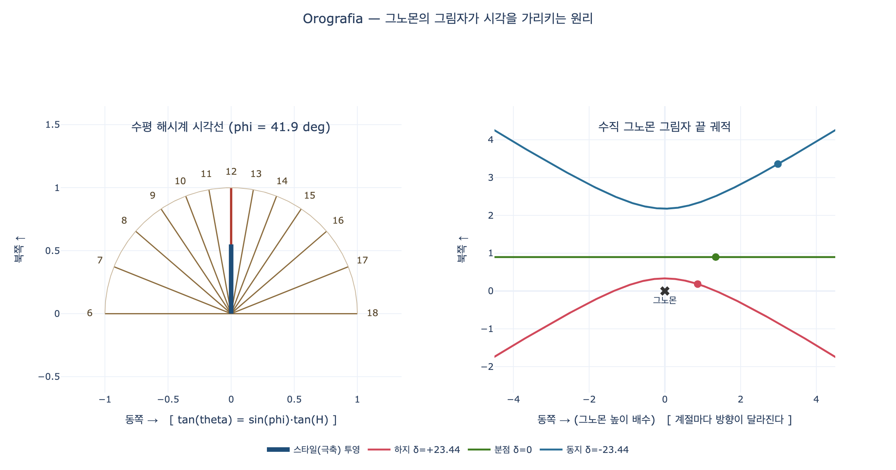

# 시각 측정술 — OROGRAFIA (Ripa, 『Iconologia』 제4권)

## 카드 요지

**Q.** 리파는 '시각 측정술(Orografia)'을 어떻게 의인화했는가?

**A.** 하늘색 짧은 옷을 입은 **날개 달린 젊은 여인**. 머리 꼭대기에 **모래시계**를 얹고, **오른손**에 자·컴퍼스·경사계(declinatorio)를, **왼손**에 **해시계**를 들었다. 머리 위 한쪽에 **태양**이 있고, 그 광선이 만든 **그노몬(바늘)의 그림자**가 지금 시각을 가리킨다.

---

## 1. 원문과 직역

출처: `13 Horology and the Hours to Obstinacy.md` 첫 항목 `#### ROGRAFIA: 0`(= OROGRAFIA, OCR로 첫 글자 유실). 「Di Cesare Ripa」

> *Onna [Donna] giovane, alata, e vestita di abito succinto di color celeste. Che in cima del capo abbia un orologio da polvere, e colla destra mano tenga una riga, compasso, e il declinatorio, e colla sinistra un orologio solare, e da una parte sopra il capo sia il Sole, il quale con i suoi raggi mostri la ombra del Gnomone, diretta all' ora corrente.*

직역: "젊은 여인, 날개가 달렸고, 하늘색의 **짧게 걷어올린 옷(abito succinto)**을 입었다. 머리 꼭대기에는 **모래시계(orologio da polvere, '가루 시계')**를 이고, 오른손에는 **자(riga)·컴퍼스(compasso)·경사계(declinatorio)**를, 왼손에는 **해시계(orologio solare)**를 든다. 머리 위 한편에 태양이 있어, 그 광선이 **그노몬의 그림자**를 현재 시각에 맞추어 보여준다."

> ⚠️ **혼동 주의**: 현대 이탈리아어 *orografia*는 '산악지형학(山岳誌)'이다. 리파의 *Orografia*는 그리스어 **ὥρα(hora, 시각) + γραφία(graphia, 그림·작도)**, 즉 **시각을 작도하는 기술 = 해시계 제작술(gnomonica)**이다. 카드가 '시각 측정술'로 옮긴 이유가 이것이다.

리파 자신이 어원 설명을 덧붙인다 — 마크로비우스에 따르면 24시간의 '시(ore)'는 **아폴로(=태양)**에서 이름을 얻었고, 이집트어로 태양을 **oro**라 부른다는 것. 그래서 *oro*(시각/태양) + *grafia*가 된다.

---

## 2. 도상 요소 해부 — 리파가 붙인 이유

| 요소 | 원문 어휘 | 리파의 설명(본문 근거) |
|---|---|---|
| 젊은 여인 | *giovane* | 시각(ore)을 본떠 젊게 그린다. 시간은 **끊임없이 새로 갱신되어(di continuo rinnovano il corso)** 하나 뒤에 하나씩 이어지며, 각각은 제 존재를 지킨다 |
| **날개** (어깨) | *alata, ale agli omeri* | 시간의 **빠른 흐름(il veloce corso delle ore)**. 리파는 페트라르카 「시간의 개선(Trionfo del Tempo)」의 시구 "시간·날·해·달이 미끄러져 간다"를 인용 |
| **짧게 걷어올린 옷** | *abito succinto* | 역시 속도의 표상. 달리기 좋게 걷어올린 옷 |
| **하늘색** | *color celeste* | **맑은 하늘(Ciel sereno)**. 구름에 가리지 않아야 태양의 운행으로 시각을 읽을 수 있다 — 해시계의 물리적 전제 조건을 옷 색으로 말한 것 |
| **모래시계**(머리 위) | *orologio da polvere in cima del capo* | **밤의 시간**을 담당. 해가 없을 때(le ore della notte)도 시간을 잰다. 머리 꼭대기에 인다 |
| **컴퍼스** | *compasso* | **이론적 작도**: 자오선(Meridionali)·수직선(Verticali)·분점선(Equinoziali)·**시각선(Orarie)**을 나누고, 게자리·염소자리 **회귀선(tropici)**을 함께 그린다 |
| **자** | *riga* | 그 선들의 성질(직선·길이)을 실제로 **작도**한다 |
| **경사계** | *declinatorio* | **자석 바늘(Calamita)**로 동·서·북·남 4방위뿐 아니라 **벽면의 자세와 편각(declinazioni dei muri)**을 알아낸다 → 벽면 방향에 따라 달라지는 **각종 수직 해시계**를 설계할 수 있다 |
| **해시계**(왼손) | *orologio solare* | **낮의 시간**. 리파는 발명자를 **밀레투스의 아낙시메네스**로 적는다(플리니우스 『박물지』 2권 기록) |
| **태양 + 그노몬 그림자** | *Sole … l'ombra del Gnomone* | 왼손의 해시계가 햇살을 받고, 바늘이 드리운 그림자가 **정확히 현재 시각**을 가리킨다 |

핵심 대비 구조: **왼손의 해시계 = 낮 / 머리 위의 모래시계 = 밤**. 둘을 합쳐 24시간 전체를 잰다. 오른손의 세 도구(자·컴퍼스·경사계)는 시계를 **읽는** 게 아니라 **만드는(작도·측량)** 도구라는 점이 중요하다. 즉 이 의인상은 "시간을 아는 자"가 아니라 "**시간 재는 장치를 설계하는 학문**"의 알레고리다.

---

## 3. `declinatorio`가 왜 필요한가

수평 해시계는 문자판이 항상 지평면이므로 위도만 알면 된다. 그러나 리파가 강조하는 **벽면 해시계(수직 해시계)**는 벽이 정남을 향하지 않고 얼마나 **비껴 있는지(declinazione)**에 따라 시각선 배치가 전부 달라진다. 그래서 나침반 바늘이 달린 `declinatorio`(방위·편각 측정기)로 먼저 벽의 방위를 재야 한다. 컴퍼스·자는 그 값을 받아 문자판을 작도하는 도구다.

---

## 4. 원본 판화에 대하여

이 힌트 폴더에는 원본 도판을 싣지 않았다. 해당 챕터 md(`13 Horology and the Hours to Obstinacy.md`)가 참조하는 4장의 이미지는 확인 결과 각각

- `_page_322_Picture_5.jpeg` — 장식 컷(카르투슈와 꽃바구니)
- `_page_323_Picture_2.jpeg` — **Ospitalità(환대)** 도판: 왕관 쓴 여인, 코르누코피아, 무릎 꿇은 순례자
- `_page_325_Picture_8.jpeg` / `_page_326_Picture_3.jpeg` — Ospitalità 말미와 **Ossequio(공경)** 도판

로, **Orografia와 무관**하다. 추출된 자산에서 p.292 이후 p.322 이전 구간의 도판이 통째로 누락되어 있어 Orografia 판화 자체가 asset에 존재하지 않는다. 대신 아래 **시각화** 절에서 이 알레고리의 핵심 장치(그노몬 그림자 → 시각)를 직접 계산해 그렸다.

---

## 5. 이어지는 대목 — "낮의 시간(Ore del giorno)"

Orografia 바로 뒤에 리파는 24시간을 **각각 하나의 여성 인물**로 그리는 연작을 붙인다. 시간은 태양의 시녀(ministre del Sole)이며 태양 마차의 키를 번갈아 잡는다(오비디우스 『변신 이야기』 2권), 보카치오는 시간을 **태양과 크로노스의 딸들**이라 했고, 호메로스·오비디우스는 시간이 **하늘의 문을 지킨다**고 했다. 예컨대 **제1시(Ora prima)**는 해 뜰 무렵으로, 앞머리는 금발이 바람에 날리고 뒷머리는 세었으며, 짧은 살구색 옷에 어깨 날개를 달고, 오른손에 태양의 기호를, 왼손에 막 벌어지려는 붉고 노란 꽃다발을 든다. **제3시**는 오른손에 수성 기호, 왼손에 **그림자가 3시를 가리키는 해시계**를 든다.

---

## 6. 암기 훅

- **"하늘색·날개·짧은 옷"** → 셋 다 같은 메시지: *맑은 하늘 아래 빠르게 흐르는 시간*
- **위(머리) = 밤(모래시계) / 아래(왼손) = 낮(해시계)** — 위아래로 24시간
- **오른손 3종 = 만드는 도구**(자·컴퍼스·경사계), **왼손 1종 = 재는 도구**(해시계)
- 발명자 **아낙시메네스**(플리니우스 2권), 어원 **oro = 이집트어로 태양**(마크로비우스)

---

## 시각화

`expy.py`는 리파가 말한 "태양 광선이 그노몬의 그림자로 현재 시각을 가리킨다"를 실제 천문 계산으로 재현한다. 왼쪽은 수평 해시계 문자판의 시각선($\tan\theta = \sin\phi\,\tan H$)을, 오른쪽은 수직 막대 그림자 끝이 하지·분점·동지에 그리는 궤적을 보여준다. 극축에 맞춘 스타일(gnomon)의 그림자 각도는 계절과 무관하지만, 수직 막대의 그림자 각도는 계절마다 달라진다는 것 — 그래서 리파의 "그노몬"은 반드시 극축으로 기울어져 있어야 한다.

