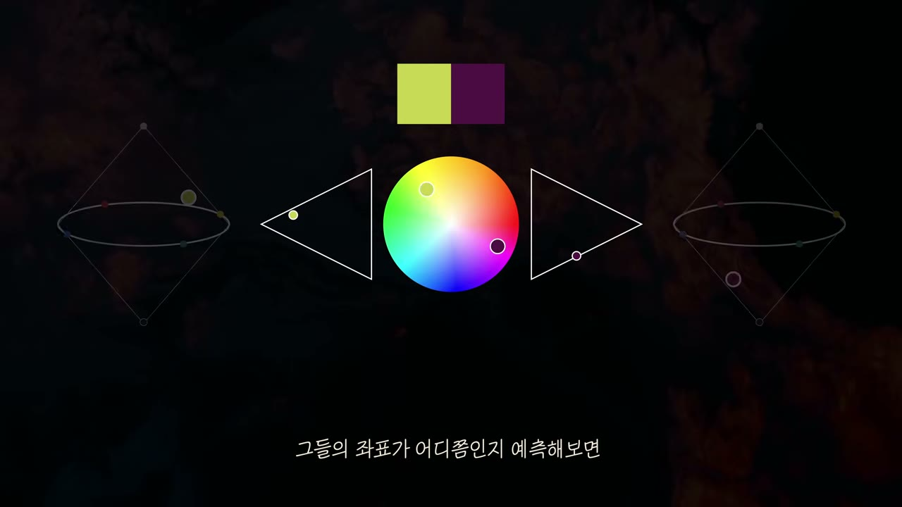
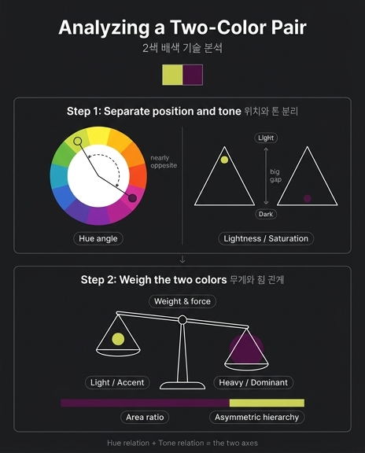

# 2색 배색을 기술적으로 분석하는 두 가지 사고 방법

> **Q.** 2색 배색을 기술적으로 분석할 때 영상이 권하는 두 가지 사고 방법은?
> **A.** (1) 각 색상의 **위치(색상환 각도)와 톤(명도·채도)을 분리**해서 보고 좌표가 어디쯤인지 예측해 본다. (2) 두 색의 **무게와 힘의 양**이 서로 어떤 관계에 있는지 생각해 본다.

영상 「그대로 갖다 쓰는 색깔 조합 16가지」는 마지막 부분(15:51~, 전사 16:13)에서 16가지 조합을 관통하는 분석 방법을 두 문장으로 정리한다. 색은 "꿈보다 해몽"이라 연상과 문화 코드에 따라 해석이 갈리지만, **기술적인 측면**만큼은 누구나 같은 절차로 읽을 수 있다는 것이 이 정리의 취지다. 영상 전체에서 각 조합을 소개할 때 붙였던 "보색인데 톤이 죽어 있다", "유사색인데 동일 톤", "보색에 명도 격차까지 극단적" 같은 설명이 사실은 모두 이 두 방법을 적용한 결과다.

---

## 그림으로 먼저 보기: 영상의 분석 모델

그림 1. 영상 16:17의 분석 모델. 예시 색은 라임옐로우 `#C7D14F`와 진보라색 `#501345`.

이 한 장이 두 방법을 모두 담고 있다. 요소별로 어떤 사고에 대응하는지 짚어 보자.

| 그림 요소 | 무엇을 나타내는가 | 대응하는 사고 방법 |
|---|---|---|
| **위쪽 스와치** (노랑·보라 두 사각형) | 분석 대상인 두 색 자체. 화면에 실제로 보이는 "결과" | 출발점 — 여기서 눈으로 좌표를 **예측**한다 |
| **가운데 색상환** (두 점) | 각 색의 **위치 = 색상 각도(Hue)**. 두 점이 원 위에서 어느 각도로 벌어져 있는지(보색·유사색·동일 색상) | 방법 1의 "위치" |
| **양옆 삼각형** (각각 점 하나) | 각 색의 **톤 = 명도·채도**. 세로축이 명도(위로 갈수록 밝음), 가로축이 채도(꼭짓점 쪽으로 갈수록 선명함). 라임의 점은 높고 안쪽(밝고 약간 탁함), 보라의 점은 낮고 바깥쪽(어둡고 상대적으로 맑음) | 방법 1의 "톤" — 색상과 **분리**해서 따로 찍는다 |
| **바깥 3D 원뿔 마름모꼴** (두 원뿔을 맞댄 형태, 타원 궤도) | 색상·명도·채도를 합친 **3차원 색공간(이중 원뿔)**. 원 둘레 = 색상, 세로 = 명도, 축에서의 거리 = 채도. 두 색이 이 공간에서 어디에 놓이고 **크기(면적·존재감)가 어떻게 다른지**를 구슬의 크기와 위치로 보여준다 | 방법 1의 좌표를 종합한 위치이자, 방법 2의 "무게와 힘" 비교 |

즉 **가운데+양옆 = 방법 1(분리해서 좌표를 찍는다)**, **바깥 = 방법 2(찍힌 두 좌표의 관계를 저울질한다)** 로 읽으면 된다. 같은 모델이 영상 내내 반복된다. 세이지그린·연분홍(그림 2)에서는 두 점이 색상환 반대편이지만 삼각형 안에서는 둘 다 낮은 채도 쪽에 모여 있었고, 라임·진보라(그림 4)에서는 점의 **높이** 차이가 극단적이었으며, 살구·파랑(그림 5)에서는 색상환의 실선 화살표(보색)와 삼각형을 가로지르는 점선(명도·채도 위계)이 따로 그려졌다.

---

## 방법 1. 위치와 톤을 분리해서 보고, 좌표를 예측한다

### 색을 세 개의 독립 좌표로 본다

"위치와 톤을 분리한다"는 것은 색 하나를 하나의 덩어리로 보지 않고, **서로 독립적인 축 위의 좌표**로 쪼개어 보는 사고다. 색 체계마다 이름은 다르지만 구조는 같다.

| 축 | 영상 용어 | HSL / HSV | 먼셀(Munsell) | 뜻 |
|---|---|---|---|---|
| 위치 | 색상환 각도 | H (Hue, 0~360°) | Hue (5R, 5Y, 5GY…) | 어떤 색 계열인가. 원형이므로 **각도**로 표현 |
| 톤 ① | 명도 | L (Lightness) / V (Value) | Value (0~10) | 얼마나 밝은가 |
| 톤 ② | 채도 | S (Saturation) | Chroma (0~14+) | 얼마나 선명한가(회색에서 얼마나 멀리 떨어졌는가) |

영상의 색상환은 H, 양옆 삼각형은 (S, L) 평면이다. 삼각형인 이유는 실제 색공간에서 **명도가 아주 높거나 아주 낮으면 채도의 최대치가 줄어들기** 때문이다(HSL의 이중 원뿔 단면, 먼셀의 색입체 단면이 모두 이런 모양). 바깥의 마름모꼴이 그 이중 원뿔 전체다.

우리가 평소에 색을 다루는 HEX(`#C7D14F`)나 RGB는 사람이 읽기 어려운 좌표계다. R·G·B 세 값이 모두 색상·명도·채도에 동시에 얽혀 있어서, 숫자를 보고도 "이 색이 저 색보다 얼마나 어두운가"를 바로 말할 수 없다. 반면 HSL/HSV/먼셀은 축이 우리의 **지각**과 일치하도록 설계됐으므로, 두 색의 관계를 "각도 차이"와 "명도 차·채도 차"로 즉시 비교할 수 있다. 분리의 첫 번째 이유는 이것이다: **비교 가능한 좌표계로 옮기는 것.**

### 왜 분리해야 하는가: 색상 관계만으로는 결과를 예측할 수 없다

두 번째 이유가 더 중요하다. 전통적 배색 이론은 "보색은 강하게 대립한다", "유사색은 조화롭다"처럼 **색상(위치) 관계만으로** 결과를 말한다. 그러나 영상의 16개 사례는 같은 색상 관계에서도 **톤에 따라 결과가 정반대로 갈린다**는 것을 반복해서 보여준다.

**보색인데 결과가 세 갈래로 갈린다**

| 조합 | 색상 관계 | 톤 관계 | 결과 |
|---|---|---|---|
| 세이지그린 & 연분홍 `#719470` / `#E0B3B6` | 보색 | 둘 다 **저채도**로 통일 | 충돌하지 않고 "속삭이는" 조화. 우아함·빈티지 |
| 아이보리 & 연하늘 `#F5ECC2` / `#A7D4E4` | 보색 | 둘 다 **고명도·저채도** | 경계가 흐려져 세게 부딪히지 않음. "표백된 여름" |
| 오렌지 & 틸블루 `#D96629` / `#0093A5` | 보색 | 톤을 **절제하지 않음** (둘 다 고채도) | 팽팽한 정면 대립. 틸 앤 오렌지 |
| 라임옐로우 & 진보라 `#C7D14F` / `#501345` | 보색 | **명도 극단 격차** (비대칭) | 위계가 확정된 대담한 배색. 독과 마법 |
| 살구 & 파랑 `#FDD4BD` / `#006EB8` | 보색 | **명도·채도 위계** (비대칭) | 충돌 없이 정갈. 차가운 색으로 차갑지 않게 |
| 빨강 & 흑녹색 `#CC1236` / `#0F1A14` | 보색 | 톤 차이 **극대화** | 가장 강렬·비장. 검정에 태운 녹색이 빨강을 더 붉게 |

색상환 위의 두 점은 여섯 조합 모두 "반대편"이다. 색상만 봤다면 전부 같은 부류로 묶였을 것이다. 그런데 결과는 "속삭임"에서 "정면 대립", "확정된 위계", "비장함"까지 완전히 다르다. 갈림길은 전부 **톤**에 있다.

**유사색인데 분위기가 갈린다**

| 조합 | 색상 관계 | 톤 관계 | 결과 |
|---|---|---|---|
| 커피브라운 & 올리브그린 `#71502F` / `#788860` | 유사색 | **동일 톤** (둘 다 회색기, 중명도·저채도) | 경계가 자연스럽게 이어짐. 신뢰감, 감정 진폭 억제 |
| 솔잎색 & 감청색 `#437742` / `#064F6E` | 유사색 | 둘 다 **무게감 있는 탁한 톤** | 사람 없는 자연, 시간 정지, 미스터리 |
| 옥색 & 라벤더 `#00978D` / `#B5B1D8` | 유사색 | **비대칭** (밝고 탁 vs 어둡고 맑) | 익숙함과 낯섦이 공존. 수면 위 안개 |
| 앰버 & 커피브라운 `#F3A257` / `#71502F` | 동일 색상 | 명도·채도만 변주 (**톤온톤**) | 갈등 없는 일상, 위스키의 깊이 |

유사색은 "조화롭다" 한 마디로 끝나지 않는다. 톤을 **맞추면**(커피·올리브) 경계가 사라지고 대상들이 하나로 연결되며, 톤에 **위계를 두면**(옥색·라벤더) 같은 유사색인데도 "중간 단계의 낯선 매력"이 생긴다.

이렇게 색상 축과 톤 축이 **서로 다른 결과를 독립적으로 만들어 내기 때문에**, 둘을 뭉쳐서 "이 두 색 어울리나?"라고 물으면 답이 나오지 않는다. 각 축을 따로 읽고 나서 합쳐야 한다. 이것이 "분리"의 이유다.

### "좌표를 예측한다"는 말의 뜻

영상은 좌표를 "측정"하라고 하지 않고 **"예측해 보라"**고 한다. 이는 컬러 피커를 열어 HEX를 HSL로 변환하기 **전에**, 눈으로 두 색을 보고 대략의 H/S/L을 가늠하는 훈련을 말한다.

- **색상 각도 예측**: "이건 노랑에서 초록으로 조금 간 연두 → 색상환 위쪽 왼편, 대략 60~90° 부근. 저건 빨강과 파랑 사이의 자주 → 아래 오른편, 300° 부근. 그러면 둘은 거의 반대편이구나."
- **명도 예측**: "이걸 흑백으로 바꾸면 밝은 회색일까 어두운 회색일까?" 라임은 밝은 회색, 진보라는 거의 검정에 가까운 회색이 될 것이다. → 명도 차가 매우 크다.
- **채도 예측**: "이 색에 회색이 얼마나 섞여 있나?" 세이지그린과 연분홍은 둘 다 회색기가 많다(저채도). 오렌지와 틸블루는 회색기가 거의 없다(고채도).

예측한 뒤에 실제 값으로 확인하면 눈이 교정된다. 예시로 영상의 색을 HSL로 변환해 보면(근사값):

| 색 | HEX | H (각도) | S (채도) | L (명도) |
|---|---|---|---|---|
| 라임옐로우 | `#C7D14F` | 약 65° | 59% | 56% |
| 진보라색 | `#501345` | 약 311° | 62% | **19%** |
| 세이지그린 | `#719470` | 약 118° | **14%** | 51% |
| 연분홍색 | `#E0B3B6` | 약 356° | 42% | 79% |
| 오렌지 | `#D96629` | 약 21° | 70% | 51% |
| 틸블루 | `#0093A5` | 약 187° | **100%** | 32% |
| 살구색 | `#FDD4BD` | 약 22° | 94% | **87%** |
| 파란색 | `#006EB8` | 약 204° | **100%** | 36% |

숫자로 보면 예측이 맞았는지 바로 드러난다. 라임·진보라는 채도가 비슷한데 **명도가 56% vs 19%**로 극단적으로 벌어져 있다(영상의 "명도 극단 격차"). 세이지그린은 채도 14%로 거의 회색에 가깝다("톤이 죽어 있다"). 살구·파랑은 명도(87% vs 36%)가 크게 다르다("명도의 위계"). 이런 확인을 반복하면 어느 순간 HEX를 보지 않고도 두 색의 관계가 읽힌다.

> 참고: 색상환은 체계마다 각도가 다르다. HSL(RGB 기반)에서 라임옐로우 65°의 정확한 반대는 245°(파랑)이고, 진보라는 311°다. 그러나 전통 미술의 RYB 색상환이나 먼셀 색상환에서는 연두(GY)와 자주(RP/P)가 서로 마주보는 보색이다. 영상의 색상환 그림도 두 점을 거의 반대편에 찍는다. "예측"의 목적은 정확한 각도가 아니라 **"대략 반대편인가, 인접했는가, 같은 색상인가"를 가늠하는 것**이므로 체계 차이에 얽매일 필요는 없다.

---

## 방법 2. 두 색의 무게와 힘의 양이 어떤 관계인지 생각한다

방법 1로 두 색의 좌표를 찍었다면, 방법 2는 그 두 점을 **저울에 올린다**. "무게와 힘의 양"이란 두 색이 화면에서 발휘하는 시각적 영향력의 크기이고, 그 관계란 두 힘이 **대등한가(대칭), 한쪽이 지배하는가(비대칭·위계)** 하는 것이다. 무게와 힘은 주로 세 요인에서 나온다.

### 힘의 세 요인

**① 중량감 — 명도가 낮을수록 무겁다**

색채 심리에서 가장 일관된 현상 중 하나로, 어두운 색은 무겁고 밝은 색은 가볍게 느껴진다. 같은 크기의 상자라도 검게 칠하면 하얀 상자보다 무거워 보인다. 진보라 `#501345`(L 19%)는 라임옐로우(L 56%)보다 훨씬 무겁고, 미드나잇블루 `#051230`는 코럴을 "받쳐 주는" 바닥처럼 기능한다. 영상이 연노란색·다크올리브를 "빛과 그림자", "윗공기와 아랫공기"라고 부른 것도 명도 차가 만드는 위아래의 무게 위계다.

**② 진출·후퇴 — 채도가 높고 따뜻할수록 앞으로 나온다**

고채도·난색은 앞으로 튀어나오고(진출색), 저채도·한색은 뒤로 물러난다(후퇴색). 오렌지 `#D96629`는 틸블루보다 앞으로 나오려 하고, 이것이 "인물과 배경이 확실히 구분되는" 틸 앤 오렌지의 원리다. 황토색·라벤더는 이 현상을 극단까지 밀어붙인 공기원근법 배색이다. 멀리 있는 것은 대기 산란으로 채도·대비가 떨어지고 청보라 쪽으로 이동하므로, 따뜻하고 채도 있는 황토색은 "손에 잡히는 것"이 되고 탁한 라벤더는 "저 멀리 대기"가 된다. 채도와 온도가 곧 **앞뒤의 힘**이다.

**③ 면적 비율 — 힘의 "양"은 얼마나 넓게 쓰느냐로 조절된다**

영상이 "무게와 힘의 **양**"이라고 표현한 부분이 여기와 닿는다. 색의 힘은 고정된 값이 아니라 **면적을 곱한 총량**으로 작용한다. 강한 색도 작은 면적에 쓰면 액센트가 되고, 약한 색도 넓게 깔면 바탕(도미넌트)이 된다. 디자인에서 흔히 말하는 60-30-10(도미넌트/서브/액센트) 비율이 이 사고의 실무 버전이다. 영상이 라임·진보라를 두고 "**순서와 면적**을 상황에 맞게 정확히 맞추면 대체 불가능한 배색"이라고 한 이유가 이것이다. 두 색의 고유한 힘(명도·채도)이 비대칭이므로, 면적으로 그 비대칭을 **어느 방향으로 얼마나 밀어줄지** 결정해야 한다.

### 대칭 관계 vs 비대칭 관계

두 색의 힘이 어떤 관계인지 판단하는 것이 방법 2의 핵심 산출물이다.

**대칭(대등) — 두 힘이 팽팽하게 맞선다**

| 조합 | 힘의 관계 | 효과 |
|---|---|---|
| 세이지그린 & 연분홍 | 둘 다 약한 힘(저채도)으로 대등 | 서로 누르지 않고 리듬만 남음. 어느 쪽이 주인공이라 말하기 어렵다 |
| 오렌지 & 틸블루 | 둘 다 강한 힘(고채도)으로 대등 | 정면 충돌. "속삭임 없이 확실하게 자기 목소리" |
| 커피브라운 & 올리브그린 | 같은 톤, 인접 색상으로 대등 | 경계가 녹아 하나의 환경이 됨 |

대등한 관계에서는 어느 쪽도 지배하지 않으므로 **긴장 또는 융화**가 결과가 된다. 힘이 둘 다 세면 긴장(오렌지·틸), 둘 다 약하면 융화(세이지·연분홍, 커피·올리브). 영상은 라임·진보라를 소개하면서 "이전의 조합들이 서로 **대등한 위치**에서 팽팽하게 맞섰다면"이라고 앞의 조합들을 이 범주로 정리했다.

**비대칭(위계) — 한쪽이 무겁고 한쪽이 가볍다**

| 조합 | 힘의 관계 | 효과 |
|---|---|---|
| 라임옐로우 & 진보라 | 진보라가 무겁고(저명도) 라임이 가볍고 밝음 → 명도 위계 | "색의 위계가 확실히 정해져" 설계가 명쾌해짐. 단, 면적·순서를 틀리면 유치해짐 |
| 살구 & 파랑 | 파랑이 무겁고 진하고(저명도·고채도), 살구는 가볍고 부드러움 → 명도와 채도 양쪽 위계 | 각자 제자리를 지키며 충돌 없이 정리. 질서·모던 |
| 옥색 & 라벤더 | 옥색이 어둡고 맑음, 라벤더는 밝고 탁함 → 교차된 위계 | 익숙함·낯섦이 공존하는 중간 단계 |
| 코럴 & 미드나잇블루 | 미드나잇블루가 압도적으로 무거움, 코럴은 작은 빛 | "척박한 땅 위의 작은 희망" — 무거운 바탕 위 가벼운 액센트 |

비대칭 관계에서는 자연스럽게 **주도색(도미넌트)과 보조색(액센트)의 역할**이 생긴다. 영상이 비대칭 배색을 "설계할 때 애매함 없이 원하는 것을 명쾌하게 전달할 수 있다"고 평가한 이유가 이것이다. 무거운 쪽이 바탕이 되고 가벼운 쪽이 그 위에 놓이는 구조가 이미 색 자체에 내장되어 있다. 반대로 대등한 관계에서는 설계자가 면적으로 위계를 **만들어 주어야** 한다.

그림 1의 바깥 마름모꼴에서 라임의 구슬은 크고 위쪽에, 진보라의 구슬은 아래쪽에 놓여 있다. 두 구슬의 높이 차가 무게 차이고, 크기 차가 면적(힘의 양) 차다. 이 두 구슬을 저울에 올려 어느 쪽으로 기우는지 보는 것이 방법 2다.

---

## 요약표의 두 열이 곧 이 두 축이다

영상 학습 문서 끝의 "16가지 조합 한눈에 보기" 표는 각 조합을 **'색상환 관계'**와 **'톤 관계'**라는 두 열로 정리한다. 이 두 열은 우연이 아니라 바로 위의 두 사고 방법을 16번 적용한 결과다.

| 열 | 대응 방법 | 값의 예 |
|---|---|---|
| 색상환 관계 | 방법 1의 **위치**(색상 각도) | 보색 / 유사색 / 유사색 경계 / 동일 색상 |
| 톤 관계 | 방법 1의 **톤**(명도·채도) + 방법 2의 **힘의 관계** | 대칭(둘 다 저채도) / 대칭(톤 절제 없음) / 비대칭(명도 극단 격차) / 톤온톤 / 빛과 그림자 |

'톤 관계' 열의 값이 "대칭"과 "비대칭"으로 시작하는 것에 주목하자. 톤을 읽는 즉시 두 색의 힘이 대등한지 위계가 있는지가 따라 나온다. 두 방법은 순서대로 이어지는 하나의 절차이고, 표의 한 행을 채우는 것이 곧 한 배색을 기술적으로 분석하는 일이다.

---

## 실전 적용 절차 (체크리스트)

새 2색 배색을 만나거나 만들 때, 아래 순서대로 자문한다.

**1단계. 위치와 톤을 분리해 좌표를 예측한다**

- [ ] 두 색을 각각 색상환 위에 찍는다. **몇 도쯤인가?** (노랑 60°, 초록 120°, 파랑 240°, 자주 300° 같은 기준점에서 가늠)
- [ ] 두 점의 **각도 차**는? → 반대편(보색) / 60° 안쪽(유사색) / 거의 같음(동일 색상) / 90° 전후(중간)
- [ ] 각 색을 흑백으로 바꿔 상상한다. **명도**는 밝은가 어두운가? 두 색의 명도 차는 큰가 작은가?
- [ ] 각 색에 **회색이 얼마나 섞였나?** 채도가 높은가(맑음) 낮은가(탁함)? 두 색의 채도는 비슷한가 다른가?
- [ ] (선택) 컬러 피커로 HSL/HSV 값을 확인해 예측을 교정한다.

**2단계. 두 색의 무게와 힘의 관계를 읽는다**

- [ ] **어느 쪽이 무거운가?** (명도가 낮은 쪽) 무게 차는 극단적인가 미미한가?
- [ ] **어느 쪽이 앞으로 나오는가?** (채도가 높고 따뜻한 쪽) 뒤로 물러나는 쪽은?
- [ ] 두 힘은 **대등한가, 위계가 있는가?**
  - 대등 + 둘 다 강함 → 긴장·대립 (틸 앤 오렌지형)
  - 대등 + 둘 다 약함 → 융화·속삭임 (세이지·연분홍형)
  - 위계 있음 → 주도색/보조색이 이미 정해짐 (라임·진보라형, 살구·파랑형)
- [ ] 위계가 없다면 **면적 비율**로 만들 것인가, 대등한 채로 둘 것인가? 위계가 있다면 무거운 쪽을 바탕으로 쓸 것인가, 뒤집어 액센트로 쓸 것인가?

**3단계. 콘셉트와 대조한다**

- [ ] 읽어낸 관계(대립/융화/위계)가 장면·브랜드가 원하는 정서와 맞는가? 맞지 않으면 색상을 바꾸지 말고 **톤이나 면적을 먼저** 조정해 본다. 영상의 사례들이 보여주듯, 같은 색상 관계에서 톤만 바꿔도 결과는 정반대가 된다.

이 절차를 거치면 "왠지 좋아 보인다"에서 "**보색인데 톤을 통일해서 대립을 눌렀고, 힘은 대등하다**"처럼 재현 가능한 문장으로 배색을 설명할 수 있게 된다. 그것이 영상이 말한 "기술적인 측면"의 분석이다.

---

## 참고

- 출처 영상: 그대로 갖다 쓰는 색깔 조합 16가지 (YouTube `23kxFVxYZIY`), 15:51~ "배색의 해석과 기술적 분석 팁", 전사 16:13
- 색 조합 출처: 와다 산조(和田三造) 『배색사전(配色事典)』
- 색 체계: HSL/HSV (RGB 기반 원통·이중원뿔 좌표), 먼셀 색체계 (Hue / Value / Chroma)
- 관련 개념: 색의 중량감(명도), 진출색·후퇴색(채도·온도), 공기원근법, 도미넌트/서브/액센트 면적 비율

## 인포그래픽

