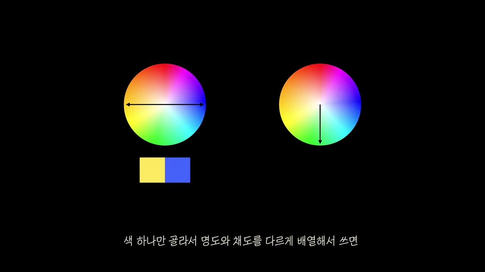
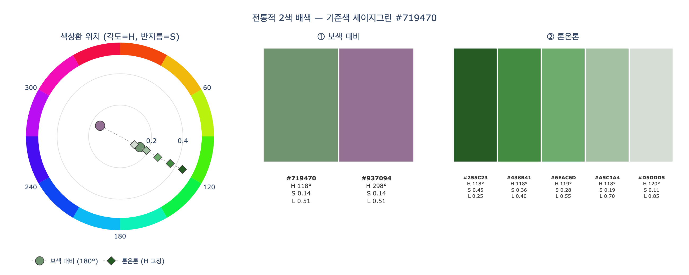

# 전통적 2색 배색의 두 가지 방법 — 보색 대비와 톤온톤

> **Q.** 특별한 콘셉트가 없을 때 검색 없이도 '꽤 괜찮은' 2색 배색을 만드는 전통적인 두 가지 방법은?
>
> **A.** (1) 색상환 반대편에 있는 두 색을 가져오는 **보색 대비**, (2) 색 하나만 골라 명도와 채도를 다르게 배열하는 **톤온톤 배색**. 아주 뛰어나지는 않아도 꽤 괜찮은 조합이 나온다.

## 1. 영상의 맥락 — "검색조차 필요 없다"

영상 「그대로 갖다 쓰는 색깔 조합 16가지」의 인트로(00:46~01:12)는 이렇게 시작한다. 그럴듯한 색 조합은 조금만 찾아도 수십·수백 개를 긁어모을 수 있고 저작권도 없어 그대로 쓸 수 있다. 그런데 **아주 특별한 콘셉트가 없다면 검색조차 필요 없다.** 아래 두 가지 전통적 규칙만 따르면 실패하지 않는 배색이 나오기 때문이다.

| | 방법 | 고정하는 것 | 바꾸는 것 | 색공간에서의 모양 |
|---|---|---|---|---|
| ① | **보색 대비** | 명도·채도 | 색상 $H \to H + 180^\circ$ | 색상환의 **정반대 두 점** |
| ② | **톤온톤** | 색상 $H$ | 명도 $L$, 채도 $S$ | 같은 각도의 **한 반지름 위** |

발표자의 평가는 "아주 뛰어나진 않아도 꽤 괜찮은 조합". 즉 이 둘은 **안전한 기본값**이고, 영상 본편은 여기서 "살짝 벗어난" 16가지 조합을 소개하는 구조다.

## 2. 그림으로 보는 두 방법

영상의 그림 1(01:07)은 두 방법을 색상환 두 개로 대비시킨다.

- **왼쪽 색상환 — 보색 대비.** 원의 중심을 지나는 **양방향 화살표**가 좌우로 뻗어 있다. 화살표의 양끝이 가리키는 색(노란 계열 ↔ 파란 계열)을 그대로 가져온 결과가 아래의 **노랑·파랑 2색 스와치**다. 색상환에서 180° 떨어진 두 색은 서로를 가장 선명하게 대비시켜 준다.
- **오른쪽 색상환 — 톤온톤.** 화살표가 **중심에서 바깥으로 한 방향(아래쪽, 녹색 방향)** 만 가리킨다. 색상환의 반지름 방향은 채도 축이므로, 색상(각도)은 그대로 두고 중심(무채색)에서 가장자리(순색)로 채도만 바꾸는 움직임이다. 자막 "색 하나만 골라서 명도와 채도를 다르게 배열해서 쓰면"이 이 장면에 붙어 있다.

두 화살표의 방향이 곧 두 방법의 정의다. 지름(중심을 통과) = 보색, 반지름(한 방향) = 톤온톤.

## 3. 각 방법의 원리

### ① 보색 대비 (complementary)

색상환은 360° 원이므로 "반대편"은 색상각을 180° 돌린 것이다.

$$H_{comp} = (H + 180^\circ) \bmod 360^\circ, \qquad S_{comp} = S,\quad L_{comp} = L$$

색상 차가 최대이므로 대비가 가장 강하고, 두 색이 서로를 두드러지게 한다. 대신 톤(명도·채도)을 조절하지 않으면 요란하게 부딪힐 수 있다. 영상에서는 1·2번 조합(세이지그린 & 연분홍색, 아이보리 & 연하늘색)이 **보색이면서 톤을 고명도·저채도로 통일**해 충돌을 눌렀고, 3·4번(오렌지 & 틸블루, 로즈핑크 & 민트그린)은 **톤을 절제하지 않아** 강렬한 인상을 만든다.

### ② 톤온톤 (tone-on-tone)

색상 하나만 정하고, 그 안에서 명도와 채도만 달리 배열한다. 색상이 같으니 두 색이 부딪힐 일이 없고 통일감·안정감이 생긴다. 대신 심심해지기 쉽다. 영상의 9번 조합 **앰버 `#F3A257` & 커피브라운 `#71502F`** 가 정확히 이 방식이다. 요약표에도 "색상환 관계: 동일 색상 / 톤 관계: 톤온톤"으로 적혀 있고, 실제로 계산하면 두 색의 색상각 차이는 약 1°, 명도 차이는 0.33이다(아래 시각화 노트 참고).

## 4. 왜 "꽤 괜찮은" 데서 멈추는가

영상의 핵심 관찰(01:12)은 "왠지 더 있어 보이는 색들은 이 전통적 방식에서 살짝 벗어나 있다"는 것이다. 발표자가 제시하는 분석 틀은 두 색의 **위치(색상환 각도)** 와 **톤(명도·채도)** 을 분리해서 보는 것이다.

- 순수한 보색 대비는 각도만 대립시키고 톤은 손대지 않는다.
- 순수한 톤온톤은 각도는 손대지 않고 톤만 바꾼다.

16가지 조합은 이 두 축을 **동시에, 비대칭으로** 만진다. 보색인데 톤은 통일(1·2번), 유사색인데 명도 격차(14번 옥색 & 라벤더), 보색인데 명도를 극단으로 벌림(7번 라임옐로우 & 진보라색, 15번 빨간색 & 흑녹색) 등이다. 그래서 카드의 답에 "아주 뛰어나지는 않아도"라는 단서가 붙는다. 두 전통 방법은 출발점이고, 그 위에서 톤이나 각도를 한 축 더 비틀면 인상적인 배색이 된다.

## 5. 한 줄 정리

- **보색 대비**: 색상환 **반대편(180°)** 두 색 → 대비 최대, 강렬.
- **톤온톤**: **색 하나**만 골라 **명도·채도**만 다르게 → 통일감, 안정.
- 둘 다 콘셉트 없이도 실패 없는 "꽤 괜찮은" 조합. 더 있어 보이려면 여기서 살짝 벗어나야 한다.

## 시각화

`expy.py`는 세이지그린 `#719470`을 기준으로 HEX→HSL 변환을 직접 구현한 뒤 (1) 색상각을 180° 돌린 보색 `#937094`, (2) 색상은 고정하고 명도·채도만 바꾼 톤온톤 사다리 5색을 계산해 나란히 그린다. 왼쪽 극좌표(각도 = 색상, 반지름 = 채도)에서 보색은 기준색의 **정반대**에, 톤온톤 사다리는 **같은 각도의 한 반지름 위**에 놓이는 것이 그림 1의 두 화살표와 대응한다.

참고로 영상이 실제 세이지그린의 짝으로 고른 연분홍색 `#E0B3B6`은 수학적 보색(298°)이 아니라 356°에 있고 명도도 훨씬 높다(L 0.79 vs 0.51). "전통적 방식에서 살짝 벗어난" 조합이라는 영상의 설명을 수치로 확인할 수 있다.

