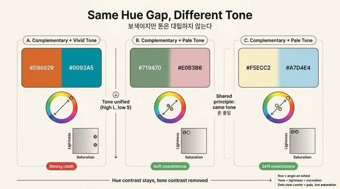

# 보색인데 왜 세게 부딪히지 않을까 — 톤을 통일한 보색 배색

## 질문

세이지그린·연분홍색과 아이보리·연하늘색은 둘 다 보색인데 강한 색 대비가 나지 않는 공통 원리는?

## 답

**톤(명도+채도)을 높은 명도와 낮은 채도로 통일했기 때문이다.** 색상환에서 그 정도 각도(거의 180°)로 벌어지면 강한 대비가 나와야 하지만, 톤이 대립하지 않아 두 색의 경계가 불분명해져서 세게 부딪히지 않는다.

## 그림으로 먼저 보기

그림 1에서 확인할 두 가지 요소가 있다.

1. **화살표 방향** — 두 원 모두 화살표가 색상환의 중심을 관통해 정반대편을 가리킨다. 왼쪽은 녹색↔붉은 분홍, 오른쪽은 노랑↔파랑. 즉 색상(hue) 축에서는 명백한 **보색 관계**이고, 이 각도만 보면 "강한 색 대비가 나와야" 한다.
2. **점의 위치** — 그런데 두 색을 나타내는 점은 화살표 끝(원의 테두리)이 아니라 **중심 근처**에 몰려 있다. 이 색상환은 테두리로 갈수록 채도가 높고 중심으로 갈수록 흰색에 가까워지는 원판이므로, 중심 근처의 점은 **채도가 낮고 명도가 높다**는 뜻이다. 두 점이 중심 가까이 나란히 있다는 것은 두 색의 톤이 거의 같다는 뜻이다.

정리하면, 화살표(색상 대비)는 크지만 점 사이 거리(톤 대비)는 작다. 이 카드의 원리는 이 한 장면에 그대로 들어 있다.

## 원리 1 — 색 대비는 세 축의 합이다

색의 차이는 하나의 축이 아니라 **세 축**으로 만들어진다.

| 축 | 뜻 | 두 조합에서의 차이 |
|---|---|---|
| 색상 (Hue) | 색상환 위의 각도 | **크다** — 거의 180° (보색) |
| 명도 (Lightness/Value) | 밝고 어두운 정도 | 작다 — 둘 다 밝음 |
| 채도 (Saturation/Chroma) | 맑고 탁한 정도 | 작다 — 둘 다 탁함(회색기) |

"강한 대비"란 세 축이 함께 벌어질 때 나온다. 색상 축 하나만 크게 벌어지고 명도·채도 축이 거의 붙어 있으면 전체 대비는 크게 완화된다. 눈은 명도 차이에 가장 민감하기 때문에, 명도가 같으면 두 색이 인접한 경계선이 흐릿해진다(색상만 다른 두 면은 흑백으로 바꾸면 거의 구분되지 않는다). 채도까지 낮으면 두 색 모두에 회색·흰색이 섞여 있어 공통 성분이 많아지고, 그만큼 서로 "닮은" 색이 된다.

영상은 이것을 "색상환에서 이 정도 각도로 벌어지면 강한 색 대비가 나와야 하는데, 높은 명도와 낮은 채도로 톤을 통일했기 때문에 경계가 불분명해져 세게 부딪히지 않는다"라고 표현한다. 실제 값으로 확인해 보면 다음과 같다(HSV 기준, 대략값).

| 색 | HEX | 색상각 | 명도(V) | 채도(S) |
|---|---|---|---|---|
| 세이지그린 | `#719470` | 118° | 58% | 24% |
| 연분홍 | `#E0B3B6` | 356° | 88% | 20% |
| 아이보리 | `#F5ECC2` | 49° | 96% | 21% |
| 연하늘 | `#A7D4E4` | 196° | 89% | 27% |

네 색 모두 채도가 20% 안팎으로 낮고 명도는 높다. 색상각은 두 쌍 모두 약 150~240° 떨어져 있어 보색권이다. 즉 "색상만 반대, 톤은 같음"이 숫자로도 확인된다. (세이지그린은 넷 중 명도가 가장 낮지만 그래도 중간 이상이고, 채도가 가장 낮은 "죽은 톤"이어서 연분홍과 부딪히지 않는다. 그림 2에서 발표자가 "둘 다 톤이 죽어 있어서 충돌하지 않고"라고 말한 이유다.)

## 원리 2 — '톤'은 명도와 채도를 한 묶음으로 부르는 말

이 카드에서 핵심 용어는 **톤(tone)**이다. 일상에서는 "톤을 맞춘다"를 막연하게 쓰지만, 배색 이론에서 톤은 **명도와 채도를 하나로 묶은 개념**이다. 색상을 뺀 나머지, 즉 "그 색이 얼마나 밝고 얼마나 맑은가"를 한 단어로 부르는 것이다.

이 정의를 체계화한 대표적 사례가 일본색채연구소의 **PCCS(Practical Color Co-ordinate System)** 톤 체계다. PCCS는 명도·채도 평면을 12개 톤(vivid, bright, strong, deep, light, soft, dull, dark, pale, light grayish, grayish, dark grayish)으로 나누고, 색상이 무엇이든 같은 톤에 속하는 색들은 비슷한 인상을 준다고 본다. 영상이 많이 인용한 와다 산조의 『배색사전』도 같은 일본 배색 전통 위에 있어, 조합을 설명할 때 색상환의 각도(색상)와 삼각형 위의 점(명도·채도 = 톤)을 분리해서 보여 준다(그림 2, 그림 6).

이 카드의 네 색은 PCCS로 말하면 **pale(연한)·light grayish(연회색빛)·soft** 부근, 즉 파스텔·그레이시 톤에 해당한다. 색상은 정반대이지만 **톤 이름은 같다**. 톤이 같으면 "같은 가족"으로 읽히기 때문에 색상이 달라도 조화가 성립한다. 이런 배색을 **톤인톤(tone in tone)** 또는 동일 톤 배색이라고 부르며, 그림 1의 두 색 조합은 '보색 색상 + 톤인톤'이라는 조합이다.

요약표(16가지 조합 한눈에 보기)에서 이 두 조합의 톤 관계가 "**대칭** (둘 다 저채도 / 고명도·저채도)"으로 적혀 있는 것도 같은 뜻이다. 대칭이란 두 색이 명도·채도 평면에서 서로 대등한 위치에 있다는 말이다.

## 원리 3 — 파스텔·그레이시 톤에서 보색이 부드럽게 공존하는 이유

파스텔 톤은 순색에 **흰색**을 많이 섞은 색, 그레이시 톤은 순색에 **회색**을 섞은 색이다. 어느 쪽이든 두 색에 공통 성분(흰색 또는 회색)이 크게 들어간다.

- 순색 상태의 보색 두 개는 공통 성분이 없어 각자가 자기 색을 100% 주장한다 → 경계가 날카롭고 눈이 튄다.
- 같은 양의 흰색·회색을 섞은 보색 두 개는 공통 성분이 대부분이고 "색상 정보"는 살짝 얹힌 정도다 → 경계는 남아 있지만 부드럽고, 두 면이 서로 스며드는 느낌이 난다.

그래서 세이지그린·연분홍은 "색 대비가 리듬감을 만들지만 요란하지 않게 속삭이며 서서히 빠져들게" 하고, 아이보리·연하늘은 "표백된 여름"이라는 말처럼 맑고 무해한 인상을 준다. 보색이 주는 **긴장(리듬)**은 남기고, 순색 보색이 주는 **충돌(소음)**은 지우는 것이 이 배색의 목적이다. 발표자가 이 조합을 "겉은 멀쩡한데 속은 그렇지 않은 이야기"에 쓴다고 한 것도, 표면은 평온하지만 색상 축에는 보색의 대립이 숨어 있다는 구조와 정확히 맞아떨어진다.

## 반대 사례로 확인하기

같은 영상에 나오는 다른 보색 조합과 비교하면 이 원리가 선명해진다.

### 오렌지 & 틸블루 — 톤을 절제하지 않은 보색

| 색 | HEX | 명도(V) | 채도(S) |
|---|---|---|---|
| 오렌지 | `#D96629` | 85% | 81% |
| 틸블루 | `#0093A5` | 65% | 100% |

색상 관계는 세이지·연분홍과 똑같이 보색이지만, **채도를 전혀 낮추지 않았다**. 그림 1의 원판으로 말하면 두 점이 중심이 아니라 **테두리 끝**에 찍힌다. 색상 대비도 크고 채도도 최대라서 "속삭임 없이 확실하게 자기 목소리를" 내며, 할리우드의 '틸 앤 오렌지'처럼 인물과 배경을 강하게 분리한다. 톤 관계는 여전히 "대칭"(둘 다 높은 채도)이지만 **톤을 절제하지 않은 대칭**이므로 대비가 완화되지 않는다. → 이 카드의 원리는 "톤이 같다"만으로는 부족하고, **"톤이 같으면서 고명도·저채도"**여야 한다는 점을 알려 준다.

### 라임옐로우 & 진보라색 — 톤을 비대칭으로 벌린 보색

| 색 | HEX | 명도(V) | 채도(S) |
|---|---|---|---|
| 라임옐로우 | `#C7D14F` | 82% | 62% |
| 진보라 | `#501345` | 31% | 76% |

이 조합도 보색이지만, 톤을 통일하는 대신 **명도를 극단적으로 벌려** 비대칭 관계를 만들었다(그림 4, 삼각형 위 점의 높이가 크게 다르다). 색상·명도 두 축이 동시에 벌어지므로 대비는 오히려 극대화되고, 밝은 쪽이 주도색·어두운 쪽이 보조색이라는 위계가 생긴다. 영상은 이를 "가장 대담하고 위험한" 조합이라 부른다.

### 세 조합을 한 줄로

| 조합 | 색상 대비 | 명도 대비 | 채도 대비 | 결과 |
|---|---|---|---|---|
| 세이지·연분홍 / 아이보리·연하늘 | 크다 (보색) | 작다 (둘 다 밝음) | 작다 (둘 다 탁함) | **부드러운 공존** |
| 오렌지·틸블루 | 크다 (보색) | 중간 | 작다 (둘 다 **높음**) | 강한 충돌, 팽팽한 대립 |
| 라임옐로우·진보라 | 크다 (보색) | **매우 크다** | 중간 | 극단적 대비, 위계 |

같은 "보색"이라도 명도·채도 축을 어떻게 다루느냐에 따라 결과가 세 갈래로 나뉜다. 이 카드의 두 조합은 그중 **색상 대비만 남기고 나머지 두 축을 높은 명도·낮은 채도에서 통일한 경우**다.

## 한 줄 정리

> 보색 각도는 그대로 두고, 두 색을 모두 **밝고 탁하게(고명도·저채도)** 만들어 톤을 맞추면, 색상 대비가 주는 리듬은 남고 명도·채도 대비가 주는 충돌은 사라져 경계가 부드러워진다.

## 인포그래픽

