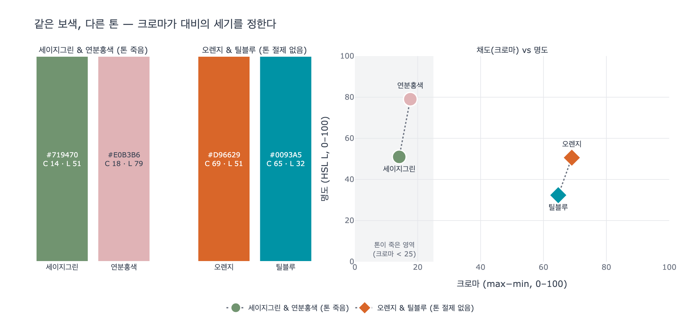

# 보색인데 왜 충돌하지 않는가 — 세이지그린 & 연분홍색

> **Q.** 세이지그린과 연분홍색은 색상환에서 팽팽하게 대립하는 보색인데 왜 충돌하지 않는가?
>
> **A.** 두 색 모두 톤이 죽어 있어서(채도가 낮아서) 대비가 가볍게 눌린다. 색 대비가 리듬감은 만들지만 요란하지 않게 속삭이면서 서서히 빠져들게 하는 조화로운 배색이 된다.

| 색 | HEX | 원어 이름 | 색상(H) | 크로마 | 명도(L) |
|---|---|---|---|---|---|
| 세이지그린 | `#719470` | Chromium Green | 118° | **14** | 51 |
| 연분홍색 | `#E0B3B6` | Cameo Pink | 356° | **18** | 79 |

(크로마 = RGB 최대−최소, 0–100. 명도 = HSL L. 수치는 `expy.py`로 계산.)

## 1. 영상이 말하는 것

영상(02:29)은 이 조합을 "기술적으로 팽팽하게 대립되는 보색 관계에 놓여 있지만 **둘 다 톤이 죽어 있어서** 충돌하지 않고 가볍게 눌러 주는 조화로운 배색"이라고 설명한다. 이어서 03:35에서는 아이보리·연하늘색과 묶어 공통 원리를 정리한다. 색상환에서 이 정도 각도로 벌어지면 강한 색 대비가 나와야 하는데, **높은 명도와 낮은 채도의 톤으로 통일**했기 때문에 경계가 불분명해져 세게 부딪히지 않는다는 것이다.

핵심은 세 가지 축을 분리해서 보는 것이다.

- **색상(Hue)**: 색상환 위의 각도. 두 색은 여기서 반대편에 있다 → 대립 요인.
- **채도(Saturation / Chroma)**: 회색축에서 얼마나 멀리 나갔는가. 두 색 모두 낮다 → 대립을 누르는 요인.
- **명도(Lightness)**: 밝기. 두 색 모두 중간 이상이며 어두운 색이 없다 → 같은 '톤 영역'에 있다.

"톤(tone)"은 채도와 명도를 묶어 부르는 말이다. 색상은 반대여도 톤이 같으면 한 식구처럼 보인다.

## 2. 그림 2 읽기 — 색상환의 두 점과 양옆 삼각형

화면 왼쪽 절반이 세이지그린, 오른쪽 절반이 연분홍색으로 채워져 있고, 가운데 색상환과 양옆 삼각형이 두 색의 좌표를 보여준다.

- **가운데 색상환**: 초록 점과 분홍 점이 원의 중심 가까이에서 좌우로 마주 놓여 있다. 방향은 정반대(초록 ↔ 빨강)지만, 두 점이 원 **가장자리가 아니라 중심 근처**에 있다는 것이 포인트다. 색상환에서 중심으로 갈수록 채도가 떨어져 회색에 가까워진다. 즉 "방향은 대립하지만 둘 다 회색축에서 조금밖에 나가지 않았다".
- **왼쪽 삼각형(세이지그린)**: 위 꼭짓점이 명도, 왼쪽 꼭짓점이 채도다. 점은 채도 꼭짓점에서 멀리 떨어진 오른쪽 변 중간쯤에 있다 → 채도가 낮고 명도는 중간(L 51).
- **오른쪽 삼각형(연분홍색)**: 좌우가 뒤집힌 배치(명도 위, 채도 오른쪽). 점은 명도 꼭짓점 바로 아래, 채도 꼭짓점에서 가장 먼 쪽에 있다 → 명도가 높고(L 79) 채도가 낮다.

두 삼각형의 점이 모두 채도 꼭짓점과 반대편에 몰려 있는 것이 "둘 다 톤이 죽어 있다"의 시각적 표현이다.

## 3. 그림 3 읽기 — 보색 각도는 그대로, 톤만 통일

왼쪽 색상환이 세이지그린·연분홍, 오른쪽이 아이보리·연하늘이다. 화살표는 원의 지름을 가로지르며 두 색이 **정반대 방향**임을 강조하지만, 실제 두 색을 표시한 원반은 화살표 끝(순색)이 아니라 중심 근처에 찍혀 있다. 방향(보색)과 거리(채도)를 분리해서 그린 것이다. 왼쪽은 초록–빨강 축, 오른쪽은 노랑–파랑 축인데, 이 둘이 바로 아래에서 다룰 시각계의 두 대립 채널이다.

## 4. 보색 대비가 강하게 느껴지는 지각적 이유 — 대립 색상 채널

우리 눈의 세 원추세포(L, M, S) 신호는 망막 신경절 세포 단계에서 그대로 전달되지 않고 **차이 신호**로 다시 묶인다(헤링 Hering 의 대립색 이론, Hurvich–Jameson 의 실험적 확인).

- 빨강–초록 채널: 대략 $L - M$
- 노랑–파랑 채널: 대략 $(L + M) - S$
- 명암 채널: 대략 $L + M$

각 채널은 한 방향으로 흥분하면 반대 방향으로는 억제된다. 그래서 빨강과 초록은 **같은 뉴런의 양 끝**을 잡아당기는 관계다. 두 색이 나란히 놓이면 경계에서 그 채널이 한쪽은 +, 한쪽은 −로 최대 진폭으로 흔들리고, 이것이 보색 대비가 유난히 '팽팽하게' 느껴지는 생리적 이유다. 잔상(빨강을 오래 보면 초록 잔상)도 같은 채널의 되튐이다.

CIELAB 좌표로 확인하면 세이지그린은 $a^* = -19.6$ (초록 방향), 연분홍은 $a^* = +16.7$ (빨강 방향)으로 부호가 반대다. 대립 채널에서 정확히 반대편에 있는 색이 맞다.

> 참고: RGB 기반 HSL 색상각으로 재면 두 색의 차이는 122° 로 180° 가 아니다. RGB 색상환에서 초록(120°)의 보색은 마젠타(300°)이기 때문이다. 하지만 영상의 색상환(그림 1·2)은 위 노랑, 오른쪽 빨강, 아래 파랑, 왼쪽 초록의 **화가용(RYB)·대립색 배치**이고, 여기서는 빨강↔초록이 정확히 마주본다. 지각적 대립(헤링 채널, CIELAB $a^*$ 축)으로도 빨강–초록이 짝이므로, 영상의 "보색"은 후자 의미다. 반면 오렌지·틸블루는 HSL 색상각으로도 166° 로 거의 정반대다.

## 5. 채도가 낮아지면 왜 대비가 '눌리는가'

대립 채널이 만들어내는 신호의 **크기**는 방향이 아니라 **진폭**에 달려 있다. 채도(크로마)는 회색축에서의 거리이므로, 채도가 낮다는 것은 채널이 +쪽으로도 −쪽으로도 조금밖에 흔들리지 않는다는 뜻이다.

CIELAB 에서 두 색 사이의 색채 거리를 대립축 성분으로 보면

$$\Delta a^* = |(-19.6) - (+16.7)| \approx 36, \qquad \Delta b^* \approx 10$$

인데, 오렌지·틸블루는

$$\Delta a^* = |41.6 - (-26.0)| \approx 68, \qquad \Delta b^* = |53.2 - (-18.8)| \approx 72$$

로 대립 채널의 진폭이 두 배 가까이 크다. 같은 "반대 방향"이라도 두 점 사이의 거리가 절반이면 경계에서 채널이 흔들리는 폭도 절반이다. 그래서 보색 대비는 사라지지 않되(리듬감은 남고) 소리만 작아진다. 영상의 표현대로 "요란하지 않게 속삭이면서" 대비하는 것이다.

또 하나, 채도가 낮은 두 색은 서로 **공통 성분(회색)** 을 많이 갖는다. `#719470`과 `#E0B3B6`은 각각 R,G,B 채널이 0x70~0x94, 0xB3~0xE0 안에 몰려 있어 색 자체가 대부분 회색 성분이다. 공통 성분이 많으면 두 색은 서로 '섞여 보이는' 여지가 생겨 경계가 불분명해진다. 영상이 말한 "경계가 불분명해져서 세게 부딪히지 않는다"가 이것이다.

## 6. 명도 — 어두운 색이 없다

세이지그린 L 51, 연분홍 L 79 로 차이는 있지만 두 색 모두 **중간 이상의 밝기**이고 어두운 색이 없다. 밝기가 높으면 색 자체가 흰색 쪽으로 희석되어 크로마가 더 낮게 느껴지고(연분홍이 대표적), 어두운 색이 없으니 명암 채널에서도 강한 충돌이 나지 않는다. 영상이 "높은 명도와 낮은 채도의 톤으로 통일"이라고 명도를 함께 언급하는 이유다. 대비의 주된 억제 요인은 채도이고, 명도는 두 색을 같은 '가벼운' 톤 영역에 묶어 주는 보조 역할이다.

## 7. 반례 — 톤을 절제하지 않은 보색, 오렌지 & 틸블루

| 색 | HEX | 색상(H) | 크로마 | 명도(L) | CIELAB $L^*$ |
|---|---|---|---|---|---|
| 오렌지 | `#D96629` | 21° | **69** | 51 | 56.5 |
| 틸블루 | `#0093A5` | 187° | **65** | 32 | 55.7 |

영상(03:51)은 이 조합을 "똑같이 보색 관계지만 굳이 **톤을 절제하지 않는** 조합", "완벽한 보색 대비 안에서 팽팽한 대립각을 세우고, 속삭임 없이 확실하게 자기 목소리를 내는 조합"이라고 설명한다. 수치로 보면 두 색의 크로마가 65~69 로 세이지그린·연분홍(14~18)의 **4배 이상**이다. 대립 채널의 양 끝을 멀리 잡아당기니 경계가 세게 부딪히고, 그래서 눈에 바로 띄고 강렬하다.

흥미로운 점은 두 색의 지각 명도 $L^*$ 가 56.5 / 55.7 로 거의 같다는 것이다(등명도). 밝기 차이가 없으면 경계는 오직 색 채널의 대립만으로 만들어지는데, 고채도 등명도 보색 경계는 시각적으로 '진동'하는 것으로 잘 알려져 있다. 할리우드의 '틸 앤 오렌지' 그레이딩이 인물(피부톤=오렌지)과 배경(틸)을 확실히 분리하면서도 화면 전체에 긴장감을 주는 이유가 여기에 있다.

정리하면, **보색 관계(방향)는 두 조합이 같고, 다른 것은 채도(거리)다.** 방향이 대비의 종류를 정하고 거리가 대비의 세기를 정한다. 세이지그린·연분홍은 거리를 짧게 잡아 "우아함과 빈티지함이 공존하는", 겉은 평온한데 속은 서늘한 이야기에 맞는 배색이 되었고, 오렌지·틸블루는 거리를 끝까지 벌려 레트로하고 이국적인 강렬함을 얻었다.

## 시각화

`expy.py` 실행 결과. 왼쪽·가운데는 두 쌍의 실제 스와치(크로마 C, 명도 L 표기), 오른쪽은 각 색을 (크로마, 명도) 평면에 찍은 것이다. 세이지그린·연분홍은 회색 음영의 저크로마 영역에 모여 있고, 오렌지·틸블루는 크로마 65~69 로 멀리 떨어져 있다.

