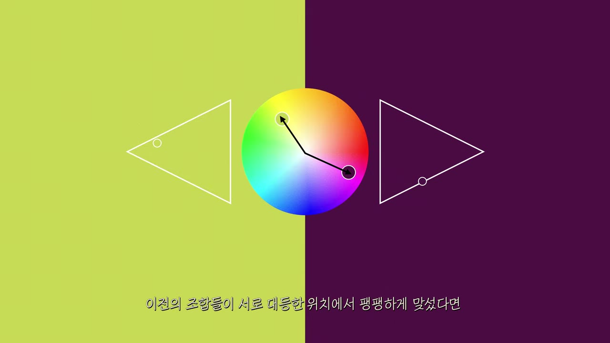
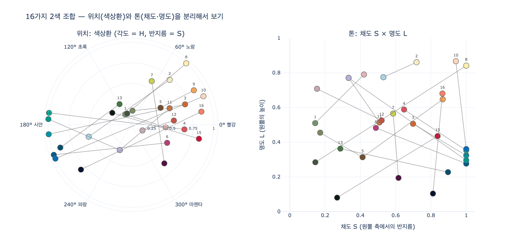

# 2색 배색 분석 모델 — 원·삼각형·마름모꼴이 각각 나타내는 것

> **문제**: 아래 그림은 2색 배색을 분석하는 모델이다. 가운데 원, 양옆 삼각형, 바깥 마름모꼴 도형이 각각 나타내는 것은?
>
> **답**: 가운데 원은 색상환에서 두 색의 각도(보색·유사색 관계), 양옆 삼각형은 각 색의 명도·채도 위치, 바깥의 마름모꼴은 색상환을 위아래로 확장한 3차원 원뿔 색공간에서 두 색의 좌표를 나타낸다. 이렇게 위치와 톤을 분리해 두 색의 무게와 힘의 관계를 읽는다. 그림의 예는 라임옐로우와 진보라색이다.

## 한눈에 보기

| 그림 속 도형 | 읽는 것 | 색공간 용어 | HSL 좌표 |
|---|---|---|---|
| **가운데 원** | 두 색의 **각도** — 보색인가, 유사색인가 | 색상환 (hue wheel) | $H$ |
| **양옆 삼각형** (색마다 하나) | 각 색의 **명도·채도** 위치 (톤) | 한 hue를 고정한 색공간의 **수직 단면** | $(S, L)$ |
| **바깥 마름모꼴** (양쪽) | 두 색의 **3차원 좌표** | HSL **쌍원뿔(bicone)** 색공간을 옆에서 본 윤곽 | $(H, S, L)$ 전체 |

영상의 결론부(15:51~)는 이렇게 정리한다. *"기술적으로는 각 색상의 위치(색상환 각도)와 톤(명도·채도)을 분리해서 보고, 그 좌표가 어디쯤인지 예측해 보면 큰 도움이 된다. 그리고 두 색의 무게와 힘의 양이 서로 어떤 관계에 있는지 생각해 보라."* 세 도형은 이 문장을 그대로 그림으로 옮긴 것이다.

## 그림 1의 요소를 하나씩 읽기

그림 1을 가운데에서 바깥으로 따라가 보자.

1. **맨 위 두 색 견본** — 분석 대상. 왼쪽 라임옐로우(`#C7D14F`), 오른쪽 진보라(`#501345`).
2. **가운데 색상환** — 노랑–연두 쪽에 라임옐로우 점, 자주–마젠타 쪽에 진보라 점이 찍혀 있다. 두 점을 중심과 이으면 약 114°가 벌어져 보색에 가까운 관계다(정확한 180° 보색은 아니지만 영상은 "보색"으로 분류한다). 색상환은 hue 하나만 보는 도구라 **밝고 어두운 정도는 전혀 표현되지 않는다** — 그래서 어두운 진보라도 순색 자주 위치에 점만 찍힌다.
3. **왼쪽 삼각형 (라임옐로우용)** — 삼각형 안 점이 중간보다 약간 위에 있다. 명도 $L \approx 0.56$, 채도 $S \approx 0.59$.
4. **오른쪽 삼각형 (진보라용)** — 점이 삼각형 아래쪽 변 근처에 있다. 명도 $L \approx 0.19$로 매우 어둡다. 두 삼각형의 점 높이 차가 이 조합의 핵심인 **명도 비대칭**을 보여준다.
5. **양쪽 바깥 마름모꼴** — 위·아래 꼭짓점과 허리에 타원이 있는 철사 도형이다. 두 원뿔을 밑면끼리 맞댄 3D 물체를 비스듬히 본 것으로, 허리 타원 위에 몇 개의 회색 점(순색 위치 표시)이 있고 큰 점 하나가 각 색의 위치를 나타낸다. 왼쪽 마름모꼴의 라임옐로우 점은 허리 근처 약간 위, 오른쪽 마름모꼴의 진보라 점은 허리보다 훨씬 아래에 찍혀 있다.

## 왜 그 도형인가 — 색공간 모델과의 대응

### 가운데 원 = 색상환 (hue 원판)

HSL·HSV 색공간에서 hue는 0°~360° 각도로 표현되며, 이를 원 위에 늘어놓은 것이 색상환이다. 180° 맞은편이 보색, 이웃 각도가 유사색이다. 영상에서는 이 각도만으로 16쌍을 "보색 / 유사색 / 동일 색상"으로 1차 분류한다.

### 양옆 삼각형 = hue를 고정한 명도·채도 단면

HSL 색공간을 **쌍원뿔(bicone)** 로 그리면 위 꼭짓점이 흰색($L=1$), 아래 꼭짓점이 검정($L=0$), 허리 원둘레가 순색($L=0.5, S=1$)이다. 이 물체를 **중심축을 지나는 평면으로 자르면** 한쪽 절반의 단면은

- 축 위의 흰색 꼭짓점, 검정 꼭짓점,
- 허리의 순색 점

세 점을 잇는 **삼각형**이 된다. 삼각형의 세로 방향이 명도(높이), 축에서 바깥으로 나가는 방향이 채도(반지름)다. 즉 그림의 삼각형은 "이 hue의 색이 가질 수 있는 모든 톤"을 펼쳐 놓은 지도이고, 점 하나는 그 안에서 실제 색의 $(S, L)$ 위치다. 삼각형이 색상환 양옆에 꼭짓점을 바깥으로 향해 붙어 있는 것은 축(색상환 중심)에서 바깥(순색)으로 뻗은 단면이라는 뜻이다.

> HSV(원뿔 하나)로 그리면 단면이 삼각형이 아니라 직각삼각형·사각형이 된다. 영상의 도형이 위아래로 뾰족한 마름모꼴이므로 HSL 쌍원뿔 모델로 보는 것이 자연스럽다.

### 바깥 마름모꼴 = 쌍원뿔 색공간 전체

색상환(원판)에 명도 축을 위아래로 세운 것이 3D 색공간이다. 옆에서 보면 두 원뿔이 꼭짓점을 위아래로 향한 마름모꼴 윤곽이 되고, 허리의 원은 비스듬히 봐서 타원으로 보인다. 그림에서 허리 타원 위에 있는 작은 회색 점들은 순색(빨강·노랑·초록·시안·파랑·마젠타)의 위치, 큰 점은 분석 대상 색의 좌표다. 원기둥 좌표 $(H, S, L)$을 직교좌표로 바꾸면

$$x = S\cos H,\qquad y = S\sin H,\qquad z = L$$

이다. 이 한 점 안에 원(각도 $H$)과 삼각형(반지름 $S$, 높이 $L$)이 모두 들어 있다. 즉 **세 도형은 한 물체를 세 각도에서 본 것**이다 — 위에서 내려다본 평면도가 색상환, 축을 지나는 단면이 삼각형, 옆에서 본 입체가 마름모꼴.

### Munsell 색입체와의 관계

색을 "색상·명도·채도" 세 축으로 나눠 입체로 만드는 발상은 1905년 Albert H. Munsell의 **Munsell 색체계**(Munsell color system)가 원형이다. Munsell 색입체도 세로축이 명도(value 0~10), 축에서 거리가 채도(chroma), 둘레 각도가 색상(hue)이다. 차이는

- Munsell은 지각적 균등성을 우선해 색상마다 도달 가능한 최대 채도가 달라 **울퉁불퉁한 비대칭 입체**가 되고,
- HSL은 RGB 큐브를 기하학적으로 변형한 것이라 **매끈한 대칭 쌍원뿔**이 된다.

영상의 도형은 후자(HSL) 쪽의 단순화된 그림이지만, "명도는 높이, 채도는 반지름, 색상은 각도"라는 읽기 방식은 Munsell과 동일하다. 한국 산업표준(KS)과 미술 교과의 색입체 설명도 Munsell 기준이므로 그 개념이 이 도형에 그대로 적용된다.

- HSL/HSV 색공간과 쌍원뿔·단면 설명: <https://en.wikipedia.org/wiki/HSL_and_HSV>
- Munsell 색체계: <https://en.wikipedia.org/wiki/Munsell_color_system>

## "위치와 톤을 분리해서" 무게와 힘을 읽는 방법

| 물리량 | 좌표 | 배색에서의 의미 |
|---|---|---|
| **위치** | 각도 $H$ | 두 색이 대립(보색)하는지, 나란한지(유사색) — 색 대비의 *종류* |
| **무게** | 높이 $L$ | 어두우면 무겁고 가라앉으며, 밝으면 가볍고 떠오른다. 두 점의 높이 차가 클수록 위계가 분명하다 |
| **힘** | 반지름 $S$ | 채도가 높으면 앞으로 튀어나오고 힘이 세다. 둘 다 축 가까이(저채도)면 서로 부딪히지 않는다 |

이 분리가 중요한 이유는 색상환만 보면 놓치는 것이 있기 때문이다.

- **세이지그린·연분홍, 아이보리·연하늘(그림 2, 3)**: 색상환에서는 보색에 가깝지만 삼각형의 점이 둘 다 축 가까이(저채도) 비슷한 높이에 있어 충돌하지 않는다 → "보색이지만 톤은 대립하지 않는다".
- **라임옐로우·진보라(그림 4, 이 카드의 그림 1)**: 보색 각도 + 높이 차 0.37 → 위계가 확실한 **비대칭** 조합. 가장 대담하고 위험하다는 평이 여기서 나온다.
- **살구·파랑(그림 5)**: 거의 완전한 보색이지만 명도(살구 0.87 vs 파랑 0.36)와 채도의 위계가 모두 뚜렷해 깨끗하게 정리된다.
- **앰버·커피브라운**: 각도 차 1°(동일 색상)인데 높이만 다르다 → 톤온톤.

## 그림 2·4·5는 같은 모델의 2D 판

영상 중간에 나오는 그림 2(세이지그린·연분홍), 그림 4(라임옐로우·진보라, 위), 그림 5(살구·파랑)는 모두 **원 + 두 삼각형**만 그린다. 그림 4에서 왼쪽 삼각형의 점은 위쪽, 오른쪽 삼각형의 점은 아래쪽 변에 붙어 있어 명도 격차가 곧바로 읽힌다. 그림 5는 여기에 점선 화살표를 더해 명도·채도의 "위계" 방향을 표시한다. 마지막 그림 6은 여기에 바깥 마름모꼴을 덧붙여, 지금까지 따로 봤던 각도와 톤이 사실은 **하나의 3D 좌표**였음을 보여주는 총정리 화면이다.

## 시각화

`expy.py`는 16쌍 HEX를 `colorsys`로 HSL로 바꿔 왼쪽에 색상환(각도 $H$, 반지름 $S$), 오른쪽에 톤 평면($S$, $L$)을 그린다 — 그림 1의 원과 삼각형을 16쌍 전체에 적용한 것이다. 노트북에서 실행하면 보너스로 HSL 쌍원뿔 3D 산점도(마름모꼴에 대응)도 볼 수 있다.

왼쪽에서 원 중심을 길게 가로지르는 선(3, 4, 10, 15)이 보색 쌍, 짧은 선(5, 9, 12)이 유사색·동일 색상 쌍이다. 오른쪽에서 세로로 긴 선(7, 8, 10, 14, 16)이 명도 비대칭 쌍, 두 점이 비슷한 높이·낮은 채도에 모인 쌍(1, 5)이 톤 대칭 쌍이다.
