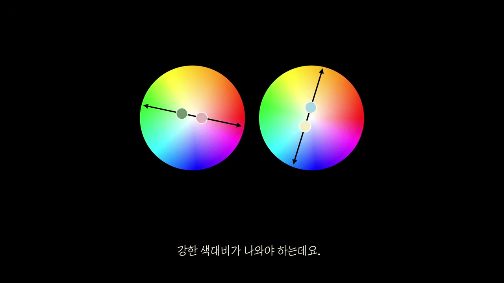

# 그림 1 읽기 — 전통적 2색 배색의 두 방식: 보색 대비와 톤온톤

> **질문**: 아래 그림에서 왼쪽과 오른쪽 색상환의 화살표는 각각 어떤 전통적 배색 방식을 나타내는가?
>
> **답**: 왼쪽의 색상환을 가로지르는 양방향 화살표는 반대편 두 색을 고르는 **보색 대비**(예: 노랑과 파랑), 오른쪽의 한 색 안에서 중심에서 바깥으로 향하는 화살표는 한 색상의 명도·채도만 바꾸는 **톤온톤 배색**을 나타낸다.

영상 01:07 장면. 자막은 "색 하나만 골라서 명도와 채도를 다르게 배열해서 쓰면"으로, 오른쪽 색상환(톤온톤)을 설명하는 대목이다. 왼쪽 색상환 아래에는 노랑·파랑 스와치가 붙어 있어 방금 설명이 끝난 보색 대비의 예시를 보여준다.

---

## 1. 그림에서 실제로 보이는 것

| 위치 | 관찰되는 요소 | 의미 |
|---|---|---|
| 왼쪽 색상환 | 원을 **수평으로 가로지르는 양방향 화살표** (왼쪽 노랑–주황 영역 ↔ 오른쪽 파랑 영역) | 색상환에서 서로 정반대(180°)에 있는 두 색을 잡는다 → **보색 대비** |
| 왼쪽 색상환 아래 | 노랑(`≈#F5E05A`)과 파랑(`≈#3C5BE0`) 스와치 두 칸 | 화살표 양끝에서 실제로 뽑아낸 두 색. 노랑과 파랑은 대표적인 보색 쌍 |
| 오른쪽 색상환 | 원 **중심(흰색 부근)에서 아래쪽 노랑–주황 영역으로 뻗는 단방향 화살표** | 색상(hue)은 하나로 고정하고, 중심(무채색)에서 바깥(고채도)까지의 **채도 축**을 따라 움직인다 → **톤온톤** |
| 오른쪽 색상환 아래 | 스와치 없음 | 자막 타이밍상 아직 예시 색이 나오기 전 장면 |

두 화살표의 방향 차이가 핵심이다.

- **왼쪽**: 지름을 따라 **양쪽 끝으로** → "두 개의 서로 다른 색상"을 고른다.
- **오른쪽**: 한 반지름을 따라 **안에서 밖으로** → "하나의 색상 안에서 세기(톤)만" 바꾼다.

---

## 2. 색상환(hue wheel)의 구조

그림에 쓰인 색상환은 HSV/HSL 계열의 원형 색공간을 위에서 내려다본 모양이다.

- **각도(θ) = 색상(hue)**: 원 둘레를 한 바퀴 돌면 빨강 → 주황 → 노랑 → 초록 → 청록 → 파랑 → 보라 → 자홍 → 다시 빨강으로 돌아온다. 그림에서는 위쪽이 빨강, 왼쪽 아래가 노랑, 오른쪽이 파랑, 아래가 청록이다.
- **반지름(r) = 채도(saturation/chroma)**: 중심은 흰색(무채색)이고 바깥으로 갈수록 순색에 가까워진다. 그래서 두 원의 중심이 모두 하얗게 빠져 있다.
- **명도(value/lightness)**는 이 평면에 그려지지 않은 세 번째 축이다. 원판을 위아래로 쌓은 원기둥(HSL) 또는 원뿔(HSV)의 높이 방향에 해당한다. 영상 후반(그림 6)에서는 이 축을 색상환 옆의 삼각형과 3차원 원뿔로 따로 그려 보여준다.

즉 그림 1의 색상환 한 장에는 **색상(각도)과 채도(반지름)** 두 정보가 들어 있고, 명도는 암묵적으로 따로 다뤄진다.

---

## 3. 왼쪽 화살표 — 보색 대비 (complementary contrast)

### 보색이 180° 반대편에 있는 이유

- 색상환은 색상(hue)을 0°~360°에 고르게 배치한 원이다. 어떤 색에서 **정확히 반 바퀴(180°)** 돌아간 위치의 색을 **보색(complementary color)** 이라 부른다.
- 물리적으로는 두 색의 빛을 합쳤을 때 **흰색(무채색)** 이 되는 쌍, 물감이라면 섞었을 때 **회색·검정에 가까워지는** 쌍이다. 색상환의 중심이 흰색이라는 점을 생각하면, 지름의 양끝을 평균 내면 중심(무채색)으로 떨어진다는 것과 같은 말이다.
- RGB/HSV 기준 대표 보색 쌍: **빨강 ↔ 청록(cyan)**, **초록 ↔ 자홍(magenta)**, **파랑 ↔ 노랑**. 그림의 스와치가 바로 이 중 **노랑 ↔ 파랑** 이다. (전통 RYB 미술 색상환에서도 노랑의 보색은 보라 계열로, 그림의 파랑은 이 둘 사이에 걸쳐 있는 값이다.)

### 왜 "대비"인가

- 사람 눈의 색 인식은 **대립 과정(opponent process)** 으로 작동한다. 빨강–초록, 파랑–노랑 채널이 서로 반대 신호를 내기 때문에, 색상환의 정반대 색을 나란히 놓으면 각 색이 상대를 더 선명하게 보이게 만든다(동시 대비).
- 그래서 보색 대비는 "가장 쉽게 눈에 띄는 2색 조합"의 정석이다. 영상에서 "색상환 반대편에 있는 두 개의 색을 가져오면 … 꽤 괜찮은 조합"이라 말하는 대목이다.

---

## 4. 오른쪽 화살표 — 톤온톤 (tone-on-tone)

### 정의

- **톤(tone)** = 색상을 뺀 나머지, 즉 **명도와 채도의 조합**. 같은 색상이라도 밝고 탁한지, 어둡고 맑은지가 다르면 톤이 다르다.
- **톤온톤 배색** = 색상(hue)은 **하나로 고정**하고, 톤(명도·채도)만 두 단계 이상으로 달리 쓰는 배색. 자막 그대로 "색 하나만 골라서 명도와 채도를 다르게 배열해서 쓰면"이다.

### 색상환 위에서의 표현

- 오른쪽 화살표는 중심(흰색, 채도 0)에서 시작해 노랑–주황 영역 가장자리(채도 최대)를 향한다. 이 **한 반지름 위의 모든 점은 색상이 같고 채도만 다르다**. 화살표가 지름을 가로지르지 않고 반지름 하나만 따라간다는 것이 "색상을 바꾸지 않는다"는 뜻이다.
- 색상환 평면에는 없는 **명도 축**(원기둥의 높이)까지 함께 움직이는 것이 실제 톤온톤이다. 즉 톤온톤은 색공간에서 **하나의 색상 단면(수직 평면)** 안에서만 점을 고르는 방식이고, 그 단면이 영상 후반에 등장하는 "명도·채도 삼각형"이다.
- 영상의 대표 사례는 **9번 앰버 & 커피브라운**(`#F3A257` / `#71502F`). 거의 같은 주황 계열 색상 안에서 밝고 맑은 앰버와 어둡고 탁한 브라운으로 갈라지는 "잔에 담긴 위스키가 깊이에 따라 달라 보이는" 배색이다.

### 톤온톤이 안전한 이유

- 색상 대립이 없으므로 충돌하지 않고, 자연광 아래 한 물체가 밝은 면과 그늘진 면을 가지는 것과 같은 구조라 눈에 익숙하다. 반면 그만큼 자극이 약해 "뻔해" 보이기 쉽다.

---

## 5. 영상이 이 두 방식을 어떻게 다루는가 — "꽤 괜찮지만 뻔한" 기준선

발표자는 그림 1의 두 방식을 이렇게 위치시킨다.

> 색상환 반대편에 있는 두 개의 색을 가져오거나 색 하나만 골라서 명도와 채도를 다르게 배열해서 쓰면 **아주 뛰어나진 않아도 꽤 괜찮은 조합**을 만들 수 있습니다. 그런데 우리 눈에 왠지 모르게 더 있어 보이고 좋아 보이는 색들을 자세히 보면 **방금 이야기했던 전통적인 방식에서 살짝 벗어나** 있습니다. (00:46–01:12)

즉 그림 1은 정답이 아니라 **출발점(baseline)** 이다. 이후 16가지 조합은 이 두 방식을 두 개의 독립 변수로 분해해서 비튼 결과로 읽을 수 있다.

| 변수 | 그림 1의 기본값 | 16가지 조합에서 비트는 방법 |
|---|---|---|
| **색상 각도** (왼쪽 화살표가 정하는 것) | 정확히 180° 보색 | 180°에서 살짝 틀기(로즈핑크 & 민트그린), 인접 유사색으로 좁히기(커피브라운 & 올리브그린, 솔잎색 & 감청색), 유사색 경계 넘나들기(자홍색 & 진파란색) |
| **톤 관계** (오른쪽 화살표가 정하는 것) | 톤온톤이면 색상 고정 / 보색이면 톤은 신경 안 씀 | 보색인데 톤을 **둘 다 고명도·저채도로 통일**해 충돌을 죽이기(세이지그린 & 연분홍, 아이보리 & 연하늘), 보색에 **명도·채도 위계(비대칭)** 를 얹기(라임옐로우 & 진보라, 살구색 & 파란색), 톤 차이를 **극대화**하기(빨간색 & 흑녹색) |

핵심 메시지: **"색상환에서의 위치(각도)"와 "톤(명도·채도)"을 분리해서 보라.** 그림 1은 두 축을 각각 한 가지씩만 쓰는 순수한 경우이고, 좋아 보이는 조합은 두 축을 동시에, 그리고 어긋나게 조합한 것이다.

### 그림 3 — 보색 각도는 유지하되 톤을 통일한 첫 변주

영상 03:45 장면. 왼쪽은 세이지그린 & 연분홍색, 오른쪽은 아이보리 & 연하늘색이다.

- 화살표는 그림 1 왼쪽과 똑같이 **지름을 가로지르는 양방향 화살표** → 여전히 보색 관계다.
- 다른 점은 화살표 위에 찍힌 **두 점이 색상환 가장자리(고채도)가 아니라 중심(무채색) 가까이** 모여 있다는 것. 즉 두 색 모두 채도가 낮다. 그림 1의 오른쪽 화살표가 가리키는 "채도 축"을 두 색 모두 안쪽으로 당겨온 셈이다.
- 자막 "강한 색대비가 나와야 하는데요"는 곧이어 "높은 명도와 낮은 채도의 톤으로 통일시켰기 때문에 … 세게 부딪히지 않습니다"로 이어진다. 보색(왼쪽 원리)과 톤 조절(오른쪽 원리)을 **동시에** 쓴 첫 사례다.

---

## 6. 요약

- **왼쪽 양방향 화살표 = 보색 대비.** 색상환 지름의 양끝, 즉 색상 각도가 180° 차이 나는 두 색(노랑·파랑 스와치). 합치면 무채색이 되는 대립 쌍이라 가장 강한 색 대비가 난다.
- **오른쪽 중심→바깥 화살표 = 톤온톤.** 한 반지름 위, 즉 색상은 하나로 고정하고 채도(그리고 그림에 없는 명도)만 바꾼 색들. 충돌은 없지만 자극도 약하다.
- 영상은 이 둘을 "꽤 괜찮지만 뻔한" 기준선으로 두고, 16가지 조합에서 **각도**와 **톤**을 따로따로 비틀어 그 기준선에서 "살짝 벗어난" 배색을 만든다.

## 참고

- 원본 학습 문서: `../../assets/23kxFVxYZIY.md` (인트로 00:00–01:50, 그림 1·3·6)
- 영상: https://www.youtube.com/watch?v=23kxFVxYZIY
- 색상환·보색 일반 개념: HSV/HSL 색공간의 hue 각도, 대립 과정 이론(opponent process theory)
