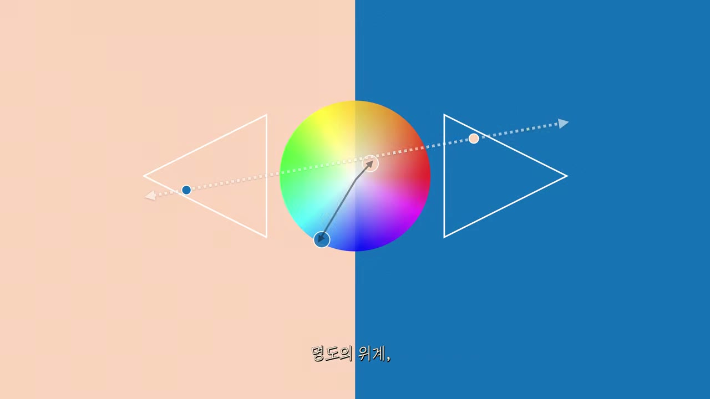

# 파란색+흰색의 한계와 살구색+파란색의 해법

> 출처: 「그대로 갖다 쓰는 색깔 조합 16가지」 (YouTube 23kxFVxYZIY) — 살구색 & 파란색 구간 (09:27–10:29)

| 색 | HEX | 원어 이름 | HSB(대략) | 역할 |
|---|---|---|---|---|
| 살구색 | `#FDD4BD` | Seashell Pink | H 22° · S 25% · B 99% | 밝은 바탕, 따뜻한 뉴트럴 |
| 파란색 | `#006EB8` | Blue | H 204° · S 100% · B 72% | 강조·구조, 정직하게 차가운 색 |
| (비교) 순백 | `#FFFFFF` | White | S 0% · B 100% | 색온도 중립, 파랑의 차가움을 그대로 둠 |

## 1. 왜 파란색+흰색이 '신뢰·청결'의 관용구가 되었나

파랑은 문화권을 가로질러 **침착함·유능함·안정성**과 묶이는 색이다. 은행(신한·우리·Chase·Citi), IT(IBM·Intel·Facebook·삼성), 항공, 보험 등 "돈이나 데이터를 맡기는" 업종이 유독 파랑을 택하는 이유가 여기 있고, 많이 쓰이자 이제는 학습된 연상만으로도 "믿을 수 있는 기관"을 뜻하게 되었다. 흰색은 여기에 **깨끗함·투명함·여백**을 더한다. 그래서 파랑+흰색은 "정직하고 깨끗하다"를 가장 안전하게 말하는 조합이 되었다.

문제는 병원·실험실·치과가 정확히 같은 조합을 쓴다는 점이다. 흰 가운, 흰 타일, 파란 수술포와 표지판. 파랑+흰색을 그대로 가져오면 브랜드가 의도한 "신뢰"에 **'임상적(clinical)' 느낌**—소독된, 감정 없는, 사람이 없는 공간—이 따라붙는다. 영상이 "너무 차갑기만 하고 임상적인 느낌으로만 남는다"고 짚는 바로 그 지점이다.

- 참고: [Blue Color Psychology in Branding: Why Every Bank and Tech Giant Chooses Blue](https://colorarchive.org/guides/blue-color-psychology-branding-guide/) — 파랑이 금융·기술 업종에서 "불안을 낮추는 색"으로 굳어진 배경과 학습된 연상을 정리한 글.

## 2. 순백은 '중립'이라 파랑의 차가움을 그대로 둔다

색온도 관점에서 순백(`#FFFFFF`)은 채도가 0이다. 난색도 한색도 아니어서 옆에 놓인 색의 온도를 **바꾸지 못하고 그대로 반사**한다. 화면에 파랑과 흰색만 있으면 유일한 유채색이 파랑이므로 화면 전체의 체감 온도는 파랑이 결정하고, 흰색은 그 차가움을 더 또렷하게 드러내는 배경이 될 뿐이다.

살구색(`#FDD4BD`)은 다르다. 색상은 22°(주황~살몬), 채도는 25% 정도로 낮고, 명도는 99%로 매우 높다. 즉 **"따뜻한 뉴트럴"(warm neutral)**—피부톤과 가까운 저채도 난색이다. 채도가 낮아 색으로 나서지는 않지만, 색상축은 분명히 난색 쪽에 있어서 화면 전체의 온도를 **미약하게 위로 끌어올린다**. 영상의 표현대로 "화면 전체의 온도는 미약하지만 따뜻하게 유지"되고, 피부색과 가까운 만큼 "사람 냄새"가 자연스럽게 따라온다.

정리하면:

- 파랑+순백: 유채색이 파랑 하나 → 온도 = 파랑의 온도 → 차갑고 임상적.
- 파랑+살구: 차가운 고채도 색과 따뜻한 저채도 색이 공존 → 온도가 살짝 중화 → 쾌청하지만 친밀.

## 3. 그래도 흰색의 '밝은 바탕' 역할은 그대로 유지된다

살구색을 넣었다고 해서 흰색이 하던 일이 사라지는 것은 아니다. 명도(B) 99%는 사실상 흰색과 같은 밝기다. 그래서 다음이 그대로 성립한다.

- **명도 위계**: 살구(아주 밝음) ↔ 파랑(중간 밝기). 파랑 텍스트·아이콘이 살구 바탕 위에서 흰 바탕 위와 거의 같은 대비로 읽힌다.
- **채도 위계**: 살구(저채도) ↔ 파랑(고채도). 시선은 여전히 파랑으로 간다. 살구는 뒤로 물러나 바탕 역할만 한다.
- **색상 관계**: 22° ↔ 204°, 약 180° 차이로 사실상 완전한 보색이다. 보색은 원래 팽팽하게 충돌하지만, 위의 두 위계가 **비대칭**이어서(한쪽은 밝고 탁, 한쪽은 중간 밝기에 맑) 충돌 대신 "각자의 자리를 지키는" 정갈한 관계가 된다.

영상 요약표에서 이 조합을 "보색 · 비대칭(명도·채도 위계)"으로 분류하는 이유가 이것이다. 세이지그린+연분홍(둘 다 톤이 죽어 있어 대칭)이나 오렌지+틸(둘 다 톤 절제 없음)과 달리, 살구+파랑은 **한쪽만 눌러서** 위계를 만든다.

## 4. 그림으로 보기

- **배경 반반**: 왼쪽 살구, 오른쪽 파랑. 두 색이 섞이지 않고 경계가 칼같이 나뉜다. "섞이지 않고 정갈하게 각자의 자리를 지키는 관계", "안과 바깥의 명확한 분리"를 그대로 시각화한 것이다. 그런데 왼쪽 절반이 흰색이 아니라 살구라서, 화면을 통째로 봤을 때 차갑게만 느껴지지 않는다.
- **색상환 위의 실선 화살표**: 파랑 점(왼쪽 아래, 약 204°)에서 살구 점(오른쪽 위, 약 22°)으로 이어지는 실선이 원의 중심을 거의 정확히 지난다. 두 색이 **색상각 기준으로 거의 완전한 보색**임을 보여준다. 살구 점은 색상환의 바깥 테두리가 아니라 중심 가까이에 찍혀 있는데, 이것이 살구의 **낮은 채도**를 뜻한다. 파랑 점은 테두리 쪽에 있어 채도가 높다.
- **점선과 두 삼각형**: 점선은 두 색을 각자의 톤 삼각형(명도·채도 공간) 안의 위치로 끌어다 놓는다. 왼쪽 삼각형(살구 배경 위)에는 파랑 점이 낮은 명도 쪽에, 오른쪽 삼각형(파랑 배경 위)에는 살구 점이 높은 명도 쪽에 찍혀 있다. 두 점이 서로 다른 높이에 있다는 것이 곧 **명도의 위계**이고, 점선이 기울어져 있다는 것이 그 위계가 대칭이 아님을 보여준다. 자막 "명도의 위계"가 바로 이 장면(10:21)이다.

## 5. UI·브랜딩의 오프화이트·크림 배경과 같은 원리

영상이 말하는 "차가운 색을 쓰면서 차가운 인상을 피하는 방법"은 실무에서 이미 널리 쓰이는 관행과 같은 원리다.

- 많은 서비스가 순백 대신 `#FAF8F5`, `#FFFBF5`처럼 **아주 살짝 노랑·주황 쪽으로 기운 오프화이트/크림**을 배경으로 쓴다. 채도는 몇 퍼센트에 불과해 흰색처럼 읽히지만, 그 위에 놓인 파랑·검정이 덜 차갑고 덜 "화면 같아" 보인다. 종이 질감, 눈 피로 감소, 따뜻한 인상이 모두 같은 원리에서 나온다.
- 살구색+파란색은 이 관행을 **한 단계 더 세게** 밀어붙인 버전이다. 채도 25%짜리 살구는 더 이상 "거의 흰색"이 아니라 눈에 보이는 색이지만, 명도 99%가 흰색의 역할(밝은 바탕, 높은 대비, 여백감)을 지켜 주므로 파랑 UI가 그대로 작동한다.
- 반대로 파랑을 데우려고 파랑 자체를 보라·청록으로 틀거나 채도를 낮추면 "정직하게 차가운" 신뢰 신호가 약해진다. 영상의 해법은 **파랑은 그대로 두고, 바탕만 바꾼다**는 점에서 브랜드 컬러를 건드리지 않고 톤을 조절할 수 있는 실용적인 방법이다.

## 한 줄 요약

파랑+흰색은 파랑의 차가움을 중립인 흰색이 그대로 반사해 임상적으로 굳는다. 흰색 자리에 **밝기는 흰색이면서 색상은 피부색에 가까운 저채도 난색(살구)**을 놓으면, 명도·채도 위계는 그대로라 정갈함이 유지되면서 화면 온도만 살짝 올라 "쾌청하되 사람 냄새 나는" 조합이 된다.
