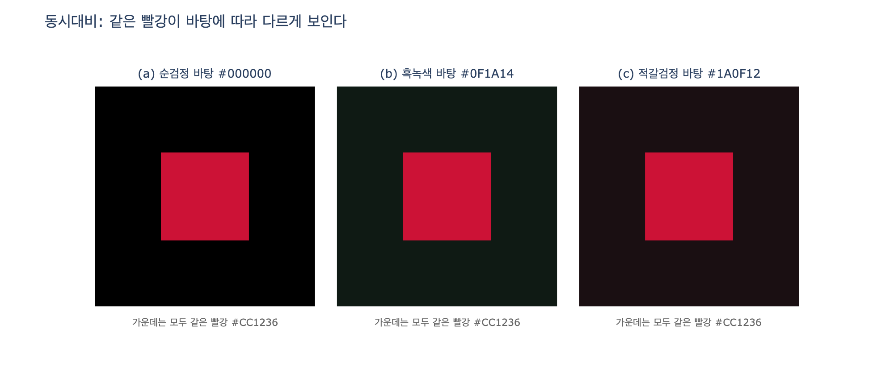

# 검정 대신 흑녹색을 빨강 옆에 두면 — "태운 검정"이 빨강을 더 붉게 만드는 원리

## 질문

검정 대신 흑녹색을 빨간색 옆에 두면 기술적으로 어떤 효과가 생기는가?

## 한 줄 답

보색 관계에 톤 차이까지 극대화되어, 검정에 태운 녹색 미색이 **동시대비**로 빨강을 더 붉게 보이게 강화한다. 어두운 부분에 색이 섞여 경계의 날카로운 질감은 살짝 무뎌지지만, 감정은 더 원초적으로 표현되고 빈티지한 맛도 살짝 난다.

영상 14:01–14:52의 설명 그대로다. "원래는 빨간색과 순수한 검정의 조합이었는데, 흑색에 녹색을 살짝 태우는 게 더 치명적으로 느껴져서 그렇게 조정했습니다. 보색관계에 놓여 있으면서 톤 차이까지 극대화시켰기 때문에 검정색에 태운 미색이 빨강을 더 붉게 만들어 색을 강화시키고요."

## 두 색의 수치

이 카드에 직접 해당하는 그림은 없으므로 색은 HEX로 적는다.

| 색 | HEX | 원어 이름 | HSL (H°, S%, L%) | 상대 휘도 |
|---|---|---|---|---|
| 빨간색 | `#CC1236` | Carmine | 348.4°, 83.8%, 43.5% | 0.135 |
| 흑녹색 | `#0F1A14` | Ink Green | 147.3°, 26.8%, 8.0% | 0.009 |
| (비교) 순검정 | `#000000` | — | 색상 없음, 0%, 0% | 0.000 |

- **색상각 차이**: 348° vs 147° → 약 159°. 180°에 가까우므로 거의 **보색**이다. 빨강의 정확한 보색은 청록(약 168°)이지만, 흑녹색은 그 근처의 녹색 방향에 있다.
- **톤 차이**: 명도 43.5% vs 8.0%. 밝은 순색 빨강과 거의 검정에 가까운 어두운 톤이 맞서 "톤 차이 극대화"가 된다.
- **명암 대비율**(WCAG 기준): 빨강:흑녹색 = 3.15:1, 빨강:순검정 = 3.71:1. 순검정이 명암 대비는 조금 더 세다. 즉 순검정은 **경계**를 더 날카롭게 만들지만, 아래 설명처럼 빨강의 **색** 자체를 강화하는 재료는 없다.
- **채도**: 흑녹색은 어둡지만 채도 26.8%의 유채색이고, 순검정은 채도 0이다. 이 차이가 핵심이다.

## 왜 녹색기 있는 어두운 바탕이 빨강을 더 붉게 보이게 하는가 — 동시대비

**동시대비(simultaneous contrast)** 는 두 색을 나란히 놓으면 서로의 지각이 바뀌는 현상이다. 나란히 놓인 색들은 색상·명도·채도가 모두 달라 보이며, 서로 다른 성질은 강조되고 비슷한 성질은 약해진다. 방향이 중요하다: 한 색은 **주변색의 보색 방향으로 밀려** 보인다. 이는 보색 잔상(afterimage)과 같은 생리적 메커니즘으로 설명된다 — 녹색을 오래 보면 시각 계통의 녹색 채널이 적응해 빨강 쪽 잔상이 남듯, 녹색기 있는 바탕이 시야를 채우면 그 위의 빨강에 빨강 방향의 유도가 더해진다.

- 프랑스 화학자 **셰브뢸(Michel Eugène Chevreul)** 은 고블랭 태피스트리 공장의 염색 책임자로 일하며 "검정 실이 흐려 보인다"는 불만이 염료 문제가 아니라 옆에 놓인 실의 색과의 상호작용 때문임을 밝혔고, 1839년 『색의 동시대비 법칙(De la loi du contraste simultané des couleurs)』으로 정리했다.
- **이텐(Johannes Itten)** 은 『색채의 예술』에서 이를 7가지 색 대비 중 하나로 정리하고, 어떤 색이든 그 주변에 보색을 유도한다고 설명했다.
- **앨버스(Josef Albers)** 의 『Interaction of Color』(1963)는 셰브뢸의 원리 위에 세워진 실습서로, 같은 색지도 주변색에 따라 더 밝게·어둡게, 더 따뜻하게·차갑게 보인다는 것을 색지 실험으로 보여준다. 앨버스의 유명한 명제 "색은 예술에서 가장 상대적인 매체다"가 이 현상을 가리킨다.

이 규칙을 빨강 & 흑녹색에 적용하면:

1. 흑녹색 바탕은 시야에 **녹색 방향의 유채 성분**을 깔아 놓는다.
2. 그 위의 빨강은 녹색의 보색 방향, 즉 **빨강 쪽으로 더 밀려** 보인다 — 채도가 더 높고 더 "붉게" 지각된다.
3. 명도 차이는 그대로 크게 유지되므로 톤 대비(밝은 빨강 vs 어두운 바탕)와 색상 대비(빨강 vs 녹색기)가 **동시에** 작동한다. 영상의 "보색 관계 + 톤 차이 극대화"가 정확히 이 두 축이다.

## 순검정은 왜 이 효과를 주지 못하는가

순검정 `#000000`은 채도 0, 즉 **색상 정보가 없다**. 동시대비는 주변색의 보색 방향으로 지각을 미는 현상인데, 무채색 바탕에는 "밀어 줄 방향"이 없다. 순검정 바탕은 명암 대비만 최대로 만들어 빨강의 **경계를 날카롭게** 자를 뿐, 빨강의 붉음 자체를 강화하지 못한다. 오히려 아주 강한 명암 대비는 색보다 형태(실루엣)를 먼저 읽게 만들어 빨강이 상대적으로 "그래픽하게" 납작해 보일 수 있다.

반대로 검정을 **빨강 쪽으로** 태우면(예: 어두운 적갈색 `#1A0F12`) 바탕이 빨강 성분을 이미 가지고 있어 위의 빨강이 덜 붉게, 탁하게 보인다. 이것이 흑녹색을 고른 이유의 반증이다.

## "검정에 색을 태운다(tinted black)" — 회화·영화 그레이딩 관행

순검정 대신 유채색을 조금 섞은 어두운 톤을 쓰는 것은 오래된 관행이다.

- **회화**: 많은 화가가 튜브 검정을 쓰지 않고 울트라마린 + 번트 엄버 같은 보색 혼합으로 "색이 있는 검정(chromatic black)"을 만든다. 그림자에 색 온도가 생겨 깊이가 생기고, 인접한 밝은 색이 동시대비로 살아난다.
- **영화 색보정(color grading)**: 순검정(0,0,0)으로 떨어지는 그림자는 디지털 특유의 "뚝 잘린" 느낌을 준다. 그레이딩에서는 섀도우 영역을 청록·녹색·따뜻한 갈색 등으로 살짝 띄우는(lifted, tinted blacks) 일이 흔하다. 필름 시절 네거티브·프린트 특성상 검정이 완전 검정이 아니고 미묘한 색을 띠었기 때문에, 이 처리는 **빈티지 필름 룩**과 연결된다. 영상이 "흑색에 섞인 미색 덕분에 빈티지한 맛까지 살짝 낼 수 있다"고 한 것이 이 관행이다.
- 흑녹색은 이 계열 중에서도 빨강의 보색 쪽으로 태운 검정이므로, 빈티지 룩과 빨강 강화를 동시에 얻는다. 스릴러·호러·느와르·시대극에 어울린다는 영상의 평가도 이 맥락이다 — 어둡고 무거운 톤 위에서 불과 피의 붉음만 살아남는다.

## 왜 "질감은 무뎌지되 감정은 원초적"인가 — 경계의 경도 vs 색의 온도

두 가지 서로 다른 대비 축을 나눠 보면 정리된다.

| 축 | 순검정 바탕 | 흑녹색 바탕 |
|---|---|---|
| 명암 대비(경계의 경도) | 3.71:1 — 최대, 경계가 칼처럼 날카로움 | 3.15:1 — 조금 낮아 경계가 살짝 부드러워짐 |
| 색상 대비(색의 온도) | 없음 — 바탕이 무채색 | 있음 — 차가운 녹색기 vs 뜨거운 빨강 |
| 어두운 부분의 정보 | 텅 빈 검정 | 색이 섞인 어둠 (그림자에 온도가 있음) |

- **질감이 무뎌진다**: 어두운 부분이 순검정이 아니라 유채색이므로 명암 대비가 조금 줄고, 경계가 "잘린" 느낌에서 "번진" 느낌으로 미세하게 이동한다. 날카로웠던 그래픽적 질감이 살짝 부드러워진다.
- **감정은 더 원초적이 된다**: 대신 어둠에 색 온도가 생기고, 빨강은 보색 유도로 더 붉어진다. 형태 대비(실루엣)보다 **색 대비(뜨거움 vs 차가움, 피 vs 어둠)** 가 앞으로 나오면서 지각이 지적·그래픽한 쪽에서 감각적·본능적인 쪽으로 옮겨 간다. 영상이 말한 "더 치명적으로 느껴진다"가 이 이동이다.

## 요약

- 흑녹색은 빨강의 **거의 보색(Δh ≈ 159°)** 이면서 **명도 차가 극대화**된(43.5% vs 8.0%) 어두운 유채색이다.
- 동시대비(셰브뢸 → 이텐 → 앨버스)에 따라 녹색기 바탕은 빨강을 **보색 방향(더 붉게)** 으로 밀어 채도를 강화한다.
- 순검정은 색상 정보가 없어 이 유도가 생기지 않고, 명암 대비만 높여 **경계만 날카롭게** 만든다.
- 검정에 색을 태우는 것은 회화의 chromatic black, 영화 그레이딩의 tinted blacks와 같은 관행으로, 깊이와 **빈티지 필름 룩**을 준다.
- 결과: 경계의 날카로운 질감은 살짝 무뎌지지만 색 온도 대비가 커져 감정이 더 원초적으로 읽힌다.

## 참고 링크

- [Simultaneous Contrasts — Wikipedia](https://en.wikipedia.org/wiki/Simultaneous_Contrasts) (셰브뢸의 1839년 저서와 법칙)
- [Color Theory: Chevreul & Albers — Oberlin College Libraries](https://libraries.oberlin.edu/news/2024/02/21/check-it-out-color-theory-chevreul-albers) (앨버스 『Interaction of Color』가 셰브뢸의 원리 위에 있음)
- [Understanding Simultaneous Contrast — Humanities LibreTexts](https://human.libretexts.org/Workbench/Color_Theory_and_Composition/07:_Color_Perception/7.02:_Understanding_Simultaneous_Contrast)
- [Color Context — DePaul University](http://facweb.cs.depaul.edu/sgrais/color_context.htm) (대비가 생리적 보색 방향으로 작용한다는 설명)
- [What is simultaneous contrast, and why it is important in color correction — ColorDuels](https://www.colorduels.com/what-is-simultaneous-contrast/) (색보정 관점)
- [Josef Albers Colour Theory — Printed Editions](https://www.printed-editions.com/blog/josefs-albers-colour-theory/)

## 시각화

`expy.py`는 (1) 두 색의 HSL과 대비율을 계산하고, (2) 같은 빨강 `#CC1236` 사각형을 순검정·흑녹색·적갈검정 바탕 위에 놓아 동시대비를 비교하며, (3) "바탕의 보색 방향으로 밀림"을 단순 수치 모형으로 흉내 내 CIELAB chroma 변화(순검정 +0.0, 흑녹색 +6.6, 적갈검정 −9.9)를 표로 보인다.

