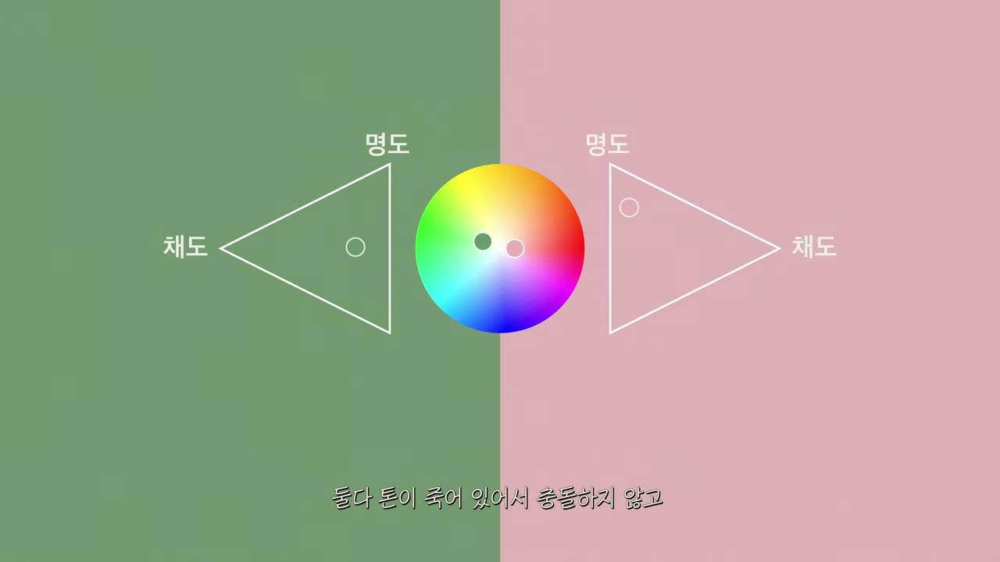
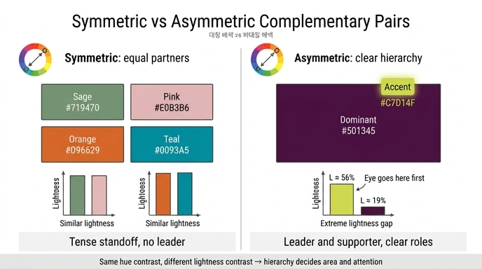

# 라임옐로우 & 진보라색 — 왜 "비대칭" 배색인가

**질문.** 라임옐로우와 진보라색 조합의 기술적 특징은 이전 조합들과 어떻게 다른가?

**답.** 보색 관계에 더해 **명도까지 극단적인 격차**를 내어 **비대칭 관계**를 만든다. 이전 조합들(세이지그린·연분홍, 오렌지·틸블루)이 대등한 위치에서 팽팽하게 맞섰다면, 이 조합은 **색의 위계(주도색/보조색)** 가 확실히 정해져 있어 설계 의도를 애매함 없이 명쾌하게 전달할 수 있다.

---

## 1. 영상 속 그림으로 먼저 보기

그림 1(영상 07:29)은 이 강의의 표준 다이어그램이다. 읽는 법은 다음과 같다.

| 그림 요소 | 의미 | 이 조합에서 보이는 것 |
|---|---|---|
| 가운데 **색상환** 위 두 점과 화살표 | 두 색의 **색상(Hue)** 위치. 반대편에 가까울수록 보색 | 라임(연두-노랑, 약 65°)과 진보라(자홍-보라, 약 310°)가 거의 마주보는 각도 → **보색 관계** |
| 양옆 **삼각형** (톤 삼각형: 위 꼭짓점이 명도, 옆 꼭짓점이 채도 방향) | 각 색의 **명도·채도(톤)** | 왼쪽 라임의 점은 삼각형 **위쪽**에, 오른쪽 진보라의 점은 **아래쪽**에 찍혀 있다 → 명도가 정반대 |
| 화면 배경 자체 | 두 색을 그대로 절반씩 깔아 놓음 | 밝은 절반과 어두운 절반이 한눈에 갈라져 **어느 쪽이 배경/도형이 될지** 바로 읽힌다 |

핵심은 **화살표(색상 대비)는 보색이라 다른 조합과 같은데, 삼각형의 점 높이(명도)가 크게 다르다**는 점이다.

그림 2(영상 02:34)의 세이지그린·연분홍을 나란히 놓고 보면 차이가 선명하다. 색상환에서는 마찬가지로 마주보고 있지만, 두 삼각형 안의 점이 **비슷한 높이, 비슷한 안쪽(저채도)** 에 있다. 즉 톤이 맞춰져 있어 두 색이 **같은 무게로 나란히 서 있는 대칭 배색**이다. 오렌지·틸블루도 채도는 높지만 두 색의 명도가 거의 같아 역시 대칭이다.

## 2. 대칭 배색 vs 비대칭 배색

| | 대칭 배색 (이전 조합들) | 비대칭 배색 (라임 & 진보라) |
|---|---|---|
| 색상 관계 | 보색 | 보색 (같음) |
| 명도 관계 | 비슷함 → 두 색이 **대등** | 극단적으로 다름 → **위계** 발생 |
| 시각적 인상 | 팽팽한 대립, 긴장 (세이지·연분홍은 저채도로 눌러 속삭이듯, 오렌지·틸블루는 고채도로 크게 외치듯) | 한 색이 **떠오르고**(figure) 다른 색이 **깔린다**(ground) |
| 설계할 때 | 어느 색이 주인공인지 매번 결정해야 하고, 잘못 잡으면 경계가 흔들림 | 주도색/보조색이 **저절로** 정해짐 → "애매함 없이 명쾌" |
| 예시 | 세이지 `#719470` / 연분홍 `#E0B3B6`, 오렌지 `#D96629` / 틸블루 `#0093A5` | 라임 `#C7D14F` / 진보라 `#501345` |

"대등하게 맞선다"는 것은 두 색이 **같은 명도 층**에서 색상만으로 부딪힌다는 뜻이다. 그러면 시선은 두 색 사이에서 왕복(往復)하며 긴장을 느낀다. 반대로 명도가 크게 갈라지면 밝은 색은 앞으로 튀어나오고 어두운 색은 뒤로 물러나 **깊이와 순서**가 생긴다.

## 3. 대략의 HSL 수치

HEX에서 환산한 근사값이다(H: 색상 0–360°, S/L: 0–100%, 상대 휘도는 sRGB 기준).

| 색 | HEX | H | S | L | 상대 휘도 | 톤 요약 |
|---|---|---|---|---|---|---|
| 라임옐로우 | `#C7D14F` | 약 65° | 약 59% | **약 56%** | **0.77** | 고명도·고채도 |
| 진보라색 | `#501345` | 약 311° | 약 62% | **약 19%** | **0.14** | 저명도·중채도 |
| (비교) 세이지그린 | `#719470` | 118° | 14% | 51% | 0.54 | 중명도·저채도 |
| (비교) 연분홍 | `#E0B3B6` | 356° | 42% | 79% | 0.74 | 고명도·저채도 |
| (비교) 오렌지 | `#D96629` | 21° | 70% | 51% | 0.48 | 중명도·고채도 |
| (비교) 틸블루 | `#0093A5` | 187° | 100% | 32% | 0.46 | 중명도·고채도 |

- 라임과 진보라의 **명도 대비율(WCAG contrast ratio)은 약 4.3:1**. 본문 텍스트에 쓸 수 있는 수준이다.
- 세이지·연분홍은 약 1.3:1, 오렌지·틸블루는 약 1.04:1로 **거의 같은 밝기**다. 채도·색상만 다르고 명도는 대등하다는 것이 수치로도 확인된다.
- 진보라는 HSL 채도 자체는 62%로 낮지 않지만, 명도가 19%까지 내려가 있어 **눈에 보이는 선명함(colorfulness)** 은 라임보다 훨씬 낮다. 그래서 강의에서 라임을 "형광", 진보라를 "바탕"으로 읽는다.

## 4. 왜 명도 대비가 색상 대비를 지배하는가

- **Itten의 7가지 색채 대비** 중 *명암 대비(light–dark contrast)* 와 *보색 대비(complementary contrast)* 는 서로 독립적인 축이다. 보색 대비만 있고 명암 대비가 없으면(오렌지·틸블루처럼) 두 색은 진동하듯 팽팽하게 맞서지만, 명암 대비가 더해지면 어느 쪽이 도형이고 어느 쪽이 바탕인지가 결정된다.
- 인간의 시각계는 **형태·윤곽·글자를 주로 휘도(명도) 채널로 인식**한다. 색상 채널은 해상도가 낮다. 그래서 명도가 같은 두 색은 경계가 "떨리고"(흑백으로 바꾸면 사라진다), 명도가 다른 두 색은 흑백으로 바꿔도 형태가 그대로 남는다. 가독성과 형태 인식은 명도 대비가 결정한다.
- **주도색/보조색(도미넌트·서브·액센트)** 설계는 결국 명도 위계를 면적으로 옮기는 일이다. 통상 60–70%를 차지하는 도미넌트, 20–30%의 서브, 5–10%의 액센트로 나누는데, 명도가 같은 두 색은 어느 쪽에 큰 면적을 줘도 "정답"이 없어 매번 감으로 조정해야 한다. 라임·진보라는 명도가 이미 갈라져 있어 **넓게 깔 색(바탕)과 작게 얹을 색(강조)** 이 자연스럽게 나온다.

## 5. "애매함 없이 명쾌"한 이유

1. **시선 유도가 결정된다.** 밝고 채도 높은 라임은 어두운 진보라 위에서 반딧불처럼 즉시 시선을 끈다("어두운 덤불 속 반딧불", 06:37). 무엇을 먼저 보게 할지 고민할 필요가 없다.
2. **면적 배분이 결정된다.** 강한 명도 격차는 곧 강한 위계이므로, 보통 어두운 진보라를 넓게 깔고 라임을 좁게 얹거나(귀족적·마법적), 라임을 넓게 깔고 진보라로 윤곽·글자를 잡는(팝·과시적) 두 가지 방향 중 하나로 정리된다. 절반씩 나누는 어중간한 배치가 제일 어색하다.
3. **그래픽 요소 간 역할 분담.** 배경/글자, 면/선, 인물/무대처럼 정보 위계가 그대로 색 위계로 옮겨진다. 인쇄물이나 UI에서 강조색(액센트)이 무엇인지 설명 없이 읽힌다.

## 6. 그런데 왜 "가장 위험한" 색인가 — 유치해지는 지점

강의는 이 조합을 "잘 쓰면 트렌디, 잘못 쓰면 칙칙하고 유치"하며 "한번 유치해지면 밋밋한 것보다 회복이 어렵다"고 말한다(06:37). 위험은 주로 **순서(어느 색이 주도인지)와 면적**을 잘못 잡을 때 나온다.

- **면적을 대등하게 나눌 때**: 명도 위계가 뚜렷한 두 색을 50:50으로 놓으면, 위계가 있는데도 서로 양보하지 않는 꼴이 되어 값싼 팀 유니폼이나 사탕 포장처럼 보인다. 위계가 강한 색은 **면적도 비대칭**이어야 한다.
- **라임의 채도를 더 올리거나 면적을 키울 때**: 형광 노랑이 과하면 '경고·형광펜' 코드로 미끄러진다. 라임은 강조일 때 가장 고급스럽다.
- **진보라의 명도를 잘못 잡을 때**: 진보라가 조금만 밝아지거나 채도가 높아지면 "마법·독"의 어두운 깊이가 사라지고 만화적 자주색이 된다(칙칙해지는 쪽은 그 반대로 진보라에 회색기가 섞일 때).
- **문화 코드**: 보라 바탕에 형광이 얹히면 독·마법·사치를 연상시킨다(07:04). 이 코드는 장면이 요구할 때는 무기지만, 무심코 쓰면 유치한 판타지 느낌으로 읽힌다.

즉 비대칭 배색은 "무엇을 주도색으로 삼을지"를 **강제로 결정하게 해 준다**는 점에서 명쾌하지만, 그 결정을 회피(대등 배분)하거나 뒤집으면 대칭 배색보다 훨씬 크게 실패한다. 강의가 "순서와 면적을 상황에 맞게 정확히 맞추면 대체 불가능한 배색"(07:26)이라고 조건을 붙인 이유다.

## 7. 한 줄 정리

> 보색(색상 대비)은 이전 조합들과 같다. 다른 것은 **명도 축을 극단적으로 벌려 위계를 만든 것**이며, 그 위계 덕분에 주도색·보조색·면적·시선 순서가 저절로 정해져 설계가 명쾌해진다. 대신 위계에 맞지 않는 순서나 면적을 쓰면 유치해진다.

## 인포그래픽

