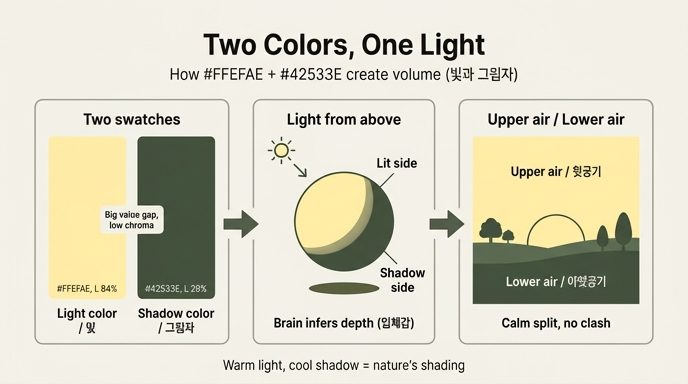

# 연노란색 & 다크올리브 — 평면 그림에 부피가 생기는 원리

**질문.** 연노란색과 다크올리브 조합이 평면적인 그림에서도 부피를 느끼게 하는 원리는?

**답.** 두 색이 각각 **빛과 그림자** 역할을 하여 광원에 방향이 생기고, 윗공기와 아랫공기가 부딪히지 않고 자연스레 나뉜다. 자연의 명암을 그대로 옮겨온 것이라 친숙하고 평온한 분위기 속에서 입체감이 만들어진다.

| 색 | HEX | 영어 이름 |
|---|---|---|
| 연노란색 | `#FFEFAE` | Pale Lemon Yellow |
| 다크올리브 | `#42533E` | Blackish Olive |

(이 카드에 직접 해당하는 원본 프레임은 없어 이미지는 넣지 않았다. 색은 위 HEX로 확인.)

---

## 1. 영상은 무슨 말을 하고 있나

영상(07:47–08:33)의 표현을 그대로 옮기면:

> 첫인상은 **건조한 틈 사이로 조용하게 새어 들어오는 빛**을 연상시킵니다. 각각 **빛과 그림자의 역할**을 하면서 **광원에 방향**이 생기고, **윗공기와 아랫공기가 부딪히지 않고 자연스레 나뉘는** 인상을 받았습니다. **자연 속에서 생기는 명암을 그대로 옮겨와** 친숙하고 평온한 분위기 속에서 입체감을 만들어 내고, 그래서 평면적인 그림 속에서도 부피가 확실히 느껴지는 배색입니다.

여기에는 세 가지 주장이 겹쳐 있다.

1. 두 색이 "빛/그림자"로 읽힌다 → **광원의 방향**이 생긴다 (뇌가 조명을 추론한다).
2. 그래서 평면 그림에서도 **부피(입체감)** 가 생긴다.
3. 그 명암이 **자연광의 명암과 닮아서** 어색하지 않고 평온하다 (친숙함).

아래에서 각각을 시각 과학과 회화 관습, 그리고 두 색의 수치로 풀어본다.

---

## 2. 뇌는 명암 기울기에서 3차원을 복원한다 — Shape-from-Shading

우리 눈에 들어오는 것은 2차원 밝기 분포일 뿐인데, 뇌는 그 밝기가 **점점 어두워지는 방향(음영의 기울기)** 을 읽어서 표면의 기울기, 즉 3차원 형태를 복원한다. 이를 **shape-from-shading(음영으로부터의 형태 복원)** 이라 부른다.

Ramachandran(1988, *Nature*)은 이 과정이 매우 빠르고 자동적이며, 두 가지 **가정(prior)** 을 깔고 작동한다고 보였다.

- **단일 광원 가정**: 화면 전체가 하나의 광원으로 비춰진다고 가정한다. 그래서 한 그림 안에서 밝은 색이 위쪽에 있으면 "위에서 빛이 온다"는 하나의 해석이 그림 전체에 적용된다.
- **Light-from-above prior(빛은 위에서 온다는 가정)**: 밝기가 위→아래로 어두워지면 볼록(convex), 반대로 아래가 밝으면 오목(concave)으로 읽는다. 이 가정은 망막 좌표 기준으로 작동하며, 4~12세 아동 발달 연구에서도 나이가 들수록 강해지는 것이 확인되었고, 시각-촉각 훈련이나 몸의 방향(중력)에 따라 조금 이동하기도 한다.

**이 카드에 적용하면**: 연노란색(매우 밝음)과 다크올리브(매우 어두움)가 한 그림 안에 있으면, 뇌는 자동으로 *"밝은 쪽이 빛을 받는 면, 어두운 쪽이 그림자 면"* 이라고 해석하고, 그 순간 **광원이 어디 있는지**(보통 위) 결정된다. 광원 방향이 정해지면 평면 도형에도 "앞으로 튀어나온 면 / 뒤로 물러난 면"이 붙는다. 영상이 말하는 **"광원에 방향이 생긴다"** 는 표현은 정확히 이 light-from-above prior가 발동했다는 뜻이다.

참고 링크:
- Ramachandran, V. S. (1988). *Perception of shape from shading*. Nature 331, 163–166. — <https://www.nature.com/articles/331163a0> / PubMed <https://pubmed.ncbi.nlm.nih.gov/3340162/>
- Kleffner & Ramachandran (1992). *On the perception of shape from shading*. Perception & Psychophysics. — <https://link.springer.com/article/10.3758/BF03206757>
- Thomas, Nardini & Mareschal (2010). *Interactions between "light-from-above" and convexity priors in visual development*. JOV. — <https://jov.arvojournals.org/article.aspx?articleid=2191755>
- Adams, Graf & Ernst (2004). *Experience can change the 'light-from-above' prior*. — <https://www.academia.edu/13427049/Experience_can_change_the_light_from_above_prior>
- *Gravity-dependent change in the 'light-from-above' prior* (PMC). — <https://www.ncbi.nlm.nih.gov/pmc/articles/PMC6181920/>
- 직접 체험 데모(Michael Bach, 착시 모음): <https://michaelbach.de/ot/lum-shapeFromShading/index.html>

---

## 3. 왜 "따뜻하고 밝은 색 = 빛", "차갑고 어두운 색 = 그림자"인가 — 회화 관습

### 3-1. 명암법(chiaroscuro)

르네상스 이후 회화의 **명암법(chiaroscuro, 이탈리아어 chiaro=밝음, scuro=어둠)** 은 강한 밝음과 어둠의 대비로 평면 위에 부피를 만드는 기법이다. 핵심은 색상의 수가 아니라 **명도(밝음)의 대비**다. 두 색만 있어도 명도 차가 충분하면 부피가 생긴다. 연노란색/다크올리브 조합은 사실상 **두 단계짜리 명암법**이다.

### 3-2. 자연광 아래 빛은 노랗고 그림자는 청록·올리브로 기운다

야외에서 맑은 날, 물체를 비추는 광원은 두 개다.

- **직사 태양광**: 노랗고 따뜻하다. 빛을 받는 면은 노란 기가 돈다.
- **하늘빛(skylight)**: 대기의 레일리 산란으로 파란 빛이 하늘 전체에서 내려온다. 태양이 가려진 그림자 영역은 이 파란 하늘빛만 받으므로 **그림자는 푸른 기**를 띤다.

여기에 땅·풀·나무 등 주변 반사광(초록·갈색)이 그림자에 섞이면, 그림자는 순수한 파랑보다 **청록~올리브**로 기운다. 그래서 화가들은 "**warm light, cool shadow(따뜻한 빛, 차가운 그림자)**"를 기본 법칙처럼 쓴다.

**이 카드에 적용하면**: 연노란색은 "햇빛을 받는 면"의 색이고, 다크올리브는 "하늘빛 + 풀빛 반사를 받는 그림자 면"의 색이다. 두 색을 나란히 놓으면 우리 뇌는 **평생 봐온 야외 명암의 패턴**을 그대로 인식한다. 영상이 말한 "**자연 속에서 생기는 명암을 그대로 옮겨와 친숙하고 평온하다**"가 바로 이것이다 — 인위적으로 설계한 대비가 아니라 학습된 자연 통계와 일치하기 때문에 편안하다.

참고 링크:
- Wikipedia *Shadow* — 야외 그림자가 푸른 이유(레일리 산란, 하늘빛): <https://en.wikipedia.org/wiki/Shadow>
- Realism Today, *Does Warmer Light Have Cooler Shadows?*: <https://realismtoday.com/painting-shadows-warmer-cooler/>
- Tucson Art Academy Online, *Temperature of Shadows*: <https://tucsonartacademyonline.com/blog/2023/7/7/temperature-of-shadows>
- Schaefer Fine Art, *Understanding Light and Shadow*: <https://www.schaeferfineart.com/blog/2015/01/26/understanding-light-and-shadow>

---

## 4. 두 색의 수치 — 왜 "부딪히지 않고 나뉘는가"

| | 연노란색 `#FFEFAE` | 다크올리브 `#42533E` |
|---|---|---|
| RGB | (255, 239, 174) | (66, 83, 62) |
| HSL (대략) | H 48°, S 100%, **L 84%** | H 109°, S 14%, **L 28%** |
| HSV/HSB (대략) | H 48°, S 32%, V 100% | H 109°, S 25%, V 33% |
| 상대 휘도(sRGB) | ≈ 0.86 | ≈ 0.08 |
| 인상 | 흰색에 가까운 노랑, 채도 낮게 느껴짐 | 검정에 가까운 초록, 채도 낮음 |

- **명도 차가 매우 크다**: L 84% vs 28%, 상대 휘도 0.86 vs 0.08. 두 색의 명도 대비율은 약 **7.2 : 1**(WCAG AAA 기준 7:1 이상)이다. shape-from-shading은 색상보다 **밝기 기울기**를 읽으므로, 이 정도 명도 차면 두 색만으로 "빛 면/그림자 면"이 확정된다.
- **채도는 둘 다 낮게 지각된다**: 연노란색은 HSL 상 S가 100%로 보이지만 이는 흰색에 가까운 색의 HSL 특성(L이 높으면 S가 부풀려짐)이고, HSV S는 32%, 실제 색도(chroma)도 낮다. 다크올리브는 S 14~25%로 명백히 탁하다. 채도가 높은 두 색(예: 순색 노랑 vs 순색 초록)이 만나면 경계에서 **색상 대비가 진동**(동시대비, 경계가 떨리는 느낌)하지만, 이 조합은 채도가 낮아 **경계가 조용하다**.
- **색상은 인접(48° vs 109°, 약 60° 차)**: 노랑과 황록/초록은 색상환에서 이웃이라 보색처럼 충돌하지 않는다.

정리하면, **"명도는 크게 다르고, 채도는 둘 다 낮고, 색상은 이웃"** 이다. 명도 차가 부피를 만들고, 낮은 채도와 이웃 색상이 경계의 싸움을 없앤다. 영상이 "**윗공기와 아랫공기가 부딪히지 않고 자연스레 나뉜다**"고 한 것은 정확히 이 구조다 — 분리는 확실한데(명도), 충돌은 없다(채도·색상).

---

## 5. 영상의 표현을 원리로 번역하기

| 영상의 표현 | 대응 원리 |
|---|---|
| "건조한 틈 사이로 조용하게 새어 들어오는 빛" | 다크올리브의 넓은 어둠 속에 연노란색이 좁게 들어오는 장면. 노랑=직사광, 올리브=그늘. 채도가 낮아 "조용한" 빛 |
| "각각 빛과 그림자의 역할" | 명도 차 큼(L 84% vs 28%) + 따뜻한 밝음/차가운 어둠이라는 자연광 관습 |
| "광원에 방향이 생기고" | shape-from-shading의 단일 광원 가정 + light-from-above prior가 발동 |
| "윗공기와 아랫공기가 부딪히지 않고 자연스레 나뉜다" | 위(하늘·빛)=연노랑, 아래(땅·그늘)=올리브로 화면이 상하로 갈리는데, 저채도·이웃 색상이라 경계가 진동하지 않음 |
| "자연 속 명암을 그대로 옮겨와 친숙하고 평온" | 태양광(노랑)+하늘빛·풀 반사(청록·올리브)라는 실제 야외 명암 통계와 일치 |
| "평면적인 그림 속에서도 부피가 확실히 느껴진다" | 위 모든 것의 결과. 뇌가 두 색 경계를 "표면이 꺾이는 곳"으로 해석 |

---

## 6. 한 줄 요약

연노란색(빛 면)과 다크올리브(그림자 면)는 **명도 차가 크고 채도가 둘 다 낮은 이웃 색상**이어서, 뇌의 shape-from-shading(빛은 위에서 온다는 가정)이 두 색 경계를 **"표면이 꺾이는 곳"** 으로 읽는다. 이 명암 배치가 실제 야외의 **따뜻한 태양광 / 차가운 하늘빛 그림자** 패턴과 같기 때문에 친숙하고 평온하며, 그래서 평면 그림에도 부피가 생긴다.

## 인포그래픽

