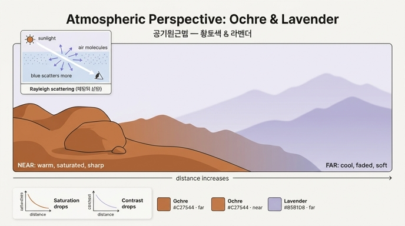

# 황토색 & 라벤더 — 공기원근법으로 앞뒤가 갈라지는 이유

## 질문

황토색과 라벤더 조합이 화면의 앞과 뒤를 명확하게 분리하는 원리는?

## 답

**공기원근법(空氣遠近法, atmospheric/aerial perspective)을 응용한 배색**이기 때문이다. 현실에서 멀리 있는 것은 대기 산란 때문에 대비와 채도가 떨어지고 색이 청보라 쪽으로 이동한다. 라벤더가 바로 그 "먼 곳의 색"이고, 따뜻하고 무게감 있는 황토색은 "가까이 손에 잡히는 색"이다. 두 색을 나란히 두면 눈이 평생 학습한 거리 단서가 그대로 작동해 앞뒤가 저절로 갈라진다.

| 색 | HEX | 원어 이름 | 대략 HSL | 원근 역할 |
|---|---|---|---|---|
| 황토색 | `#C27544` | Cinnamon Rufous | H 23° · S 51% · L 51% | 전경 (가깝게 다가옴) |
| 라벤더 | `#B5B1D8` | Grayish Lavender | H 246° · S 33% · L 77% | 배경 (멀리 물러남) |

---

## 1. 물리: 대기가 먼 물체를 푸르고 탁하게 만든다

### 레일리 산란

햇빛이 공기 분자(질소·산소)처럼 파장보다 훨씬 작은 입자에 부딪히면 **레일리 산란(Rayleigh scattering)**이 일어난다. 산란 세기는 파장의 4제곱에 반비례(∝ 1/λ⁴)하므로, 파장이 짧은 **파랑·보라**가 빨강보다 훨씬 많이 흩어진다. 하늘이 파란 이유이자, 노을이 붉은 이유(긴 경로를 지나며 파랑이 다 빠져나가고 빨강만 남음)다.

### 먼 물체에 생기는 세 가지 변화

관찰자와 물체 사이에 공기층이 두꺼워질수록 다음 세 가지가 동시에 일어난다.

1. **파랗게 물든다(hue shift)** — 시선 경로 위의 공기가 산란한 하늘빛(파랑·보라)이 물체에서 오는 빛 위에 덧씌워진다. 그래서 먼 산은 원래 색이 무엇이든 청보라 회색으로 보인다.
2. **대비가 떨어진다(contrast loss)** — 물체의 어두운 부분에도 산란광이 더해져 밝아지므로, 밝은 곳과 어두운 곳의 차이가 줄어든다. 윤곽이 뿌옇게 풀린다.
3. **채도가 떨어진다(desaturation)** — 원래 색에 회청색 빛이 섞이는 것이므로 색의 순도가 낮아지고, 결과적으로 배경 하늘 색에 수렴한다.

정리하면 **"멀수록 → 더 파랗고, 더 밝고 회색이며, 더 흐릿하다"**. 영상이 말한 "대비와 채도가 떨어지며 청보라색 쪽으로 이동"이 정확히 이 내용이다.

### 회화 전통

레오나르도 다빈치는 1500년대 초 노트에서 이미 이 현상을 "소실의 원근법(perspective of disappearance)"으로 기술하고, 어떤 물체를 5배 멀리 보이게 하려면 **"5배 더 파랗게 칠하라"**고 조언했다. 이후 풍경화 전통(클로드 로랭, 터너, 인상주의, 그리고 애니메이션 배경미술)에서 근경은 따뜻하고 선명하게, 원경은 차갑고 옅게 칠하는 것이 거리감을 만드는 표준 기법으로 굳어졌다.

---

## 2. 지각 심리: 색 자체가 거리 단서다

물리 현상을 평생 보아온 결과, 우리 뇌는 색 특성만으로도 거리를 추정한다. 이것을 **색채 원근(color perspective)**이라 부른다.

| 속성 | 가깝게 보임 (advancing) | 멀게 보임 (receding) |
|---|---|---|
| 색온도 | 난색 (빨강·주황·황토) | 한색 (파랑·보라·청회색) |
| 채도 | 높음 (선명) | 낮음 (탁함) |
| 대비 | 높음 (윤곽 뚜렷) | 낮음 (윤곽 흐림) |
| 명도 | 상대적으로 어둡고 무게감 | 상대적으로 밝고 가벼움(하늘과 가까움) |

세 축(온도·채도·대비)이 모두 같은 방향을 가리킬 때 거리감이 가장 강하게 생긴다. 축이 서로 어긋나면(예: 선명한 파랑 vs 탁한 주황) 효과가 약해지거나 뒤집힌다.

---

## 3. 황토색과 라벤더가 정확히 이 역할에 맞는 이유

HSL 수치를 보면 두 색은 위 표의 양쪽 칸에 거의 교과서처럼 들어간다.

- **황토색 `#C27544`** — H 약 23°(주황 계열 난색), S 약 51%(중채도), L 약 51%(중명도). 붉은 흙·벽돌·구운 점토처럼 **손에 잡히는 물성**이 연상되는 색이다. 라벤더 옆에 두면 상대적으로 어둡고 채도가 높아 대비가 커지고, 난색이므로 앞으로 다가온다.
- **라벤더 `#B5B1D8`** — H 약 246°(청보라 한색), S 약 33%(저채도), L 약 77%(고명도). 회색이 섞인 옅은 청보라는 **먼 산과 하늘이 만나는 경계**에서 실제로 관찰되는 대기색 그 자체다. 밝고 탁하고 차갑기 때문에 배경으로 물러난다.

두 색의 색상 차는 약 220°로 거의 보색에 가깝지만, 톤이 비대칭(어둡고 선명 vs 밝고 탁)이라 **위계**가 생긴다. 이 위계가 "앞(황토) / 뒤(라벤더)"라는 공간 질서로 읽힌다. 단순히 보색 대비가 아니라, 실제 대기 물리와 같은 방향으로 놓인 대비라서 억지스럽지 않고 자연스럽다.

---

## 4. "거리감 극대화 → 인물 표정이 더 깊게"가 생기는 이유

영상은 이 조합을 장면에 입히면 "실제 공간의 원근이라 평면에서 거리감이 극대화되고, 그만큼 인물의 표정도 더 짙고 깊은 감정으로 표현된다"고 말한다. 이유는 다음과 같다.

1. **전경-배경 분리(figure-ground segregation)** — 배경이 저채도·저대비·한색으로 물러나면 전경 인물은 그 위에 "떠 있는" 것처럼 분리된다. 배경이 시각적 소음을 내지 않으니 눈이 자동으로 인물로 간다.
2. **시선 집중 → 미세 표정 읽기** — 주변이 흐릿하고 조용할수록 인간은 얼굴의 작은 변화(눈꺼풀, 입꼬리)를 더 오래, 더 세밀하게 살핀다. 같은 표정이라도 더 "깊게" 느껴지는 것은 이 주의 배분 효과다.
3. **정서의 공간화** — 아련하고 텅 빈 청보라 원경은 그 자체로 "먼 곳·과거·닿을 수 없음"이라는 감정 은유를 갖는다(몽환적 레트로). 인물의 따뜻한 황토 톤과 대비되어 고립·그리움·회상 같은 감정이 배경으로부터 증폭된다.
4. **거리 단서의 중첩** — 그림에 이미 크기·겹침·선원근이 있는데, 색이 같은 방향의 거리 신호를 한 번 더 보내니 깊이감이 합산되어 평면이 "실제 공간"처럼 느껴진다. 인물이 서 있는 공간이 실감날수록 표정도 실감난다.

---

## 5. 한 줄 정리

> 라벤더는 "공기가 먼 곳을 물들이는 색"이고 황토색은 "손에 잡히는 흙의 색"이다. 두 색을 함께 놓으면 레일리 산란이 만든 현실의 거리 단서(한색·저채도·저대비 = 멀리 / 난색·고채도·고대비 = 가까이)가 평면 위에서 그대로 재생되어 앞뒤가 저절로 갈라지고, 분리된 전경 인물에 시선이 모여 표정이 더 깊게 읽힌다.

## 참고 링크

- [Aerial perspective — Wikipedia](https://en.wikipedia.org/wiki/Aerial_perspective): 다빈치의 관찰과 "5배 더 파랗게" 조언, 먼 물체가 더 옅고 파랗고 대비가 낮아지는 원리.
- ["Warm Colors Advance, Cool Colors Recede" — Mitchell Albala](https://mitchalbala.com/lies-my-art-teacher-told-me-warm-colors-advance-cool-colors-recede/): 색온도뿐 아니라 채도·명도·대비가 함께 작용해야 원근 효과가 성립한다는 화가의 설명.
- [Rayleigh scattering — Wikipedia](https://en.wikipedia.org/wiki/Rayleigh_scattering): 산란 세기가 파장의 4제곱에 반비례하는 물리.

## 인포그래픽

