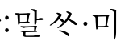
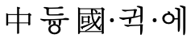
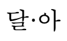
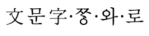
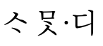
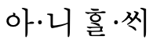

# 파일: 암기5(고전어휘, 중세국어: 세종어제훈민정음- 1)​
​​
 q  | a
--- | ---
홍진			| 더러운 속세
생애			| 생활
하다			| 많다, 크다
수간모옥			| 작은 초가집
벽계수			| 푸른 시냇물
풍월주인			| 인간과 자연이 조화를 이룸
도화			| 복숭아 꽃
녹양방초			| 버들가지와 풀
세우			| 가랑비
ᄆᆞᆯ​다			| 재단하다
헌ᄉᆞᄅᆞᆸ다​ 1. 긍정			| 대단하다
헌ᄉᆞᄅᆞᆸ다​ 1. ​부정			| 험하다
물아일체			| 자연물과 화자가 동화
시비			| 초가집 문/ 고전소설- 종
소요음영			| 천천히 거닐며 시를 음미함
소요			| 천천히 걸음
음영			| 시를 음미함
한			| 한가로움
나조ᄒᆡ​			| 저녁
조수			| 낚시를 함
준중			| 술통
날ᄃᆞ려​​			| 나에게 (부사격조사- ᄃᆞ려​, 에게)
날ᄃᆞ려​/ ᄃᆞ려​ 조사			| 부사격조사
미음완보			| 시를 음미하며 천천히 걸음
조ᄒᆞᆫ​			| 깨끗하다
ᄆᆡ​			| 들판
천촌만락			| 많은 마을
연하일휘			| 안개와 노을과 햇살
연하			| 안개와 노을
금수			| 1. 짐승 2. 비단
공명			| 출세 사자성어- 입신양명
ᄭᅴ우고			| 꺼리고
단표누항			| 소박한 삶
혜음			| 생각
​
 q  | a
--- | ---
언해본				| 한글해설서- 세로쓰기, 띄어쓰기X, 한글로 번역
훈민정음 언해본 <__>				| 예의
우리나라의 말이 중국과는 달라 한자와는 서로 통하지 아니하여서/ 정신				| 자주정신
내가 이를 가엾게 생각하여/ 정신				| 애민
새로 스물여덟 자를 만드노니/ 정신				| 창조
모든사람마다 쉽게 익혀 날마다 씀에 편안케 하고자 할 따름이니라/ 정신				| 실용

 q  | a
--- | ---
한자음 표기법		| 동국정운식 한자음 표기법( 중국 발음에 가깝게 표기, 초성 중성 종성 모두 표기)
형식적인 자음		| ㅇ- 종성(음가X, 발음X)/ ㅇ(꼭지), ㅇ(-)- 초성
랏〮/ 방점		| 거성식 입성
나랏〮(: 나라의)/ 의 조사		| 관형격 조사(평칭 유정명사, 높임 유정명사, 무정명사)
관형격 조사		| 1. 평칭 유정명사 2. 높임 유정명사, 무정명사
1. 평칭 유정명사		| 높임X, 사람+ 동물
1. 평칭 유정명사/ 양성모음+ ᄋᆡ		| 나+ ᄋᆡ(현- 나의)
1. 평칭 유정명사/ 음성모음+ 의		| 거붑+ 의-> 거부븨(현- 거북의)
2. 높임 유정명사, 무정명사		| ㅅ
2. 높임 유정명사, 무정명사/ 부텨+ ㅅ		| 부텨(부처의)
2. 높임 유정명사, 무정명사/ 나라+ ㅅ		| 나랏(나라의)
		| 1. 말ᄊᆞㅁ+ 이(주격조사) 2. 15C 언어> 현대- 높임말 [의미축소] 3. ㅆ- 각자병서 4. 이어적기(연철) 보편적
(: 중국과)/ 표기		| 동국정운식 표기
(: 중국과)/ 과, 에 조사		| 비교부사격 조사
(: 달라)/ 기본자		| 다ᄅᆞ다- 다ᄅᆞ(어간)+ 아(어미) 모음 조화-> 달아(ㄹㅇ 활용형)
(: 달라)/ 활용형		| ㄹㅇ 활용형
(: 한자와는)		| 동국정운식
서르(: 서로)		| 모음조화 엄격
(: 통하지)		| 1. 사라진 어휘(사어) 2. 구개음화X 3. 세종 때- ᄉᆞᄆᆞㅊ디〮-> 종성부용초성/ 세조 때- ᄉᆞᄆᆞᆺ디〮-> 8종성법
(: 통하지)/ 세종 때		| ᄉᆞᄆᆞㅊ디〮-> 종성부용초성​
(: 통하지)/ 세조 때		| ᄉᆞᄆᆞᆺ디〮-> 8종성법​
(: 아니하므로)/ ㄹᄊᆡ〮		| ~이므로 (종속적연결어미)
