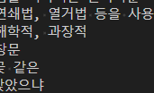

q  | a
--- | ---
(가) 지방		| 문지방- 문턱
(가) 거머희뜩		| 검은빛과 흰빛이 뒤섞인 모양
(가) 곰비임미		| 거듭 쌓이거나 앞뒤로 계속하여
(가) 천방지방		| 몹시 급하게 허둥대는 모양
(가) 정엣말		| 정겨운 말
(가) 주추리 삼대		| 삼의 줄기
(가) 모쳐라		| 때마침
(가) 화자의 상황과 정서		| 임이 돌아오기를 간절하게 기다리고 있음.
(가) 음성 상징어의 사용		| '곰비입비 입비곰비 천방지방 지방 천방', '워렁퉁탕'-> 음성 상징어를 사용하여 화자의 행동을 과장되게 묘사함
(가) 해학미		| 임에 대한 절실한 그리움 때문에 앞 뒤 생각할 겨를도 없이 한 행동이 독자에게 웃음을 선사함
(가) 주제		| 임에 대한 기다림
(가) 특징		| 의성어와 의태어를 사용한 과장된 행동 묘사로 임에 대한 화자의 그리움을 드러냄.
(가) 성격		| 해학적, 과장적
(나) 수기수기		| 꼭꼭
(나) 셜흔 날		| 서른 날
(나) 화자의 상황과 정서		| 돌아오지 않는 임에 대한 그리움과 원망의 정서를 드러냄
(나) 열거법, 점강법의 사용		| '성, 담, 집, 뒤주, 궤, 자물쇠' → 다양한 소재를 임이 오지 못하게 하는 장애물로 설정하여 열거함. → 큰 것에서부터 점차 작게 점강적으로 표현
(나) 다양한 표현 기법		| 과장법, 열거법, 연쇄법 등을 사용하여 임이 화자에게 돌아오지 못하는 이유를 제시하고, 임을 기다리는 답답하고 안타까운 마음을 드러냄
(나) 주제		| 임을 기다리는 안타까운 마음
(나) 특징		| 연쇄법, 열거법 등을 사용하여 임을 기다리는 화자의 마음을 다채롭게 표현함.
(나) 성격		| 해학적, 과장적
(다) 창전		| 창문
(다) 꼿 갓흔		| 꽃 같은
(다) 안졋더냐		| 앉았으냐
(다) 일너라		| 일러다오
(다) 화자의 상황과 정서		| 임의 소식에 대한 궁금증을 자연물을 활용하여 표현함
(다) 시어의 반복		| '달'의 반복-> 시어를 반복하여 리듬감을 조성함
(다) 도치법		| 도치법을 활용하여 입의 소식을 기다리는 화자의 마음을 강조함
(다) 주제		| 임의 소식에 대한 기다림
(다) 특징		| 반복법과 도치법을 사용하여 화자의 마음을 감조함.
(다) 성격		| 연정

